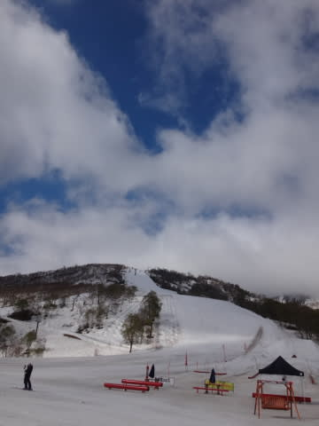
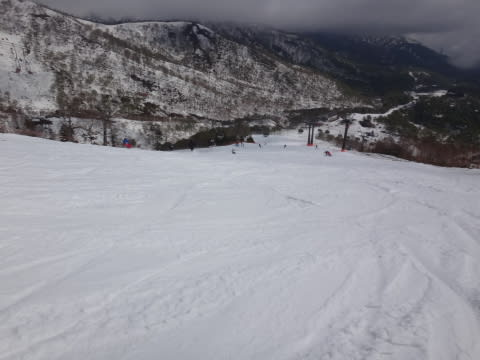
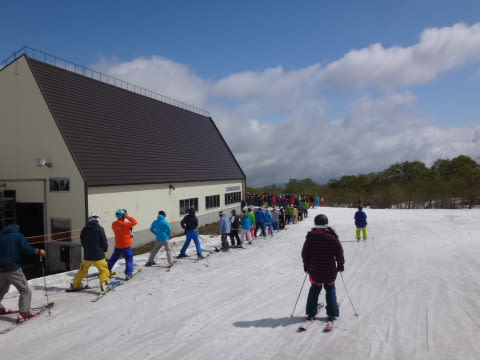
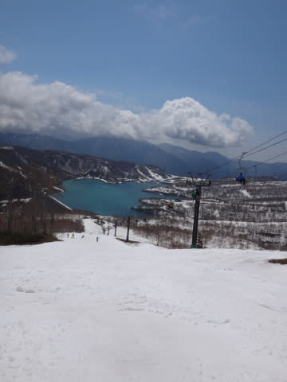
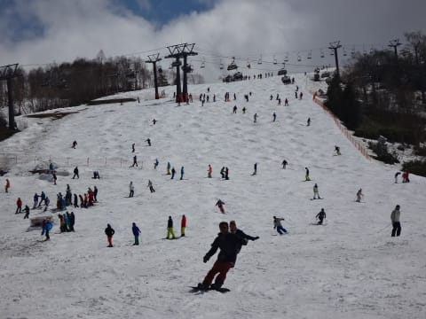

# 5月10日のかぐらスキー場速報モード…曇りのち晴れ，結構混んだよ…

📅 投稿日時: 2015-05-11 00:42:17

ということで．

今日もリフトストップまで滑ってしまい．

いつも通り，帰宅が遅かったので．

いつもの速報モードで…

えー．

曇り空で始まった，本日の朝．

山頂に着くころは，雲の合間に青空も覗く天気

でしたが．

朝の山頂付近は結構な強風で，10時近くまでかぐら高速リフトは

かな～りゆっくりの，減速運転（涙）．

だもんで，ゲレンデは人が少な目で，なかなか

荒れなかったけど…

でも，リフト待ちは最大10分以上と．

午前10時に隣のペアリフトが動くまでは，

かなり待ちました…（泣）．

でも，隣のペアリフトが動いてからは

リフト待ちは5分以下と短くなり，

ペアリフトはほぼ待ちなし．

そして．

天気も良く，すっきり晴れました～！

ただ．

やっぱり．

ゲレンデの人口密度は多かったので…

午後は，いつも通りの全面コブ祭り状態でしたよ～

ってことで．

詳細レポートはまた明日…

おやすみなさい…zzz

## 💬 コメント一覧

### 💬 コメント by (いか)
**タイトル**: Unknown
**投稿日**: 2015-05-11 20:01:41

いやー、かぐらが混み始めると春ですね！

私も昨日シーズン終了の儀を八方にて執り行ってまいりました。

風が吹いて朝イチ運転見合わせでも、なんども「風でゴンドラが止まるかもしれません」とアナウンスがあっても帰らない人たちばかりでした笑

### 💬 コメント by (Skier_S)
**タイトル**: いかさま
**投稿日**: 2015-05-12 00:54:21

八方は確か，日曜が営業最終日だったんですよね…

やっぱり，そんな日まで滑っているのは，

そういう人たちかと（笑）．

でも，八方クローズとともに，シーズン終了なんですか？（＾＾

まだ，かぐらも月山もありますよ～！

