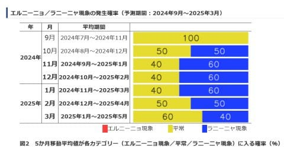

# 予想通り志賀高原熊の湯スキー場・横手山スキー場はオープン延期．そしてラニーニャになる可能性低下中（泣）

📅 投稿日時: 2024-11-13 02:54:21

えー．

今日は更新ヤバいかと思ったけど．

何とか記事を更新…！

本日，特派員より写真が送られてきましたが．

まず，横手山の現状を見ると…

あぁ…これはまだまだオープンできなさそうな

状態ですね（泣）

熊の湯も…

うーん．

オープンには程遠い感じ…（泣）

そして．

15，16，17日は異常に気温が上がりそうな

予報で，とても人工降雪機が動かせる天気

ではないので…

今週末のオープンは厳しいな，と思っていた

ところ．

本日，予想通り横手山がオープン日の延期を

アナウンスしました（涙）

新たなオープン日はまだ未定です…

（[横手山スキー場Facebook](https://www.facebook.com/yokoteyama2307/posts/pfbid058X7phZai81A7U1mmqpatzQQwGnfCQNFhA5qYPMTUaPcSQgH2tB8R38CzZDCvFadl)より）

そして，熊の湯スキー場もオープン延期を

アナウンス（泣）

まぁ，そうでしょうねぇ…

（[熊の湯スキー場ホームページ](https://www.kumanoyu.co.jp/lift/)より）

そして．

特派員からの写真には，22日オープン予定の菅平の

写真もありましたが．

うーん…

こちらも，まだまだ全くコースがつながっておらず．

22日オープンは厳しいんじゃないかな…？？

とりあえず，13日は一瞬冷えるけど．

その後下図の赤矢印で示したように，

15，16，17日と平年比+6~8℃の異常高温に

なりそうです…（泣）

ただ，そのあとは水色の矢印で示したように

18日の夜から19日の夜にかけての24時間

くらいの一瞬だけ，また志賀高原で天然雪が

降りそうなくらい冷え込みそう…

…ただ．

冷え込むのはホントに24時間くらいの

間だけですね（泣）

…おかしい．

今年はラニーニャだから冷え込むのでは…？？

と思い．

11日発表の気象庁の[エルニーニョ監視速報](https://www.data.jma.go.jp/cpd/elnino/kanshi_joho/kanshi_joho1.html)を見て

みるわけですが…

今現在，下の図の1行目にあるように，

「ラニーニャもエルニーニョも発生しない平常の状態」

のようで…

今後冬にかけても，

「ラニーニャの特徴が明瞭になるが，平常の状態が続く可能性の方がより高い」

ということで．

ラニーニャになる確率は40％程度で，

ラニーニャにならないほうの隔離が60％と高くなって

きたようです…

まぁ，上のグラフを見ると．

水色の領域がラニーニャの領域ですが．ぎりぎり

ラニーニャの領域をかすめるか，それを

下回るかという状況です．

ただ，各月の5か月平均がラニーニャの領域に

入る確率のグラフを見ると，

11，12，1月は水色のラニーニャ現象に入る

確率の方が60％と高くなっているように

見えます．

ただ…

この5か月移動平均が，6か月連続でラニーニャの

状態を維持したときに「ラニーニャ現象が発生」と

定義されているらしく．

このままだと，仮にラニーニャ状態の海水温に

なったとしても，それが6か月継続しない

可能性の方が高そうなので，

「ラニーニャにならず，平常の状態が続く可能性が高い」

ということになっているようです…

ということで．

横手も熊の湯も菅平も雪不足だし．

ラニーニャによる厳冬の期待が裏切られる

可能性が高そうという，ひたすらスキーヤーに

とって悪いニュースが続くここ数日．

12月に入ったら奇跡の冷え込みが起きるか．

あるいは季節が1か月遅れて，来年はGWまで

3月並みに冷え込むか，どっちかで

バランスとってほしい…（祈）
