# 2022/12/2(金)の横手山スキー場特派員レポート！…そして私は今週末スキーに行くのを諦めた

📅 投稿日時: 2022-12-03 01:51:44

ってなことで．

水曜に予想した，

　日本海側や白馬は雪が降る．

　志賀は雪がぱらつくが積もらず．

　でも人工降雪機が動かせるほど

　冷えるので人工降雪機フル稼働！！

という，12月2日の予想が当たり．

オープンまではまだ雪が足りなさそう

ではあるものの．

日本海側のかぐらでは，比較的雪が

積もったように見えます…！！！

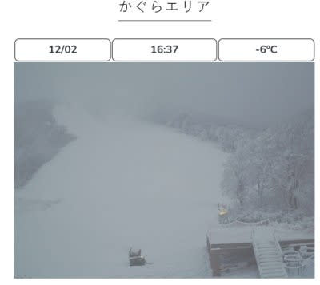

（[かぐらスキー場ライブカメラ](https://www.princehotels.co.jp/ski/kagura/livecamera/)より）

ただ．

やはり，志賀高原ではそれほど

積もらなかったようで…

うーん．焼額のライブカメラを見ると，

人工降雪機は昼間もフル稼働

していたみたいですが．

人工降雪が載ってない部分，まだ下地の

草が突き出て見えるほど雪が薄いみたい

です（涙）

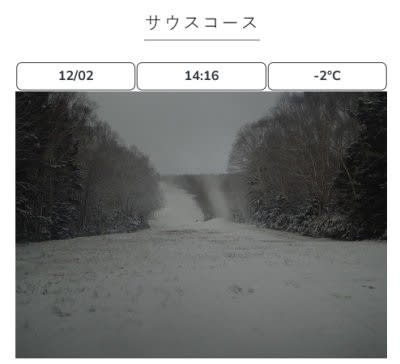

（[焼額山スキー場ライブカメラ](https://www.princehotels.co.jp/ski/shiga/livecamera/)より）

そんな中でも．

熊の湯は明日からのオープンを決めたよう

です！！

すごい…10cmあるかどうかくらいしか

天然雪が積もらなかったのに．

ほぼ2日半の人工降雪だけでオープン

させちゃうとは…！

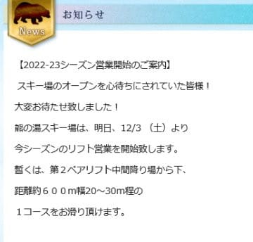

（[熊の湯スキー場ホームページ](https://www.kumanoyu.co.jp/lift/)より）

イエティも本日16時から，ようやく営業

再開したみたいですけど…

それ以外は，今週末にオープンする

スキー場はなさそうです（涙）

いや…他のスキー場は一体いつ

オープンできるのか．

来週は4日夜から5日朝にかけてと

8日の夜というわずかな時間以外，

天然雪は積もらなさそうだけど．

気温がそれほど上がらないので…

人工降雪があるスキー場は，来週末は

オープンできるかな～…

ってなことで．

一歩早く，昨日の昼過ぎに復活した

横手山ですが．

今日もまた，忠誠心の高い志賀高原特派員は，

横手山に滑りに行ったようですので．

今日も特派員レポートです！！

えー．

まず．

今日はゲレンデ回復のために，滑走中も

人工降雪機を動かす…とアナウンスしていた

横手山．

予定通り，人工降雪機が止まらないまま，

人工降雪機ブリザードを浴びて滑る

ことになったようですが…

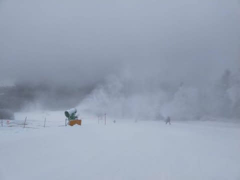

雪は思ったほどひどくなく．

一度営業休止したと考えると，予想より

かなりいい感じのフラットバーンが

お出迎え！！

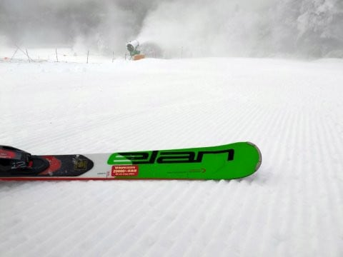

気温は結構低く，昼間も最高気温が

-6℃くらいまでしか上がらなかったので．

雪は緩まず，かなりしっかりしていた

ようです．

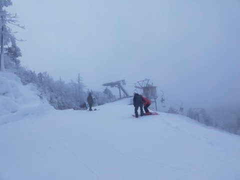

というか．実態は結構固いところも多く，

ちょっとアイスバーン気味で怖いところも

あったようです…

そして，朝9時過ぎには，平日ながらも

リフト待ちが5分ほどになったみたいです…

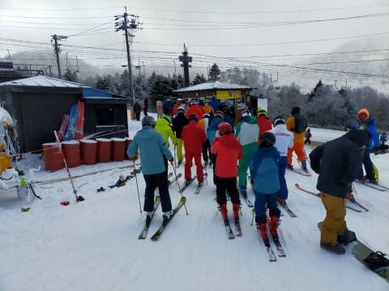

ただ，積もるほどではないのが残念だけど，

雪が降っていて，曇って暗いのもあり視界も

それほど良くなく．

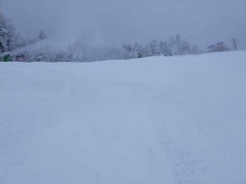

さらに視界が悪いのと人工降雪機アタックと，

下地の雪が硬いってのがあり…

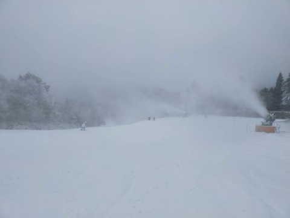

そこまでリフト待ちはひどくならず，

午前中は最大で5-10分待ち．

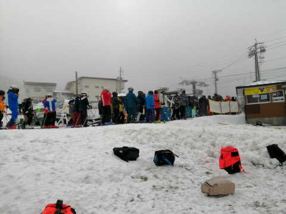

午後1時になったら，リフト待ちはゲートの

外に出ないレベルまで短くなったようです…

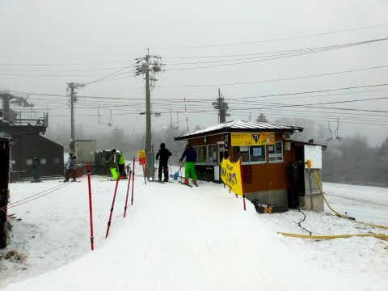

バーンは意外にもブッシュや石は無く．

ゲレンデに穴が開くようなこともなかった

ようですね…

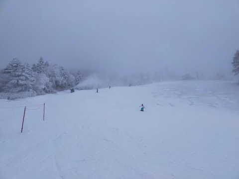

人工降雪が載せてあるところは，硬いところが

あって手ごわかったものの，

ゲレンデの雪の厚みはそこそこ確保されている

みたいです…！！

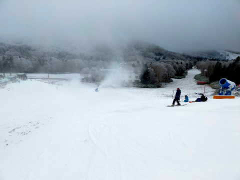

でも．

この日も終日雪は降ったけども，

昼間は積もるほどではなくパラパラ

降る程度で．

　志賀は雪がぱらつくが積もらず．

という当たらなくていい悲しい予想は

当たったみたい（泣）

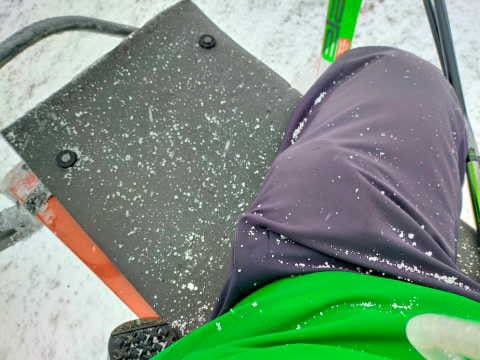

ってなことで．

天然雪は無いけど，昼間も人工降雪機を

動かすというほどの必死の努力で．

29日の雨による壊滅的なダメージから

復活した横手山．

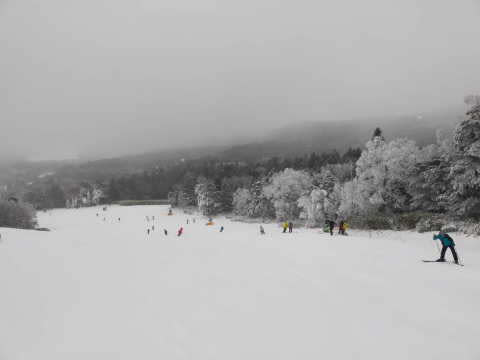

予想より雪も復活してるし．

意外と幅もあるみたいに見えますね…

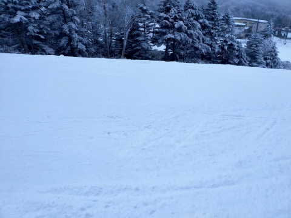

そして，

午後2時ごろには人工降雪機が

止まったようです…

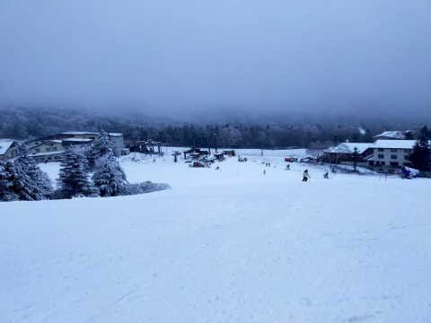

ってなことで．

予想よりまともなレベルで復活したらしい，

横手山．

明日行こうと思っている方は，道路も完全

積雪＆凍結路のようなのでご注意ください～！！

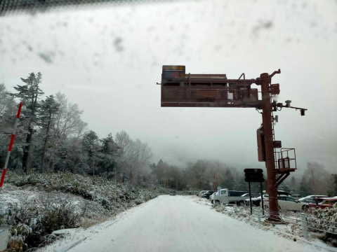

…でも．

明日は，志賀高原で滑れるのは横手のペアと

熊の湯のペアのみ．

…多分，すごい混むんだろうなぁ…

…

…ってなことで．

わがホームゲレンデがオープンしない

この週末．

私はスキーに行くことを諦めました

横手・熊か，あるいはイエティか…

という選択肢があるけれども．

今日も最後の会議が終わったのが

深夜11時で，来週月曜まで締め切り

というご無体な宿題が出されて

しまったし（涙）

12月末までの宿題とか，長期の宿題も

結構抱えているので．

この時期に激込みで雪が少ない横手・熊や

廊下のイエティで滑るより．

来週以降に備えて，雪の悪いこの時期に，

必死にいろんな宿題をこなしておいて，

来週以降に仕事で滑れなくなるリスクを

減らしておきます…

…しかし．

12月の週末に，スキーに行かないなんて．

おそらく，子供が生まれた年以来じゃ

なかろうか…（涙）

海外出張だろうが家の引っ越しが

あろうが滑りに行ったこの私が，

12月の週末に滑りに行かない

事態が生じるなんて…

自分でも信じられない…

## 💬 コメント一覧

### 💬 コメント by (横須賀のウルトラセブン)
**タイトル**: 緊急事態ですね！
**投稿日**: 2022-12-03 07:01:41

Sさんがスキーに行かないなんて～緊急事態なんで

書込みます。馴染みの床屋さんの若旦那が興味深い

事を話してました。当初の予想に反し12月に雪が降

らないのは、〇〇カップが原因だと～多くの日本人

が無意識のうちに暖まれ踊り踊って日本が温かくな

っている～うーんなるほど～セブンも昨日は朝の４

から踊ってました（反省）まさかスキーの化身Sさ

んも無意識に...なんてことはないと思いますが、ス

キーに行かないＳさんが心配になりました。因みに

セブンも初滑りはまだです（泣）早く志賀でＳさん

に会えるのを楽しみにしてますよ～！！！

### 💬 コメント by (かず)
**タイトル**: Unknown
**投稿日**: 2022-12-03 11:03:05

レインボーさん  お久しぶりです  相変わらず元気そうですね！笑  ヤケオク券にしたので朝一奥志賀でお待ちしてます  今シーズンはゴンドラの込み具合が全く読めないですが最悪パークでも入ろうと思ってます  今シーズンもお願いします！

### 💬 コメント by (炎の北海道民)
**タイトル**: Unknown
**投稿日**: 2022-12-04 02:26:02

札幌国際スキー場に行ってきましたが天然雪で山麓まで滑走できました。終始パウダーでいい条件でしたよ。今年は町民スキー場を巡ってみようかと考え中です。

### 💬 コメント by (Skier_S)
**タイトル**: 12月でスキーに行かない週末を過ごすなんて…
**投稿日**: 2022-12-04 03:33:44

＞横須賀のウルトラセブンさま

いや…ホントに緊急事態ですよ！！

しかし，○○カップが原因とは…

私はサッカーはそんなに見ないので，私は加担してないですね（笑）．

とりあえず，来週は何があっても志賀に行く予定です！！

＞かずさま

今シーズンはいつから志賀入りですか？

私は来週からは毎週志賀に行くつもりです…

＞炎の北海道民さま

北海道はね～．冷えてていいですね～…

そのパウダーを志賀まで持って来てください…（懇願）

