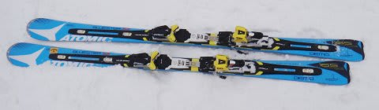
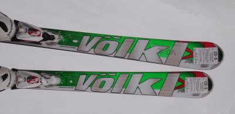

# 今シーズンのお友達…ATOMIC BLUESTER DEMO SX買っちゃった…

📅 投稿日時: 2012-12-11 03:27:55

🏷️ カテゴリ: [スキー雑談](c1f9d2cb7478308da16419928ea3945e9.md)

…昨日の最後の写真．

ATOMICの今シーズンモデルの板が写ってましたが…

はい．

実は．

買っちゃいました．

ATOMIC BLUESTER DEMO SX　X12ビンディング　165cm．

いやーーー．

今シーズン，板を買うつもりはなかったんですよ．

昨シーズンも板を買わなかったけど．

今シーズンも珍しく，まだどの板もヘタってなさそうだし．

特に，SALOMONの24hours LMはまだ調子も良かったので．

「2シーズン，板を買わないで乗り切れるか？？」

と．

甘いことを考えていたんですが．

が．

[こんなこと](e6302c5755708c26ad01f9cd7b82c90ae.md)が起きてしまったため．

「絶大なる信頼を寄せていたショートターン用の板が使えないとはっ！」

…って，動揺してしまい．

…気がついたら，買っちゃってました～．

いやーーーー．

本来なら，もし今シーズン板を買えるなら．

試乗で気に入った[VolklのCD](e4c7fe0c3e886071c5ec445a3c70cbee9.md)がほしいなぁ…

と思っていたんですが．

今回，ヘタッたのは，ギンギンにショートターンをやりたいときに

出動願う，SALOMONのLM．

なので，ギンギンのショートターン板が欲しい．

…ショート用の板で試乗で気に入ったのは，[ATOMICのBLUESTER DEMO SX](eeea1d5e73c2df261178519bab7793bd8.md)だよなぁ…

でも．

高いし．

SALMON LMの剥離に気づいたときには，もう神田の

スキー街からはATOMICのBLUESTER SXの165cmは消え去っており．

店によっては

「SX？9月には売り切れましたよ…（何をいまさら，という目)」

ってな状況．

うーん．

違う板探そうかなぁ…

と思ったところ．

いつも立ち寄るスキー屋に立ち寄ったところ．

「たまたま今，キャンセルの在庫が出たんですが…」

なに？在庫があるだと？？？お値段は…

「これでどうでしょう？」

…この値段は…SXじゃなく，Sの間違いでは？

Sの通販価格より安いよ？いいの？この値段で？

っていう，ありえない安い値段を提示されてしまい．

速攻で購入を決めていたのでした…

…

…あれ？

こんな長くなっちゃった．

…なので，板のインプレッションは次回に続きます…
