# LEVORG，4度目のスタッドレスへ…定番のタイヤ交換ネタ！

📅 投稿日時: 2021-12-12 00:13:36

えー．

本日，ものすごく残念な，

体調不良によりスキーリタイヤ

という決断をした一日だったのですが．

もうだいたい体調は快復し．

今日は娘の新しいスキーウェアを買いに

行ったり，板の手入れをしたりして，

のんびり過ごしました…←でもスキー関係のことばっかりやってたのね

で．今日の焼額ですが．

特派員によると…結構混んでたみたいですね！

2高も，午前中はすごい混みで…

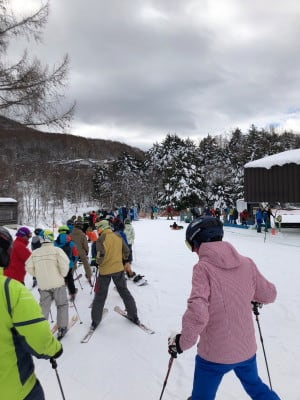

ゴンドラも，午後になっても待ち時間が

あったようです…

12月でここまで待つのは珍しい…！

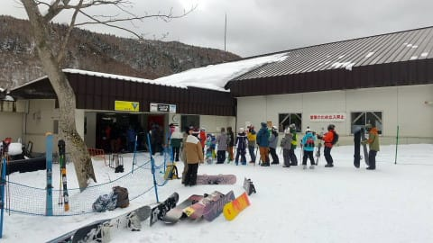

天気は晴れの予想でしたが，

ちょっと雲が多かったのかな…

バーンは硬めだったみたいですけど，

コンディションは良さそう…

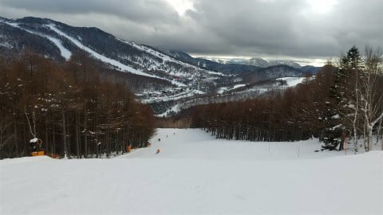

高天ヶ原も山頂から滑れたみたいで…

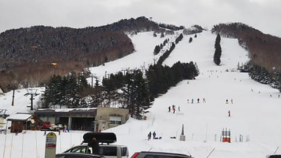

あぁ…うらやましい…

滑りたかった…

で．

明日は，基本的に曇り．

午後は雪が降る天気ですが…

でも，西風になったので，あまり

積もらなさそう（涙）

時折日が射したり，雪雲がかかって

強く雪が降ったり，目まぐるしい

天気かな．

とりあえず，明日は志賀高原に

復活します～！！

ってなことで本題へ．

もう先月の話なのですが．

いつも通り，LEVORGのタイヤを

スタッドレスに交換したので，定番のネタを…

…昨シーズンまで3シーズン履いた

YOKOHAMAのIG5+．

[4.5万km近く走ってかなり減っては
いた](e619fb80d9beb78df92ca8734c0e0717c.md)ものの．

まだギリギリ，摩耗の目安のプラット

フォームが出ていなかったので，

12月中くらいはこのタイヤを使って，

それ以降新しいスタッドレスに替えよう…

という作戦．

いつも通り，夏タイヤを外しますが…

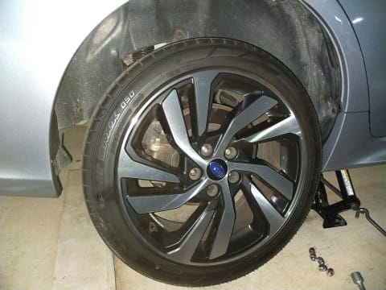

我がVMG LEVORG君，総走行距離は

3年ちょいで7.9万kmほどだけど．

うち4.5万kmはスタッドレスで走って

いるので…

純正の夏タイヤで走ったのは3.4万km

ほど．

純正タイヤ，3年は板にしてはそれほど

減っておらず，まだ使えそうですね…！

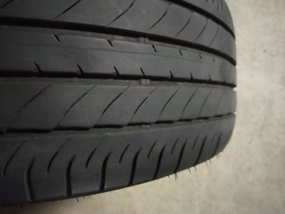

ってなことで．

タイヤを外すと…

やはり，足回りはかなり汚れてますね．

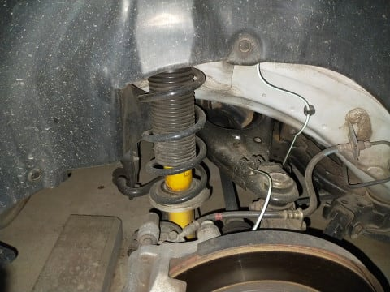

まず，フェンダー内側のプラスチックを

綺麗にしてみますが…

その際にじっくり見てみると，

アーム類の一部やナットにちょっと

錆が出始めて来ていて，

これはあまりよろしくない感じ…

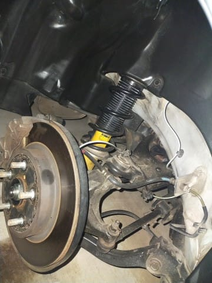

だもんで．

今回は単にきれいにするだけじゃなく．

一部ワイヤーブラシでさび落としをしたり，

徹底的なクリーニングをして…

ピカピカに仕上げました～！

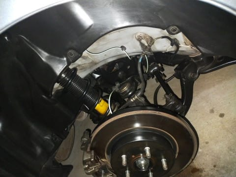

うむ．

とても8万km近く走った車の

足回りには見えない…(自己満足)

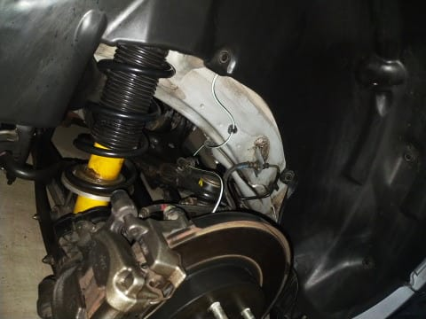

ここまで仕上げたら．

いつも通り，シャーシ下面にクリアの

シャーシコートをかけて…

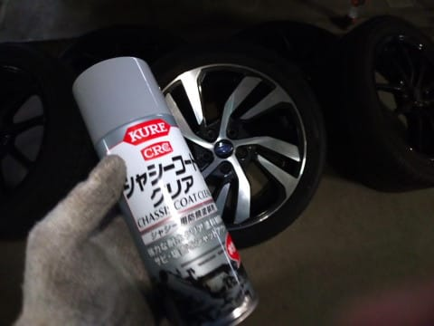

うーん．

トレーリングアームのハブ側取り付け部や

ハブのトーコントロールアームへ伸びる

取り付け部あたり，ちょっと錆が出てる

けど，このあたりにしっかりコート剤を

かけたので，凍結防止剤からひと冬守って

もらいましょう…

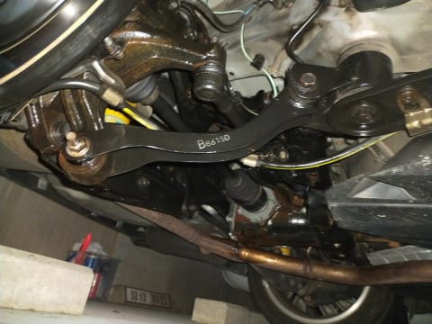

同じくフロント側も．

ストラットはこの夏に不具合対応で

無償交換したばかりなのできれい

だけど…

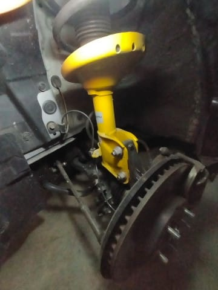

タイロッドとその取り付け部付近は

ちょいと錆が浮きかけてます(涙）

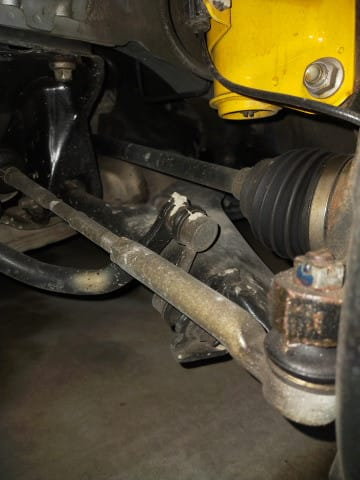

なので，こいつも徹底的にクリーニング！

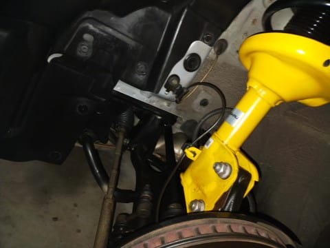

…うん．

綺麗になったかな…

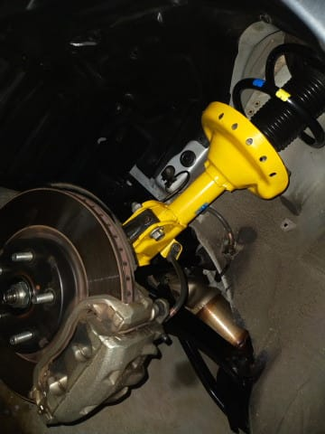

ってな感じで．

約8万km走ってきたLEVORGの下周り．

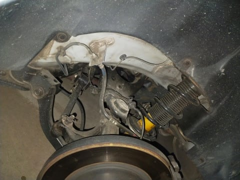

またまたピカピカになりました～！！

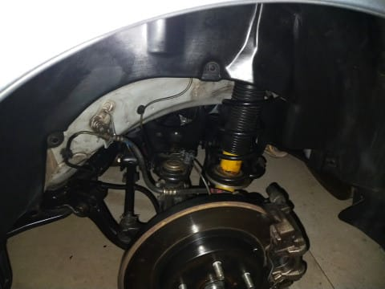

…しかし．

過走行のうちの車．

いつも足回りやエンジンルーム内の

チェックやクリーニング＆さび落としを

しているので．

外装よりも足回りやエンジンルームの方が

綺麗かも…？？

## 💬 コメント一覧

### 💬 コメント by (レインボー74)
**タイトル**: Unknown
**投稿日**: 2021-12-12 19:54:59

日曜日の志賀高原情報

ニゴンは混むとみて二高スタート。今日もポールポジション。数本滑ってニゴンに行くと、やっぱり混んでる。従業員手薄のためか、チケット売場がニゴンのみ。気の毒に階段の上まで並んでる。

すぐに二高に逃げたけど、ゲレンデが荒れ荒れ。最近ではワーストのコンディション。小さい子と一緒だったので、足がプルーク足(？)に。今日も午前様上がりでした。

今夜の雪に期待したいけど、夜の湯田中は暖かい。エス様、是非とも雪予報をお願いいたします。

ヤケビから横手に移動した友人によると、やっぱりヤケビの方がいいとのこと。

まだ山の神リフトや一ゴンが動かないので、車でしか移動できないのが残念！

明日の降雪を夢見て、今夜は寝溜めをします。

### 💬 コメント by (Skier_S)
**タイトル**: ＞レインボー74さま
**投稿日**: 2021-12-13 01:51:13

今日もお世話になりました～！

せっかく行けた日がワーストのコンディションとは…

私の日ごろの行いは悪くないはずなんですが(涙)

