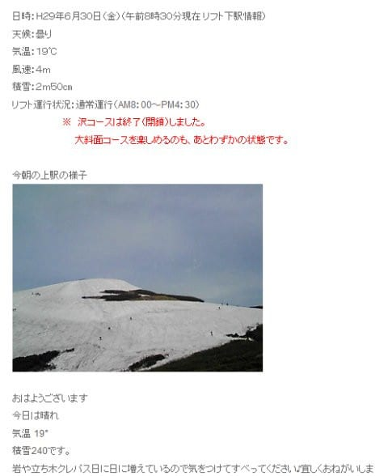

# ということで，明日は月山へ行ってきます～…天気悪そうだけど（涙）

📅 投稿日時: 2017-06-30 21:50:20

🏷️ カテゴリ: [日記](cc4b5682fb7b8b144980957a978653fb0.md)

ってなわけで．

予告通り，この週末は月山へ行ってくる

わけですが．

…やっぱり，土曜は天気が悪そう（涙）．

うーむ．梅雨だから仕方がないか…

しかし，さすが明日から7月ですから．

一気に雪は減っているようで．

（月山朝日観光協会ウェブより）

沢コースは終わり，大斜面も終了がそろそろ

迫っているようです…

…まぁ，6月10日を待たずして大斜面に藪漕ぎが入った

昨年に比べれば，7月にリフトが滑れるだけ，

恵まれてますが…

2週間前にあんなに沢コースが気持ちよかったのに，

もう大斜面も残りわずかな命とはっ！

とりあえず．

あと4時間半後に出発です～

＃相変わらず睡眠時間が短い…

またどんなだったかレポートしますので．

お楽しみに～！
