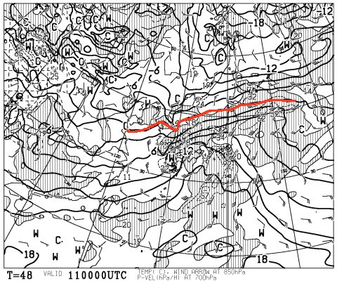
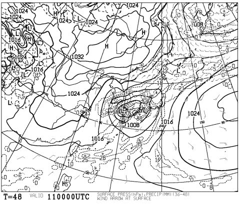
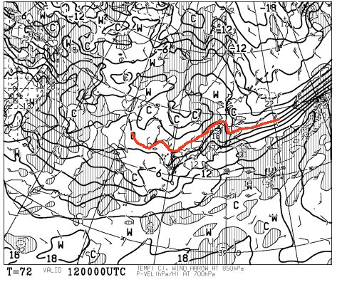
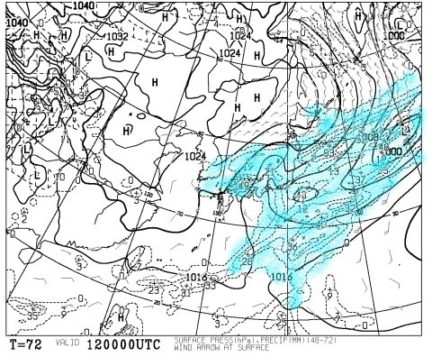
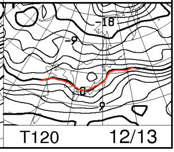
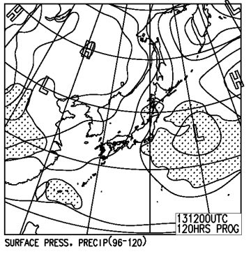
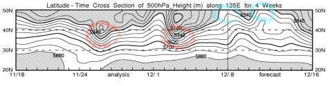

# 今週末の志賀高原の天気は………ダメだ．ダメだよ．壊滅的…（涙）

📅 投稿日時: 2015-12-10 01:44:57

🏷️ カテゴリ: [スキー天気予想](c6554f5c3c106093b511a8daae23757e8.md)

ということで．

タイトルの通りです．

…って感じで終わってしまいたいくらいの

壊滅的な週末が待っていそうな今日この頃．

皆様いかがお過ごしでしょうか（涙）．

えー．

木曜から．

人工降雪機を打つことができないくらい，

ぐんぐん気温が上がり．

…そして．11日の金曜日は．

雨

です（流れ出る涙）．

11日の850hpa予想気温図はこんな感じで．

赤く印した0℃線は北海道近くまで北上しちゃってるし．

志賀高原には，＋9℃線が…

…これは．

志賀高原でも，昼間は+10℃近くまで上がるってことなんですが！？？

12月になって，志賀高原で+10℃って，どうよ？？？

どゆことですか～！！！！（あふれ出る涙）．

そして，金曜の地上天気図はこんな感じで．

低気圧がやってきます．

そう，ひたひたと．低気圧が迫ってくるんです…

これは．

ダメです．

金曜から，雪を溶かす，強烈に高温の雨が

ゲレンデを襲います…（とめどない涙）．

そして．

12日土曜日の850hpa気温図はこんな感じで…

ダメだ．

全くダメだ…

土曜も，赤く印した0℃線は志賀よりはるか北．

志賀高原には3℃線～6℃線がかかる程度なので．

早朝は，運が良ければみぞれっぽいかもしれないけど．

昼間は間違いなく．

空から降ってくるものは，

液体

ですね…（止まらない涙）．

そして．

土曜の地上天気図は…

だ…ダメだ…．

水色に塗った降水域．

日本をすっぽり覆ってるから…

…

土曜日は．

終日雨っぽいですね（耐え難い涙）．

で．

日曜の850hpa気温図は…

…ぎりぎり志賀高原にかかるかどうか…

地上天気図を見てみると…

降水量はなさそう…

ってことで．

日曜は，降らずに済みそうですが．

…ただ，金・土で強烈に融けた雪はそのまま．

日曜も，積雪の積み増しは全く期待できず…（抑えきれない涙）．

…この1週間が，いかに異常なのかは．

FXXN519の，この図を見ればわかるんですが…

この図の上側の網掛けエリア，特定高度線が5400m以下の

領域を示してるんですけど．

この網掛け部分が，赤く印したように，

40Nより下に下りてくると，そこそこの冷え込みの目安で．

30Nと40Nの真ん中より下に下がると，かなり冷え込み，

結構な雪になる目安．

赤い印のある部分．

11月末のスキー場オープンをもたらした寒気が

やってきた11月27日や，

先週の冷え込みがあった12月3日あたり．

網掛け部分がかなり下がっているのが読み取れるかと…．

でも．

青く印した12月8日や，10，11日．

網掛け部分が，50Nより上に行っちゃってます…

…これは，普通．

夏にならないと起きないような状態で．

こーゆー状態になったら，気温が異常に上がります…

…ダメだよ．

冬にこんな風になるなんて，ありえない…

とりあえず．

この悲しい状態をまとめて，土日の予想をしてみると．

土曜：朝から雨．終日パラパラ降る．時折強く降るタイミングも…

　前日からの雨で，道路は完全ウェット．積雪なし．

　ゲレンデも，せっかくの人工雪が2日間続く雨で…一部，

　雪が薄くなって危険なエリアも発生するかも？？

　天然雪部分はほぼ壊滅でしょう．

　気温は+10℃近くと異常な高温ですが，雨なので肌寒く感じるかも．

　雨は一日降り続きます．運が良ければ，夕方は標高が高いところは

　雪っぽくなるかも…でも，かなり湿った雪でしょう．

　ダメです．この日は，ダメです．

日曜：終日曇り．皆さんの日ごろの行いが良ければ…明け方は人工降雪機が

　動かせるほど冷えるかも．

　日ごろの行いが悪ければ，人工降雪機が動かせるほど冷え込まず，

　土曜の壊滅的ゲレンデ状態はそのまま．

　ただ，冷え込んだ場合は，前日の雨で融けた雪が固まって，

　下地はかなり硬いアイスバーン状態になるのかな…

　気温がそれほど下がらなければ，人工降雪機は動かせないまま，

　ザブザブな溶けかけの雪になるでしょう…

　この日は，雨は降りそうにない…ってのが救いか

…ってことで．

…

…日曜の朝の気温が冷えるかどうか，まだ微妙なところがあるので．

直前に，また詳細予想しますが…

…あまり期待しない方が良いでしょう（泣）．

…とりあえず．

スキーヤーの皆さん．

我々ができることは，ただ一つ．

壊滅的な雨が降らないように．

祈るのだっ！！
