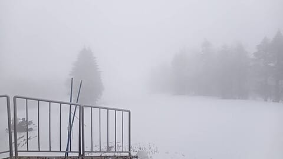
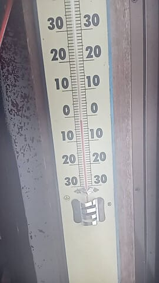
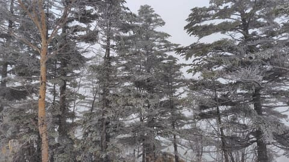
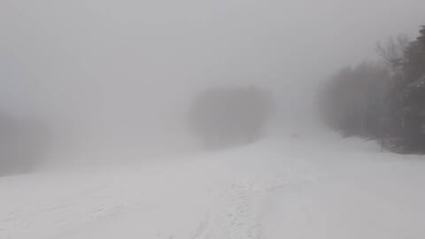
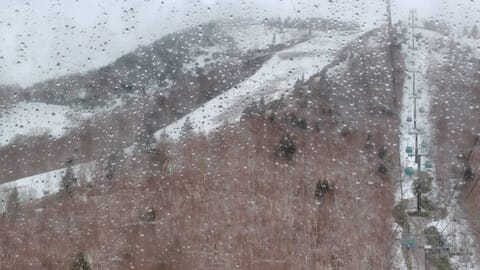
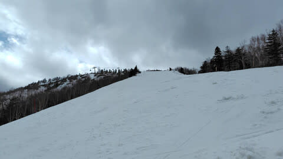
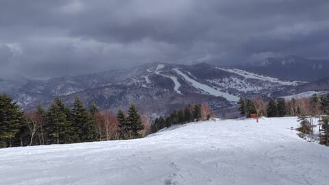
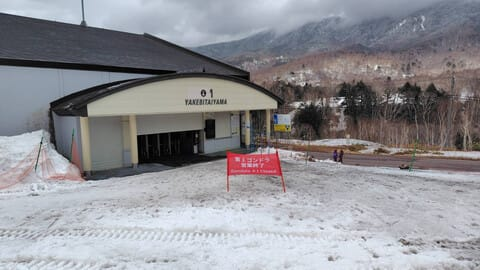

# 4月19日(金)の志賀高原焼額山スキー場は，特派員によれば雪→みぞれ＆麓は雨→昼前に曇り→夕方から晴れ．気温は低め！

📅 投稿日時: 2024-04-20 00:46:07

🏷️ カテゴリ: [日記](cc4b5682fb7b8b144980957a978653fb0.md)

えー．

本日も志賀高原の特派員よりレポートが

送られてきましたが…

やはり，朝のうちは雪だったようです…！

で．

久々に山頂の温度計がマイナスを指してますよ！！

4月に入ってから，初めてじゃなかろうか…

木々も久しぶりに白くなり，冬っぽい

景色が一瞬復活したようですが．

あさイチは下地は氷点下のガリガリバーン

ながら，その上にうっすら積もった雪で

エッジが引っかかってくれて，まぁまぁ

滑り良かったみたいですが…

朝のうちはガスで視界が悪かったみたいですね．

そして．

午前10時ごろには，麓はほぼ雨に変わってきて…

昼頃には雨も上がり，ガスも晴れてきた

みたいです…！

でも，午前は板の滑りは良かったけど，

午後は板の滑りがちょっと悪くなって

行ったみたいです…

で．

営業終了直前には，日も射してきたようで…

営業時に雨＆ガスで，終わるころに晴れる

という，嫌がらせのような天気だったとの

報告でしたが．

…特派員の日ごろの行いが悪かった

からなのかも？？

という言葉は言わないでおきましょう．

とりあえず．

この天気なのに．

早朝から営業終了まで滑る

特派員のバカさすごさには，驚く

ばかりですね…っ！！

ってなことで．

雪→麓は雨→曇り→晴れと天気が

移り変わった本日でしたが．

明日の志賀高原は，朝から晴れますよ～！

早朝はかなり硬めながら，エッジが効く

いい感じの斜面でスタートかな．

通常営業開始を過ぎるころまで，いい感じの

バーンで滑れるんじゃないでしょうか…

午後からは気温が上がるけど，雲が

増えそうなので，そこまでひどく雪は

荒れないかも？？（願望）

日が当たる午前中に，ストップ雪に

ならなきゃいいな…

日曜は…朝から気温が高め．

雪は朝はある程度冷えて硬くなると信じたいけど…

からちょっと表面が緩めかも．

でも，朝から曇り空なので，日差しで雪が

緩むことはなく．

昼間は気温が上がって雪は緩むけど，

ひどく晴れないので，板の滑りは

多少悪くなっても，ストップ雪までは

行かないはず…（引き続き願望）

そして，焼額のリフト営業時間中は，

液体が降ってくることもないはず…

ということで．

今週末も無事土日休めそうなので，

志賀高原で滑ってます～！

…そしていつも通りあと2時間半ちょいで出発…

睡眠時間2時間か…（涙）

## 💬 コメント一覧

### 💬 コメント by (かず)
**タイトル**: Unknown
**投稿日**: 2024-04-20 14:06:33

お久しぶりでした  ちょうどゴンドラで話ししてた件です  あの後友達に誘われて1ゴン下のビール飲みに行ってみました！明日は営業してないみたいなのでコメント見てないと思いますけど  GW前半はまた営業するみたいです  

 なかなか大変と思います  Sさんのブログパワーなら満席になるかなと思いました！笑

### 💬 コメント by (Skier_S)
**タイトル**: ＞かずさま
**投稿日**: 2024-04-20 21:07:22

私もちょっと前を通ってみてみたのですが．

ビールとおつまみっぽいのはありそうでしたけど，お昼をがっつり食べられるような

ランチメニューはなさそうでしたね…

ガラガラだったので，のんびりドイツビールを飲むのには良いのかも？？

明日はやらないのですね…

