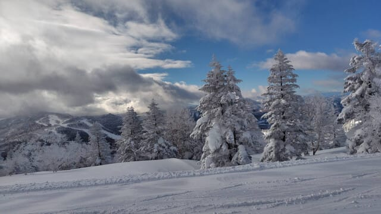
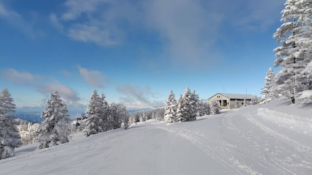
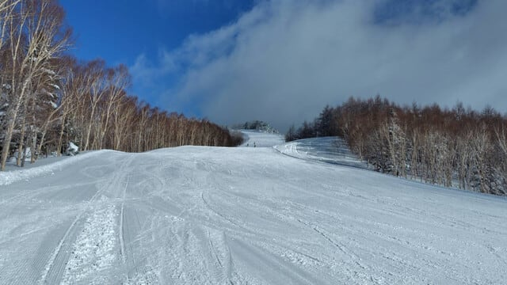
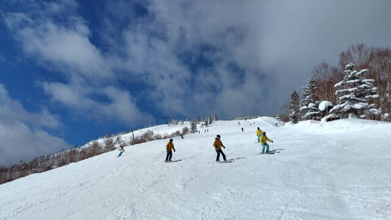
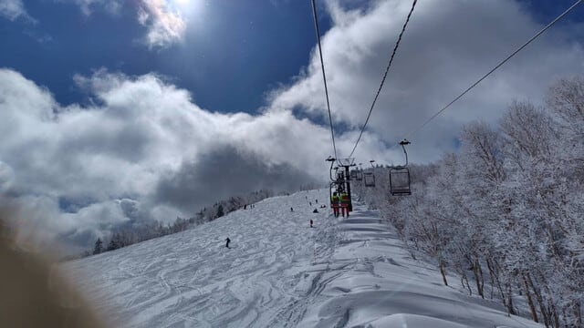

# 2月14日(金)の志賀高原スキー場は，特派員によるとちょっと混んだけど晴れ間も見えるいいコンディション！そして今週末も志賀高原で滑ってます！

📅 投稿日時: 2025-02-15 00:02:52

えー．

今日も志賀高原の特派員から写真が

送られてきましたが…

今日は雲が多めながらも，青空が見えて

日差しがまぶしい一日だったようです…！

飛び石4連休は4日とも雪降りで，

ほとんど晴れなかったので…

うーん．やっぱりこんな感じの晴れた

志賀高原を滑りたい…！！

水曜深夜から木曜の雨の危機も，

雨にならずに済んだみたいなので．

今日は雪も冷え冷えシマシマでいい

感じだったようですが…

焼額は，平日だというのにインバウンドと

団体さんで結構混んでたようです…

ちなみに，焼額以外は全く混んでなかった

ようですが…

奥志賀も雪がよさそうですね…！

ってなことで．

12日深夜の雨の危機を乗り切り，

下地がアイスバーンになることもなく，

いい雪のコンディションをキープしている

志賀高原．

明日土曜は晴れていい天気の，

最高のスキー日和になりますよ～！！

週末の天気の予想は，日曜がちょっと

いい方に変わってます…

ただ，日曜は南岸低気圧が通るので

予想が難しく，低気圧の位置が今の

予想位置よりちょっとでも北にずれると

ガスったり雪が降ったりしますが…

15日(土)：朝から晴れ！朝の積雪0．

　朝の気温は-6℃程度．

　朝イチは締まり気味のいい感じの

　シマシマ！

　晴れたシマシマが滑れる最高の朝！

　昼間は気温も0℃近くまで上がり，

　日差しもありかなり暖かく感じる，

　穏やかなスキー日和．

　日当たりのいいバーンは，雪の

　表面がわずかにしっとりするかも

　しれないけど，基本的には一日

　太陽の下，いい雪で滑れる恵まれた

　一日．

16日(日)：今の天気図なら，

　志賀は曇ったり晴れたり，

　時折一瞬雪が舞うかも…という

　天気．

　南岸低気圧っぽい感じなので，

　低気圧の通過が南北に数10㎞

　ずれただけで天気が変わるので，

　今後予想は変わるかも．

　朝の気温は-5℃程度？

　朝イチは締まったいい感じの

　シマシマ！

　昼間は気温が+3℃くらいまで

　上がりそうなので，標高が低く

　日当たりが良いバーンは雪が

　ちょっと緩む．

　でも，基本的には雪もそこまで

　荒れず，終日フラットないい

　感じで滑れそう．

という感じでしょうか．

今週末は吹雪にもやられず，

穏やかないい感じの週末に

なりそうです～！

ってなことで．

今日もいつも通り，あと3時間後に出発…

明日も朝からナイターまで滑らなきゃ

いけないのに，今日も睡眠3時間以下で

お出かけです(泣)←朝からナイターまで滑らなきゃいいだけじゃないの？？

とみんなツッコミ入れたがってると思う

ではまた，志賀高原でお会いしましょう～！
