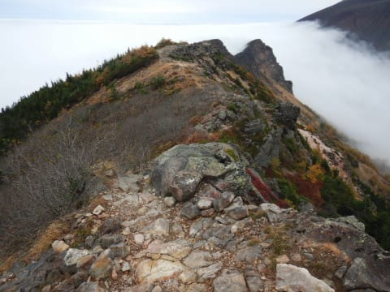

# 仕事が休みだったので，志賀高原へ紅葉を見に…行ったはずが

📅 投稿日時: 2019-10-22 02:27:14

🏷️ カテゴリ: [登山・旅行](c1d637a11a25b457ac978d197adbdafc5.md)

なんということでしょう．

…22日が祝日なので．

休みの谷間となった21日．

冗談で申請した有給休暇が

取れてしまいました…！！←仕事休んでいる暇があるのか？？

4連休ですよ，4連休！！

（どうせならスキーシーズンに4連休が

取れると嬉しかった…）

…だのに．

せっかくの4連休というのに．

土日は天気が悪く（涙）

自宅近辺でうろうろして

いたのですが．

本日は久しぶりに天気が

良さそうだったので．

紅葉を見に，またまた志賀高原へ

行ってきました～！！←一体どれだけ志賀高原が好きなんだ…

ってなわけで．

志賀高原を登っていくと…

うむ．

だんだん紅葉が色づいて

きましたね～！！

…しかし．

例年なら今の時期，紅葉は

すっかり終わっている頃なのに…

今年は紅葉が異常に遅いですね．

まずは，登り坂の途中にある，

「澗満滝」

…この滝があることは

かねてより知っていたのですが．

実は私は，今回初めてこの滝を

見ました…

坊平橋を越えた駐車場のすぐそばに

ある展望台から，こんな感じで

見えるのですが…

いや．

この滝．初めて見ました…．

だって，スキーシーズンの時は

わざわざ立ち寄ろうと思い

ませんから(笑)

でも．

ちょっと紅葉にはまだ

早い感じかな…

で．

次に．

サンバレー手前の一沼に

寄ってみましたが．

ここはちょうど見ごろの感じ！

…ですが．

ちょいと全体に色づきが

甘い感じが…

なんだか，鮮やかな色づきで

「おお！」

という感じの鮮烈さが無いのが，

ちょいと残念…

せっかくなので，天気がいい本日は．

紅葉を見るだけじゃなく，山にも

登ってみようかと思い．

岩菅に行く気マンマンでいたんですが…

え？？なに？？

岩菅山登山道入り口までの道，

台風被害で通行止め？？

（[JARTIC災害情報提供サービスページ](http://saigai.jartic.or.jp/TrafficInformationView/)より）

…この地図だと，一の瀬方面は蓮池から

通れないように見えますが．

実際は奥志賀までは行けます．

奥志賀から先と，一の瀬寮バス停から

岩菅登山口を通り，奥志賀に抜ける

旧道が通行止めです（涙）

…なんということか…（残念）

だもんで．

岩菅を諦めて，笠岳にでも登ってみるかな…

と．

蓮池から横手方面へ登り，

まずは木戸池に立ち寄ります．

木戸池も，ちょうど今が紅葉

ピークを過ぎたころでしょうか…

朝早くから数多くのカメラを

抱えた人が写真を撮ってましたが…

でも，台風でダケカンバの葉っぱが

散ってしまったからか．

普段なら赤く染まった紅葉が

ダケカンバの黄色の中に浮かぶところ．

今年は台風で葉っぱが寂しくなった

黄色い木々の中に，わずかに赤い

色合いが見えるだけで．

ちょっと寂しい感じかな～．

そして．

笠岳に向かおうとしますが．

え？？

笠岳に通じる道も通行止め！？（涙）

うーむ．

笠岳も無理か…（泣）

なら，四十八池から大沼池の，

池めぐりコースにでも行こう！！

…と思ったら．

なに？？？

四十八池から先が立ち入り禁止？

（[志賀高原観光協会トレッキングコース状況](https://www.shigakogen.gr.jp/news/trekking.html)ページより）

ええええ！

大沼池も行けないとは…（激涙）

山に登れないんなら，せめて大沼池に

紅葉を見に行こうと思ったのに…（涙）

あぁ…

台風19号．

西館山中級コースを崩した以外にも．

思った以上に志賀高原に被害を

与えたようです…（泣）

まぁ．

昨日の予想では，今日は晴れそうだったけど．

今朝の予想だと，昼ごろに天気が崩れそうで．

朝のうちから山の上には

雲がかかっちゃってるし．

…まぁ，今日は志賀高原で山登り

する感じじゃない天気だよね．

志賀高原では，紅葉を見れたってことで

満足だよね…

うん．志賀高原の山登りは諦めた．

今日の志賀高原，紅葉を

見れただけで十分．

ということで．

志賀高原以外で山登りすることに

しました～！←結局山登りするんかい！

せっかく志賀高原を登ったというのに．

再び志賀から降りましたが．

…今日は日本中どこに行っても

雲だらけっぽく．

周りの山を見渡しても，

ほとんどの山が雲に隠れている

状態…

東のほう，わずかに雲の隙間が

あるっぽかったので．

いろいろ見渡した結果．

唯一晴れ間があって，

山頂を見ることができた山．

この山の周りを登ってきました～！

たぶん，分かる人には分かると

思いますが…

こんな感じの尾根筋を歩いてきました…

足元狂ったらヤバい感じの

リッジで，かなりビビりましたが．

それだけの価値はある景色でしたよ～！

今日は朝早くから活動してたので．

山登り詳細レポートまで書く体力が

ありませんが．

…もし，気力があったら．

後日，今回の山登り詳細レポートを

やるかもしれません…

ってなことで．

おやすみなさいzzz…

## 💬 コメント一覧

### 💬 コメント by (musi)
**タイトル**: Unknown
**投稿日**: 2019-10-23 19:01:37

雪が無くても、志賀高原ww,Sさんだと、念の為古い板を積んでいるのかな？なんて妄想してしまいました。

でも、山登りも楽しそうですね。

雪積もるのか心配な暖かい日が続きますが、軽井沢は、1102に向けて雪貯めれてるのかなぁ。

イベント目当てに楽しみにしているので、心配です。

あと、遅くなりましたが、1000万PVおめでとうございます。多分50ppmぐらいは、私かな。もっとかな。今シーズンも楽しみにしてます。

### 💬 コメント by (Skier_S)
**タイトル**: ＞musiさま
**投稿日**: 2019-10-24 01:29:16

いや，ホントに志賀高原が好きなんでしょうね（笑）．

軽井沢は，もうかなり雪づくりを進めているように見えますね…

https://www.facebook.com/Karuizawaprincehotelsuki/posts/1203811693141455

とりあえず，意地でも予定通りオープンすると思いますよ！

軽井沢は，これまで予定日に遅れたことが無いはずですし…

そして，1000万PVにご協力ありがとうございます（笑）．

今シーズンもご愛読ください．

