# 2021/12/5(日)の焼額山スキー場，詳細レポート！…オープンの週にしてはゴンドラオープン＆冷え冷え雪で最高のコンディション！

📅 投稿日時: 2021-12-07 03:49:44

🏷️ カテゴリ: [2022スキー滑走日記](cc9cb73e4320f6a97af6fccc37587a61a.md)

えー．

昨日の記事に．

6日は標高の低いスキー場は

パラパラと雨が降る…と書きましたが．

…本日，標高の低いスキー場で降った雨は，

パラパラじゃなかったみたいですね…(涙）

そんな中，特派員によると．

志賀高原は標高が高かったからか，

今日の朝の気温は氷点下で，

全面雨になることはなかったようですが．

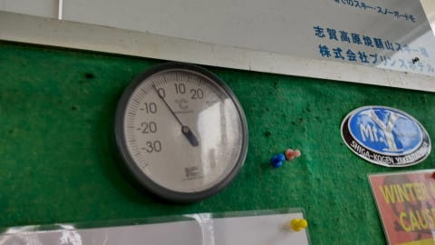

でも，朝から降り始めたのは，

かなりみぞれっぽい雪で…

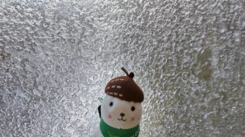

ウェアに着くとすぐにびしょびしょ

になる，限りなく雨に近い雪が，

午前中にそこそこの勢いで降った

ようで…

ゴンドラ乗り場近辺は雨だったのかな？

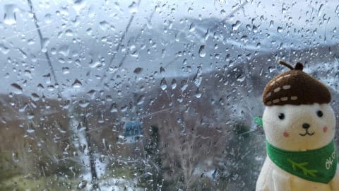

降ったのは午前中時々降る程度で，

一日降り続けたわけではないよう

なのですが…

風が強く，ゴンドラはかなりの減速

運転になっちゃったようです…

この，限りなく雨に近い霙のおかげで，

昨日は最高だった焼額山も，コース上に

雪が薄いところが出てきたみたいです…（泣）

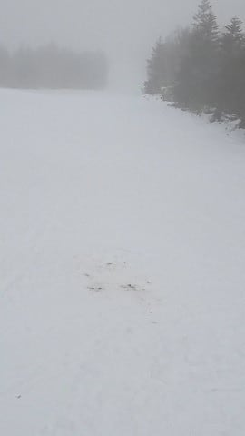

ヤバい．

これから今週末まで，ほぼ天然雪は

期待できないというのに…

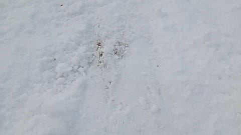

この状況はヤバい…

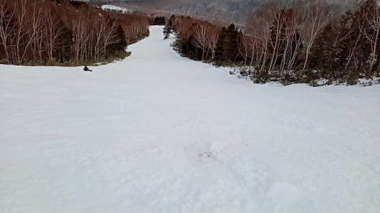

ちなみに．

明日の7日の方が天気はヤバいです．

降ります．

かなり強く，長い間降り続けます…

標高1600m以下はたぶんアウト．

志賀はギリギリ雨と雪の境目かな…

さらにその後も，9日までは高温が続き．

夜も人工降雪機を動かすのは

厳しいかな…

だもんで，今，雪が融けると，

今週末の雪の状態はヤバいかも…

10日からはギリギリ降れば雪の気温なので．

10，11日に雪になってくれると

いいんだけどなぁ…

降らなさそうなんだよなぁ…（涙）

ってな感じで．

今週末は微妙なコンディションになりそうだけど．

先日の日曜の焼額は最高でしたよ～！！！

ここから本題の，2021/2022シーズンオープン

翌日の焼額．詳細レポートです！

えー．まず．

朝，志賀高原への登り坂は…

真っ白な積雪路でしたが，

積雪はわずか2-3cm程度．

あぁ…もう少し積もってほしかった…

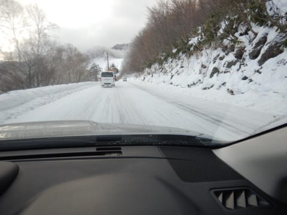

ってなことで．

8:30営業開始の第2ゴンドラに並びますが…

今日も朝イチはかなり混んでますね(涙）

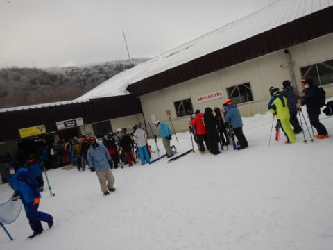

あさイチはゴンドラ10分待ちを超えてそう

だったので．

1本目はゴンドラを諦め，飛び乗り状態の

第4ロマンスリフトへ！

ゴンドラの先頭組が山頂に着く前に

4ロマ沿いのサウスコースを滑れるのですが…

うほ～！！！

まだ誰も滑ってないしましまっ！！

シマシマ，いただきま～す！！

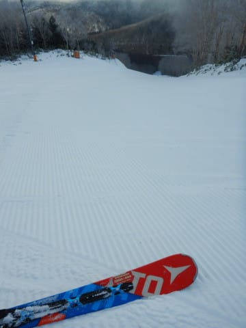

昨晩，2-3cmの天然雪はあったけど．

人工雪を打ち続けていたようで．

人工雪を打った4ロマ沿いのコースは，

シマシマながらも人工雪で硬めの，

スピードが出るバーン！

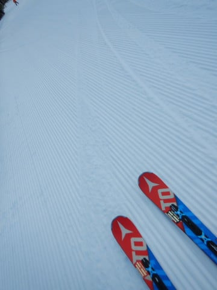

そして．

リフト1本滑った後，朝イチ待ちの列が

はけたゴンドラで山頂へ登りますが…

山頂の気温は-5℃．

うーん．

金曜夜に予想したより，3度ほど

高いか…(涙)

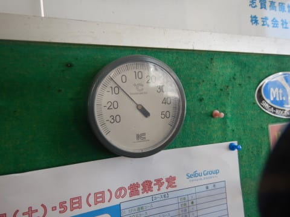

朝イチは曇り空だったけど．

ゴンドラで山頂に上がったら，

日が射し始めてきましたよ…！！

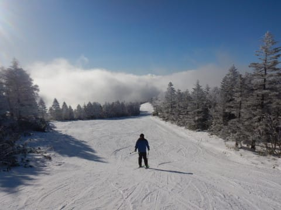

ゴンドラ山頂から4ロマ降り場までの

コースの上半分は人工降雪機が無いので．

コース上半分は，薄っすら積もった

新雪が圧雪された，トップシーズンの雪！！！

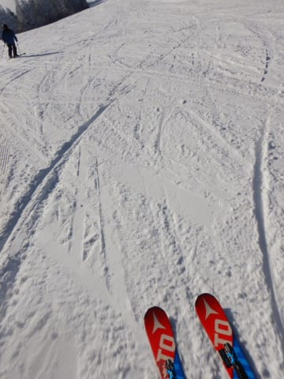

うはーーー！

12月第1週からこんな雪が滑れて．

…それも，ゴンドラが滑れるなんて，

シアワセっ！！！！！

…と，気持ちよく1本滑ったら．

リフト待ち10分(涙)

土曜はここまで混んでなかったのに…

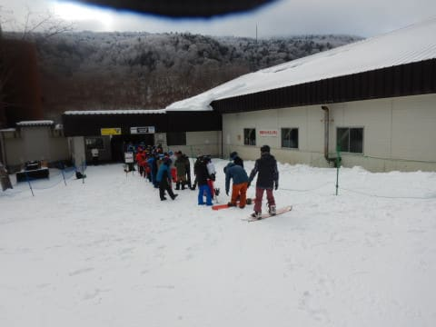

やはり，ゴンドラ乗車定員3人というのが

効いているのか…（同一グループなら

定員6人乗車までOK）

さらに，ゴンドラと4ロマで人が

送り込まれるコースは…

イエティほどじゃないけど，ちょっと

人が多めだったかな…

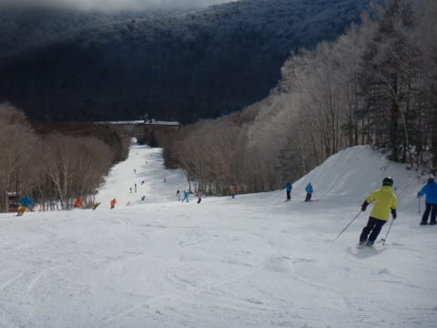

朝のうちは気温が低かったので，

バーンは硬めをキープ！

でも，人工雪を打っている4ロマの

サウスコースは，ところどころに

コロコロが出てるところもあり，

ちょいと注意が必要だったかな…

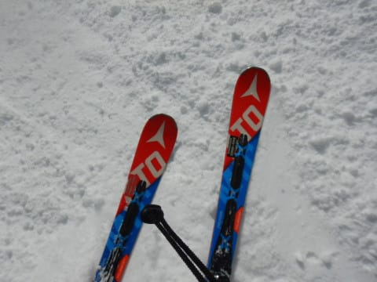

だけど，昼に向けて

雲一つない晴天になっていったので…

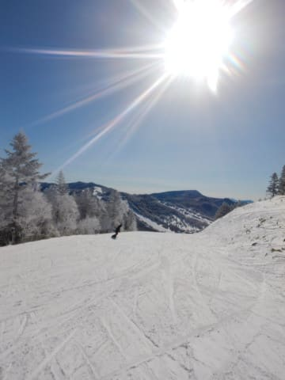

人工雪がガッツリつけてあり，かつ

急な部分では，人工雪の硬い下地が

終日残ってましたが．

それ以外はこの日差しのおかげで，

昼近くになるとコロコロも緩んで

無くなっていき．

ちょっとしっとりした，しっかり

エッジが嚙むバーンに！

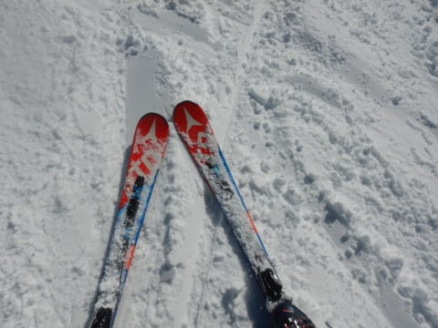

もう，これはほぼトップシーズンの

景色じゃないですか！！

こんなにいい天気で，雪も良く，

全面真っ白でゴンドラが滑れるなんて…

焼額のシーズンオープンでは，

ここ10年ほどで最も良いコンディション

じゃ無かろうか！？？

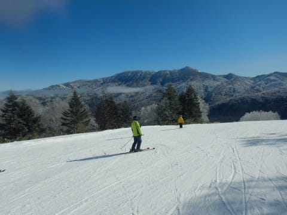

ゴンドラも，11時までは10分近く待ってたけれど…

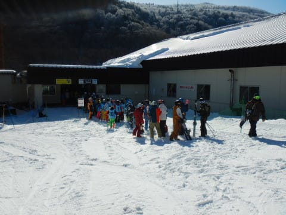

みんながお昼休みに入る11時半過ぎには，

列が一気に短くなりましたよ！

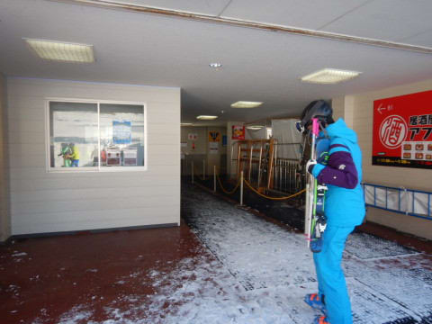

午後は，ゴンドラ待ちは大体ゲート内に

収まるほどに短くなり…

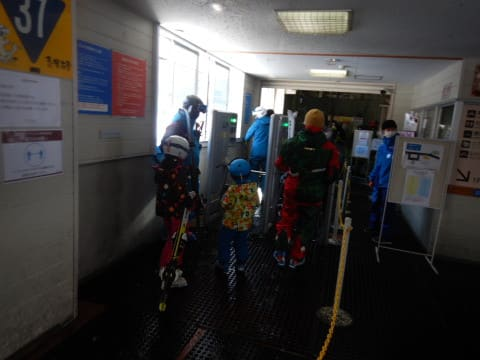

コース上の人も少なくなってきました！！

…いや．

12月第1週としては恵まれてる！

すばらしい！！

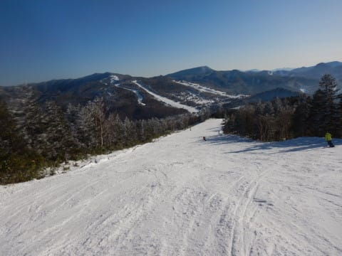

さすがに午後になってくると，

バーンも荒れ気味になってきちゃったけど．

でも，土やブッシュが出てくる気配はなく．

新品の板をもってくればよかった…と

後悔するほどのベストコンディション！

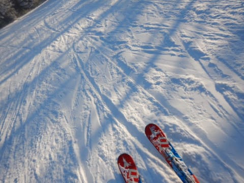

これまで，ゴンドラがオープン初日に

開いてくれた年でも，雪が薄くてすぐ

ブッシュだらけになったり．

雪が積もったばっかりのモサモサで，

大勢が滑るとすぐに雪が剝がれたり…

ってことが多くて，

安心してコースを飛ばせることは

少なかったけど…

今年は恵まれてるよ…！！

…と，感動の涙を流しつつ．

今日も15:45のラストリフトまで，

ひたすらグルグル滑り続けたのでした…

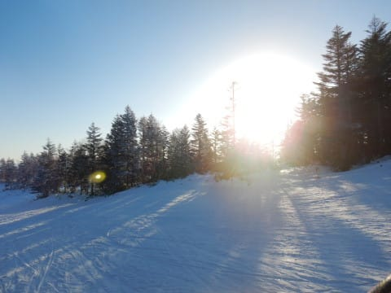

いや．

良かった．

オープンの週からいきなり，こんな

しっかりしたバーンで，ゴンドラを

終日思う存分滑れるなんて！！

11月末に雪が積もった後，12月1日に

雨が降ってしまい残念と思っていたけど．

この雨で下地がしっかり固まってくれたのが

すごく良かった気がする…！

で．

今日の雨っぽい雪でブッシュが出始めて．

さらに7日も降ってくるのが液体か固体か

微妙な天気となると…

…もしかしたら．

この土日のほうが，今週末の土日より

コンディションが良かったのかも…？？

とりあえず．

今週末のコンディションも良くなるように…

そう，7日が雨にならないよう，

全身全霊を込めた冷え冷え踊り

を踊っておきますので．

もし，7日の志賀高原が雨じゃなくて

雪になったら．

それは私の冷え冷え踊りの効果です！！

皆さん，感謝してください←違う．それは違うから

## 💬 コメント一覧

### 💬 コメント by (レインボー74)
**タイトル**: Unknown
**投稿日**: 2021-12-07 09:19:50

残念なお知らせ

焼額第三高速をメインに、皆様に親しまれたナイスガイ安井さんが、今年から他へ。とても親切で温厚な人でした。

また、ニゴンや二高で愛想を振りまいてくれた超イケメンのレオ君もです。悲しがる女性が多いかと。お世話になりました。

お二人のこれからの人生に幸あれと！

### 💬 コメント by (レインボー74)
**タイトル**: Unknown
**投稿日**: 2021-12-07 13:00:49

火曜日のヤケビ情報

朝から雨。暖かい。朝の上林5℃　蓮池3℃。

ミゾレっぽい雨で、途中で二三度ゴーグルを拭わないと見えない。四本目にしてやっと拭わずに滑れた。

前日よりゲレンデは相当悪化。地肌が増えてきた。とりわけ驚くのは、パノラマの壁の左側に危険ポールが張ってあること。

とは言っても平日のがらがらヤケビ。楽しくないはずがありません。気持ちよく滑っても私は77km/h止まり。他の２人は90を超えてました。この雨雪で、雨嫌いの隊員一人が滑らずに待っていたので、未練残りのまま11時前に終了しました。ヤケビの整地は素晴らしいですね。私でも安心してとばせます。

### 💬 コメント by (Skier_S)
**タイトル**: ＞レインボー74さま
**投稿日**: 2021-12-08 01:28:07

えええ！

安井さんもレオさんも，今シーズンはいないんですね！！！

この週末お会いしなかったので，遅れてやってくるのかな…

と思っていたんですが．

残念です…

