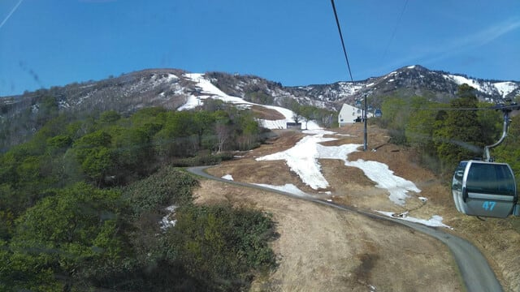
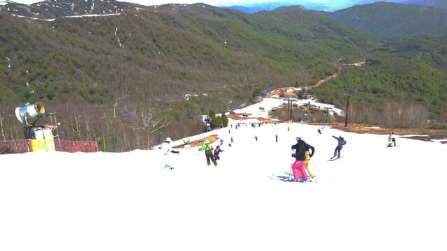
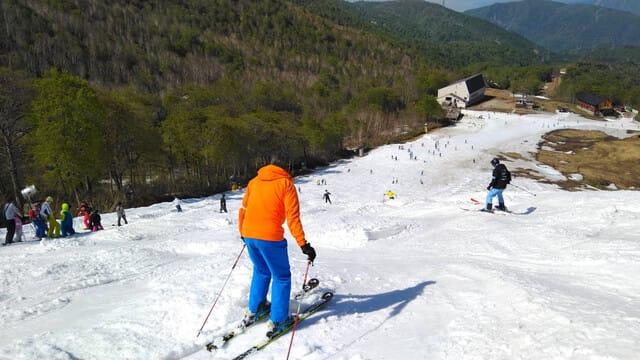
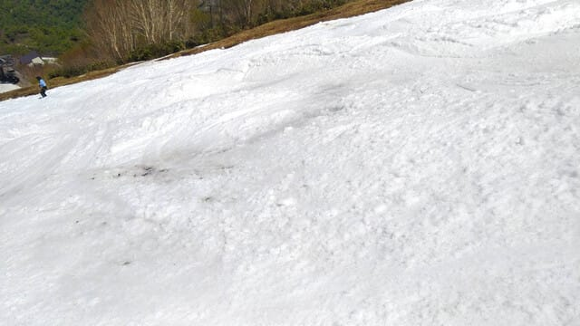
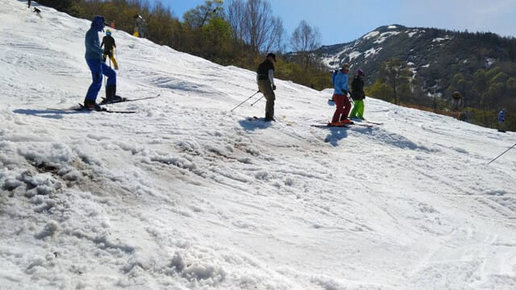
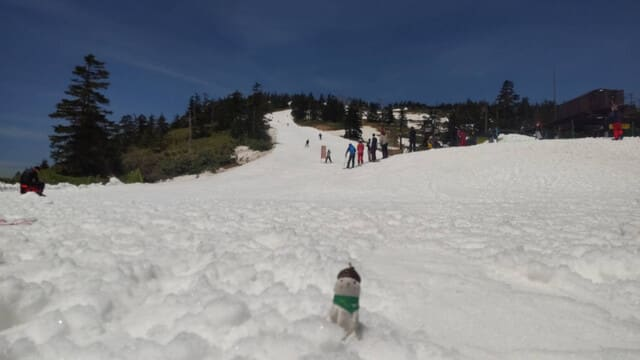
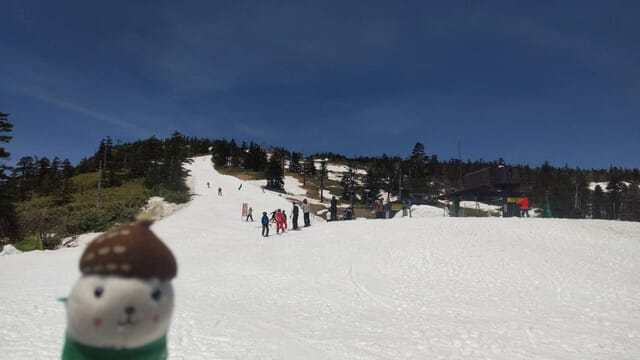

# 5月11日(土)のかぐらスキー場と渋峠の特派員情報…晴れで気温は高く，土曜としてはどっちもかなり空いていたらしい

📅 投稿日時: 2024-05-12 00:20:36

ということで．

本日はGW明けの激務の寝不足を

癒すべく，昼過ぎまで12時間以上

寝ていたSkier_Sです…

なんてったって．GWは10連休でしたが．

1日目：朝から5時間かけてタイヤ交換＆

　下回り磨き．その後オイル交換，洗車，

　社内清掃で夜（泣）

2日目：朝から関東某所へ家族でドライブ．

　スキーシーズンの罪滅ぼしのため家族に

　地元の海鮮やら何やらをごちそうして

　夜9時過ぎ帰宅

3日目：朝3時発で志賀高原へ

　300㎞運転してラストリフトまで滑る

4-5日目：朝5時起きで早朝から

　ラストリフトまで滑る．

　そして夜は飲み会

6日目：朝8時からラストまで志賀で滑り，

　夜9時過ぎ帰宅．そのまま徹夜で出発

7日目：夜寝ずに朝まで7時間半走って

　妻実家＠関西某所へ．現地で昼食やら

　買い物やら夕食やら，1日運転係

8日目：朝から関西某所観光．

　午後6時現地発，500㎞8時間

　一人で運転して深夜2時過ぎ帰着

9日目：さすがにスキーをあきらめて

　昼まで寝る．昼間はスキーシーズンに

　できなかった買い出しやら板の

　手入れやらで夜に…

10日目：3時間睡眠で朝2時半発，日帰り志賀

　焼額＆横手滑って帰宅夜10時

…ってな感じで．

10日間の走行距離2500㎞．

車の中で過ごした時間が

何時間になることやら…

という感じだったので，

はっきり言って，10連休で仕事の

疲れが取れるどころか，むしろ疲れた

GWだった

ということに，さらに加えて

GW明けの4日間の激務が厳しかった

ので．

今日は昼過ぎまで死んだように寝てました．

でも．

元気になったので…

明日かぐらへスキーに行きます！！

で．

今日のかぐらですが．

特派員からの報告によると…

雪はかなり減ったようです（泣）

リフトはそこまで混まなかったようですが，

雪解けでコースが狭くなったので…

コース上の人は多いですね（涙）

そして，朝から雪は緩く，午後になると

多くの人の掘削作業により凸凹が

激しくなり…

コースは数か所，コブ溝に土が出てきた

ようです（涙）

途中2か所ほど，コースを横切る形で

川が流れるように水が出てきて，

コース上には石ころも多数あるよう

なので…

まぁ，石ころふみ用の捨て板で

行くのが正解とのこと．

とりあえず，

明日がファイナルとなるかぐらは，

明日も結構気温が上がりそうだけど，

曇り空なのでそこまで暑いと感じない

だろうし，今のところリフト営業終了まで

雨が降らずに持ってくれそうです！！

で．

一方．

いつものおこみん特派員から渋峠の

写真がおくられてきましたが…

渋峠は，あさは多少緩み気味ながらも

きれいなシマシマで結構楽しめた

みたいです…

気温がかなり上がったので，昼間は

ザブザブだったと思いますが，

リフトも土曜日にしてはガラガラで，

晴天の中楽しめたようです…！！

ってなことで．

明日，ファイナルかぐらで滑ってます～！

…って，今日もあと4時間後に出発．

せっかく昨晩は長く寝たのに，

今日はまだ3時間ちょい睡眠に戻っちゃった…（泣）

## 💬 コメント一覧

### 💬 コメント by (ねも)
**タイトル**: Unknown
**投稿日**: 2024-05-12 05:37:43

Ｓさん　あちらに返信ありがとうございます。

何だかお仕事以上にご活躍のGWだったようで(-_-;)、ご苦労さまです。

骨折ってそんなにかかるんですか⁉️　私は夏山には間に合うんじゃないと楽観してるのですが(笑)

私のような高齢者には、骨折→ギブスというイメージですが、今回はギブスなし、手術して折れた骨を金属で固定したようです。そして、とにかく患部を動かせと(ﾟ-ﾟ)

３週間前、秋田県警ヘリのお世話になりました。警察の山岳遭難統計に１件プラスです😅

### 💬 コメント by (Skier_S)
**タイトル**: ＞ねもさま
**投稿日**: 2024-05-13 00:40:52

あら…ヘリのお世話になったんですか…

それはなかなか大変でしたね…

骨折からの復活は，骨折の部位と折れ方によりますが，

プレートを埋めた場合，ブーツの中に入る部位だと抜釘してからじゃないとブーツに

当たって痛いのでブーツが履けないとか，いろいろあると思うので…

あとは太い骨じゃない場合，抜釘する前は危ないスポーツ禁止とか言われました．

（プレートをひん曲げるような転倒とか衝突をすると障碍が一生残る…と私は脅されました（笑））

でも，夏山に間に合うくらいの早期快復するよう願ってます…

