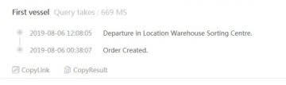

# Amazfit GTRスマートウォッチを買ってみた，その1…海外通販での購入，配達完了！

📅 投稿日時: 2019-08-20 03:06:14

えー．

[妻に買ったXiaomi Mi Band4](ef8e3ae2c99db116031ff816e681de30f.md)が

結構使えそうだったので，

なんだかうらやましくなってしまい．

…物欲に負けて．

ついつい私のスマートウォッチも

Getしてしまいました～！←スキー以外にも，物欲にあふれているのね…

ただ．

妻に買ったものと，全く同じものを買っても

面白くない．

とはいえ，妻が使っているのを

見ていると，Xiamiは私の予想以上に

品質やら出来がいいので．

Xiamiの他のモデルを探して

みると…

ふむ．

Xiaomiは，スマートウォッチの

ブランドとして，

「Amazfit」ってのを展開して

いるのか…

このAmazfitのスマートウォッチ．

日本では代理店があるものの，

店頭販売はしていないようですが…

でも，調べてみると，日本で通販で購入

した人の使用レポートなんかも，

結構あって．

ふむ．

お値段の割には品質もしっかりしており，

機能的にもなかなかとな…？？

そして．Amazfitのスマートウォッチ．

「スキーモード」

を搭載しているモデルがいくつか

あるようですね…！！！

[このレポート](https://till0196.com/post5591)によれば．

GPS搭載のスマートウォッチ，

Amazefit Paceなら，

滑走本数，最高速度，平均速度，

移動軌跡，昇降グラフ，心拍数…

とかが見られるようで．

…これって，今使ってるSuunto

Altimaxの後継機として使えるよ！！

スマートウォッチならではの，

着信通知機能やら運動＆心拍数

ログ機能がついてるうえに，

普段スキーに使ってるAltimaxより

高機能なGPS利用のスキーログ機能を

備えていて，

そしてこれが，1万円ちょいで

買えるのか…！？？

…これは，買わざるを得まい…っ！！

…ってなことで．

Amazfitのスマートウォッチ．

いろいろあって，何を買おうか

迷いましたが…

スキーモードを持っているのは，

AmazfitのPace，Stratosの2モデル．

このどちらかを買おうかと

思っていたところ．

7月に，Amazfit GTRという最新

モデルが発表されるようで…

まだ，発売されたばかりなので，

日本国内で入手している人は

誰もいないようですが．

このモデルも，スキーモードが

あるようです！

この新しいモデル，

従来モデルだと5日しか電池が

もたないところ，

時計だけの利用なら74日，

通常使用で24日程度もつらしく．

スマートウォッチの問題である，

電池もちが驚異的に改善してる

じゃないですか！

GPS連続利用でも40時間．

スキーモードで一日8時間GPSを動かしても

3～4日は充電無しで使えるということだ．

そして，本体厚さも，

従来モデルが約15mmと分厚いのに対し，

約10mmと，かなり薄型！

そして，従来モデルの60gに対し，

36gとかなり軽量で，

アルミボディのデザインもいい感じ！

さらに，5気圧防水，

傷に強いGorilla Glass，

GPS内蔵だけじゃなく，

単体気圧計にコンパスまでついて．

当然のごとく，心拍計装備．

ただ，Amazfit Paceなら1万円で買えるところ…

Amazfit GTRは1.5万円か…

ちょいと高いけど．

普通に使ってれば1か月近くもつ

電池もちの良さは魅力だし．

新しいモデルの方が，いろいろ

機能改良されてるだろうし．

サポートも長くしてもらえそうだし．

ここは新しいGTRを買ってみよう！！！

…とはいうものの．

発表されたばかりのモデル．

海外でも，注文は受け付けているものの，

まだモノの配送が始まっていない…

というレベルらしく．

当然，日本のAmazonなどでも

取り扱っているところはなく．

日本でも割と有名な海外サイト，

Gearbestで注文しました…

画面には，16349円って出てますが．

10900円（＄100）以上購入で1090円（＄10）

割引のプロモーションがあるので，

実際は15259円で買えました～！

ただ，送料無料のRegisterd Air Mailだと，

遅いときは一か月くらいかかるとのことだったので．

送料472円を払って，最短3日で着くらしい，

Expedited Shippingを選び．

そして，8月5日の深夜に注文しちゃいました～！！

で．

注文後．

荷物追跡サイトを見ていると…

8月6日に「倉庫出たよ」という状態のまま，

8月8日まで全く動かず…（涙）

うーむ．

海外通販って，こんな感じだよね…

最短3日で着くってことになって

るんだけど…

と，思っていたら，

8月8日にようやく動き出し．

ふむ…輸送会社に渡されて，

香港の配送センターみたいなところまでは

行ったようですね…

この時点で，配送業者のDHLから

「13日の配送予定」

とメールが来ました．

うーん．

5日注文で13日着となると．

注文から8日後の到着か…

まだまだ待たなきゃならないな…

と，思ったところ．

翌日には…

え？？

もう，K奈川県まで動いてるじゃないか！

…これは，配送ロッカー受け取りにすれば，

13日より前倒しで受け取れるかも？

…と，配送予定メールにかかれていたDHLの

URLから，到着場所をロッカー受け取りに

速攻で変更！

そうしたら…

なんと．

翌10日の朝には，配送ロッカーに

届きました～！！！

到着予定日より3日早く，

注文5日目に受け取れました！

いやー．

海外通販の配送を，Webから

荷物がどこにあるのかがリアルタイムで

追いかけられて．

さらに，荷物の動きを見て，配送中でも

配送先を変えられる…ってのは．

なかなか素晴らしい．

送料472円かかるけど，

DHL便にしてよかった…

ってなことで．

注文5日後に受け取れた，

Amazfit GTR．

次回以降，開封の儀式＆利用インプレッションに

続きます…！！

## 💬 コメント一覧

### 💬 コメント by (Hide)
**タイトル**: お手頃価格
**投稿日**: 2019-08-21 12:10:04

S 様

これお手頃価格で良いですね。

オレもポチろうかな・・・。

DHLやUPSは、料金・手軽さ・速さともにリーズナブルですよね。

しかし通関はザルですが・・（笑）

### 💬 コメント by (Skier_S)
**タイトル**: ＞Hideさま
**投稿日**: 2019-08-21 22:00:38

いや，GTRはまだアプリがしっかり対応してなかったり，

日本語対応がいまいちだったり…

もう少し待ちのような気がします．

今買うなら，電池持ちが最大5日と短く，$10ほど高いですが，

Amazfit Stratosの方が機能が多くて，メッセージもちゃんと日本語で

表記されるし，スマホアプリもスキーモードに

対応していたり，いいかもしれません…

