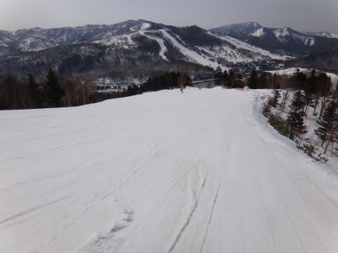

# 4月14日，日曜の志賀高原のゲレンデ速報！

📅 投稿日時: 2013-04-15 00:55:28

🏷️ カテゴリ: [2013スキー滑走日記](c91dbe557f9a69230b1600e48622fdd61.md)

で．

今日も帰宅が遅いので，速報バージョンで…

昨日は最高の一日を過ごしたわけですが．

その最高のコンディションが忘れられなかったので．

今日も早朝へ行ったんですね～．

でも．朝から気温がプラスだったので(涙）．

昨日ほどの「最高！」ってわけには行かず．

わずかに固まった感じの，柔らかめの斜面…

って感じだったのがちょっと残念だったけど．

まぁ，楽しめましたよ！

天気は朝から気持ちよく晴れて…

日差しが暑いくらい．

…というより，暑いよ．昼間に山頂でプラス10度(涙)．

…気温がプラスで晴れるということは．

雪が結構やわらかくなるということで．

板がもぐってしまうほどザブザブ，ってところまでは行かなかったけど．

午前10時ごろには結構荒れ荒れになったのでした…

そして．

強い日差しで雪が解けていくに伴い…

ゲレンデはところどころ，茶色くなっちゃいましたね～．

ところどころ板が張り付く部分も出てきて，

ゲレンデの一部は，ちょいと滑りが悪い雪の場所もありましたね～．

当然，午後にはこんな感じでボコボコになっちゃってます…(涙)．

んでも．

朝のうちは良かったし．

天気もよく．

朝10時まではそこそこ楽しめましたね～．

何よりかにより．

先週までは

「あー．GWまで，雪がもたないかも？」

と思っていたけど．

この一週間の冷え込みで．

先週からまったく雪が減っていないのがうれしい！

うーん．積雪量，GW前半は大丈夫そうな感じ…．

…とりあえず．

明日また詳細報告します…

しばしお待ちを！
