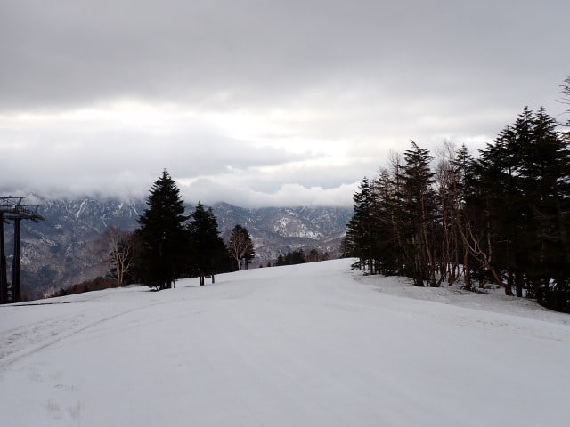
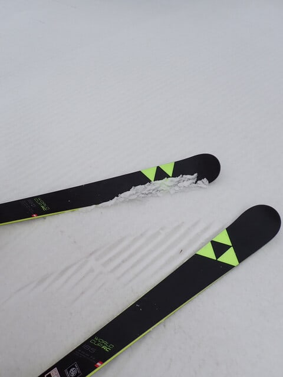
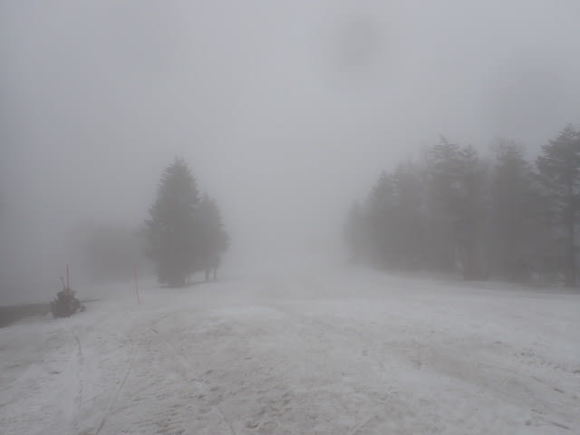
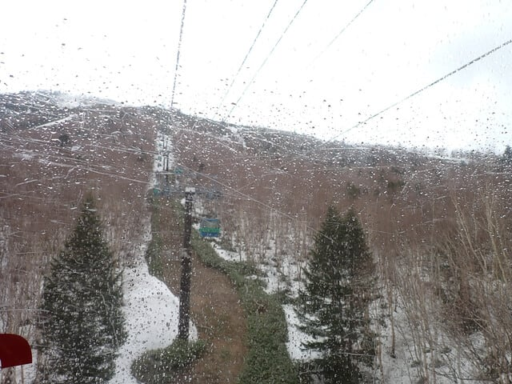
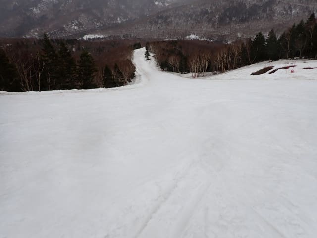
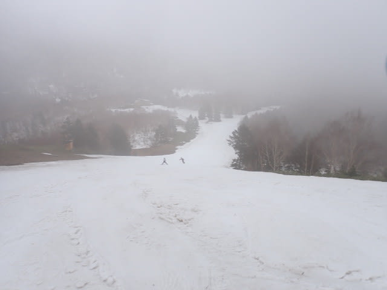
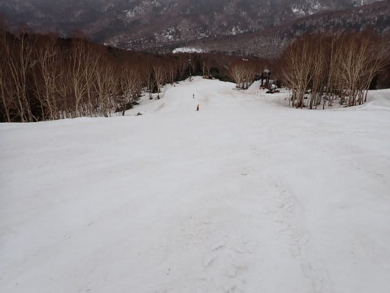
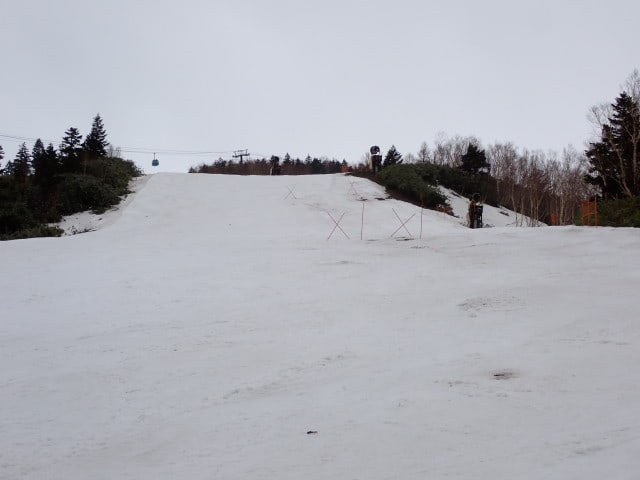
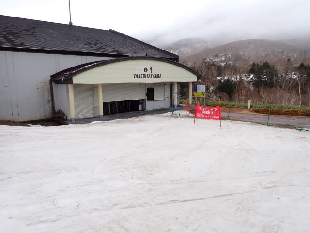

# 2025/5/6(火・振休)，GWラストの志賀高原スキー場，速報レポート！…焼額山営業最終日は曇り→雨が降ったりやんだりでガラガラの一日

📅 投稿日時: 2025-05-07 01:33:26

🏷️ カテゴリ: [2025スキー滑走日記](cacd3fbf84d4a679ee61a5894c3f95e14.md)

えー．

本日をもって，志賀高原は熊の湯と横手以外

の全てのスキー場で営業が終わり．

我がホームゲレンデの焼額も，

本日をもって今シーズンの営業が

終わりました…（涙）

スキーシーズンとはなんと短いものよ…

ってなことで．

GW最終日も，志賀高原で滑ってきて．

先ほど帰宅したわけですが．

…今日も朝5時に起きて早朝から滑って，

今は深夜1時半．

今日の活動時間も20時間を越えてきて

しまってます…（泣）

明日も仕事なので，今日は帰宅日恒例の

速報モードにて，本日…焼額営業最終日の

滑走レポート！！

まず．

本日も早朝6時スタートだったわけですが．

早朝はちょいと明るめの曇り空でスタート！

…ただ，明け方に雨が降って，志賀高原へ

登ってくる路面が濡れてるな…

と思っていたけど．

どうやら山頂付近では雪だったようで…

なんと，シマシマの上に積雪が！！！

びっくり！！！

この時期の雪は板に張り付いて滑りが悪く

なったりするけど．

今日の雪は結構滑りました…！

そして早朝営業の間は，天気は雨にならずに

もってくれましたが…

山頂付近がガスってきたな…と思ったら，

一般営業開始の8時ごろ，ちょうど雨が

降り始めてきました（泣）

このあとは，天気は終日降ったりやんだり，

ザーザーぶりではなかったものの，

パラパラとした雨が降り続けて，

レインウェアがぐっしょりするほどの

雨になったり，ときおり止んだり，

ポツポツと降ったり…という天気で．

悪天候だったので，ゴンドラ1本

滑っても誰にも会わないか，せいぜい

1-2人追い越すかという程度の

ガラガラ具合！

山頂付近は時折ガスが出ることも

あったけど．

ガスがかかるのは山頂付近だけで，

それもときどきかかる程度で，

コース下部はガスがかかることはなく，

視界はそんなに悪くなかったし…

何より雨のおかげで妖怪板つかみは

発生せず，板が良く滑る雪だったし，

さらに人がほとんどいないので…

営業終了まで，バーンはほぼフラット！

ラストまで大回り板で滑り続ける

ことができましたよ～！！！

まぁ，雨のせいで，GSコースの一部に

土が出て竿が立てられた部分もあった

けど．コース上に土が出ていたのは，

この写真に写っている右側の部分だけ．

それ以外は，最終日のラストまで

GSコース，パノラマ＆サウスコース・

パノラマインコースが，ほぼコース幅

いっぱい滑れるましたよ～！！

ってなことで．

今日も15:30のラストまでしっかり滑り．

12月からほぼ毎週通い続けた焼額山に，

2025シーズン最後の別れを告げてきた

のでした…

いやー．

今日は雨のおかげで雪は滑ったし，

雨が降ってもそこまで視界は悪く

無かったし．

人が少なくてどこを滑っても貸切り

バーンだったし．

ラストまで荒れず，営業終了まで

大回り板で気持ちよく大回りできたし…

恵まれたラストデーでした！

そして，今シーズンは雪が多く，ラスト

デーの最後の1本まで楽しめたので，

かなり恵まれたシーズンでした…

焼額山スタッフの皆さん，今シーズンも

ありがとうございました～！！

また来シーズン，よろしくお願いします！

## 💬 コメント一覧

### 💬 コメント by (おぼう)
**タイトル**: Unknown
**投稿日**: 2025-05-08 06:56:31

焼額おわっちゃいましたね。お疲れ様でした！

ずっと気になってたのでお尋ねします。

妖怪板つかみと、ストップ雪は同じ現象ですか？

それとも別で、同時に発生してしまうこともありますか？

１月、２月しか滑りに行かない軟弱者なのでみたことないんです

### 💬 コメント by (ねも)
**タイトル**: Unknown
**投稿日**: 2025-05-09 06:14:42

Ｓさん　お疲れさま(*^-^)ﾉ

ここまで滑れば十分に長～いシーズンでは？　あとはオーストラリアでも行ったら(笑)

Ｓさんの足元にも及びませんが、雪いっぱいで、私も良いシーズンでした(^^)

足首骨折の影響を懸念しましたが、整地を滑るには支障なかったたよう(^^*)(山歩きは下山にやや難ありです)

### 💬 コメント by (Skier_S)
**タイトル**: コメント回答遅れました！
**投稿日**: 2025-05-09 13:22:19

＞おぼうさま

妖怪板つかみとストップ雪は同じ現象です…

雪が汚れて水が浮いてくるとスキーが全く滑らなくなります(涙)

一度4月下旬に滑ってみてください…体験できますよ！(笑)

＞ねもさま

いや…シーズンは短いです（泣）

でも，今シーズンは雪が多くいいシーズンでしたね～！

まだまだ楽しめますよ！

