# 3月16日，日曜の志賀高原詳細レポート…昼過ぎまでは晴天快適！…だったのだが．

📅 投稿日時: 2014-03-18 00:20:22

えー．

どうも，昨日は．

新規投稿のスキー場レポートより．

その前日に書いた試乗レポートの方が，PV数が多かった…

という事実をつきつけられ．

このBlogのメインである，スキー場レポート書く

モチベーションを一瞬失いかけたところですが．

それでも，レポートを書くっ！

継続こそ力なりっ！←だから，何の？

…と，思った今日この頃．

皆様いかがお過ごしでしょうか．

…という，よくわからない時候の挨拶が終わったところで．

昨日，速報モードで報告した

日曜の志賀高原の，詳細レポートをば…

えー．この日もですねぇ．

私の日ごろの行いの良さのおかげで．

朝からスカッと晴天っ！！

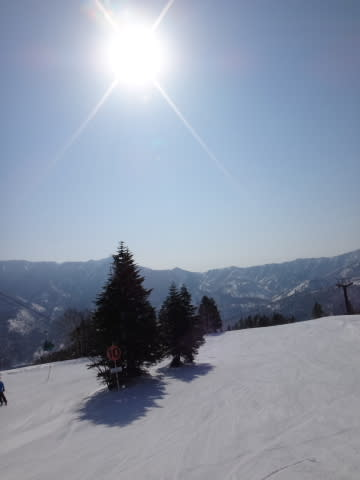

いやー．

今日も私の日ごろの行いの良さのおかげで，

いい一日になりそうですね～．

んで．

…朝の山頂の気温は，マイナス5度と．

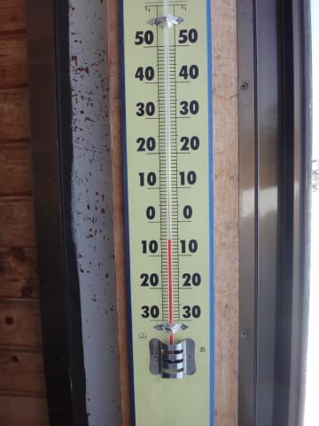

まぁ，これまでに比べれば高めだけど．

3月中旬と考えると，かなりマシかな～．

ってことで．

いつもより気温は高めでも．

マイナス気温の雪がきれいに圧雪されて…

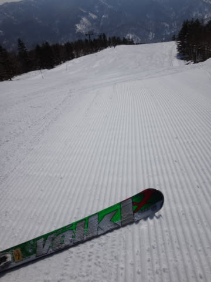

この日も朝は，いつものシマシマバーンがお出迎え！

朝イチの，快晴のゲレンデを．

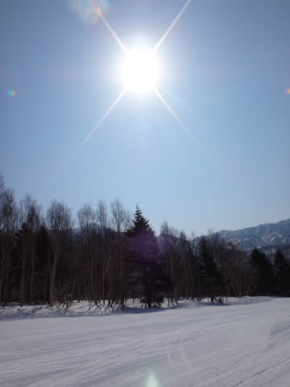

そして，人がいなくて快適なゲレンデを．

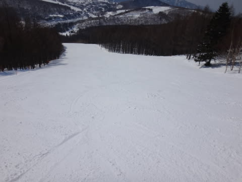

大回りマシンの，VOLKL Platinum CDで思う存分堪能するのだっ！！

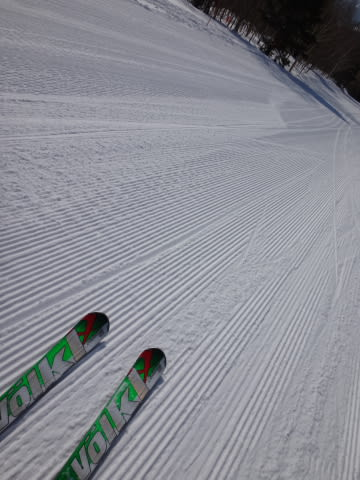

ぶわはははははははっ！

3月下旬で，こんな幸せでいいの～っ？？

10時過ぎくらいに．

一瞬，ゴンドラ待ちが2-3分まで伸びちゃったものの…

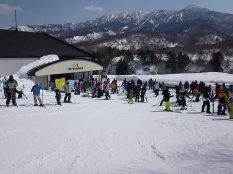

それ以降はゴンドラ待ちもほとんどなく．

ゲレンデは人が少なめで．

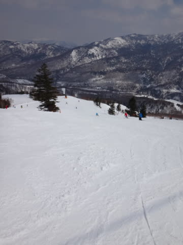

うむ．

快適じゃ…

と，思っていたものの．

やはり．

12時近くには…

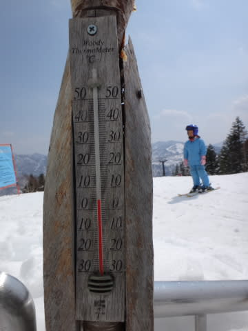

あうーん．

気温はプラスに上がっちゃいました（涙）．

そして，雪も…

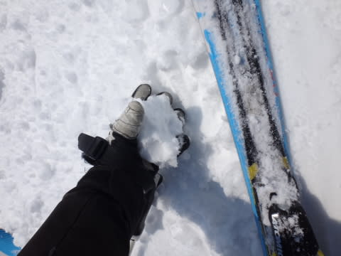

握ると固まっちゃう，水気を含んだ重い感じに…

でも．

ゲレンデの見た目はこんな感じで．

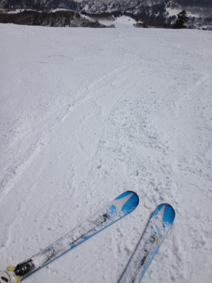

壊滅的にどぼどぼ，ってわけじゃなく．

ちょっと重めかな～，って程度．

って感じで．

娘と昼過ぎまで，スキーを堪能した後は…

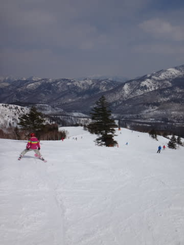

ちょっと遅めのお昼を兼ねて．

焼額プリンスホテル西館のレストランでやっている…

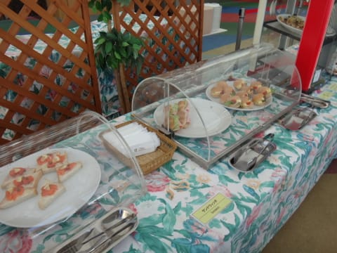

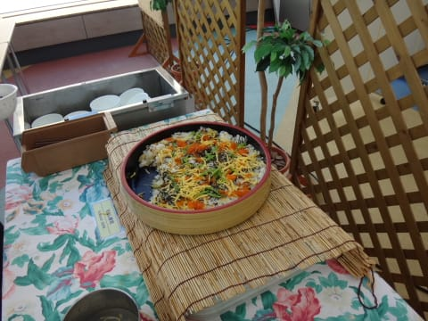

ランチ＆デザートバイキングで…

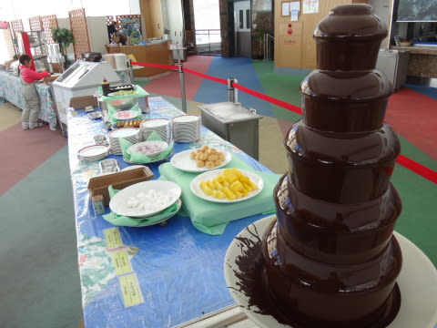

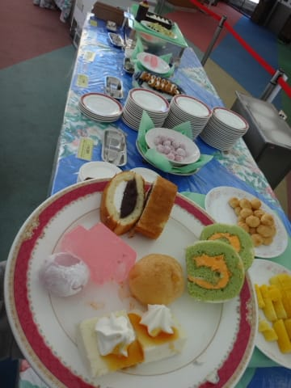

娘と一緒に…

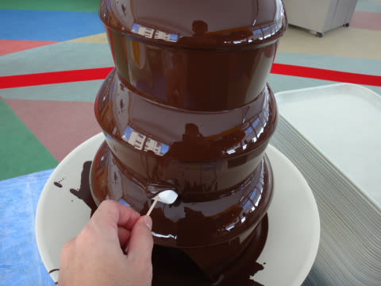

ちょっと幸せタイム．

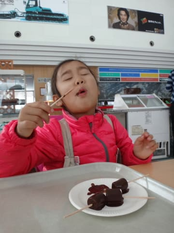

しかし．

娘はたいへん幸せそうだけど．

私のホントの幸せは，ここではなく，ゲレンデにあるのだ．

食事はそこそこに切り上げて，ゲレンデに出なくては…

ってことで．

…まだまだのんびりしていたい，という

娘と妻を置いて．

私一人，いざ．午後のゲレンデに出動！

と，いった，午後2時頃…

あれ？

なんだか．

ちょっと曇りだしたなぁ…

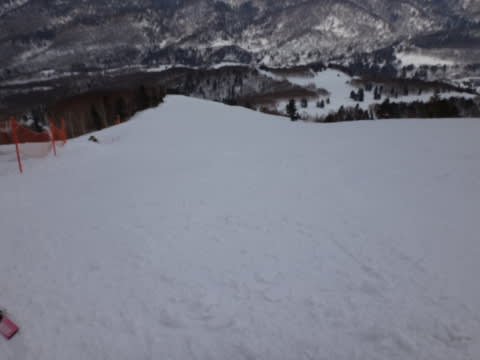

気温がそんなに高いわけではなかったので．

…日が陰ると，昼間の日差しで緩んだ雪が．

あっという間に固まりだしちゃうよ…（涙）．

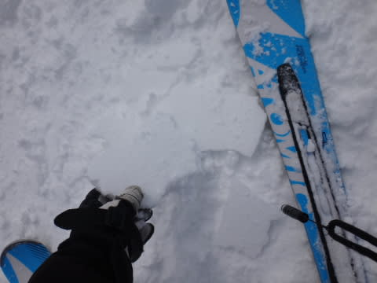

と，思っていたところ．

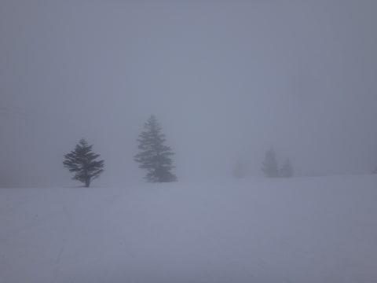

ん？ガスが…

そして．

午後3時過ぎには．気温も急降下し．

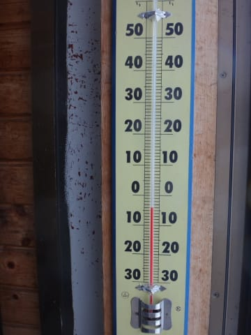

なんだか，激しく降ってきちゃったんですが～！！

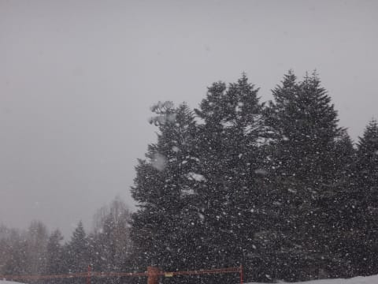

そして．風も強くなり，

吹雪っぽくなってきたんですが～！（涙）

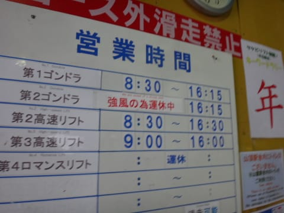

第2ゴンドラ，強風で止まっちゃったんですが～っっっ！！！

娘と滑っていた2時間ほど前までは，ぴかぴかの快晴

だったというのが，信じられない…（泣）．

…って感じで．

かなりイケていた午前中と，午後3時以降の天気の

落差があまりにも激しかった，日曜だったのでした…

しかし．

娘と滑っていた時は，晴天ピカピカ快適コンディションで．

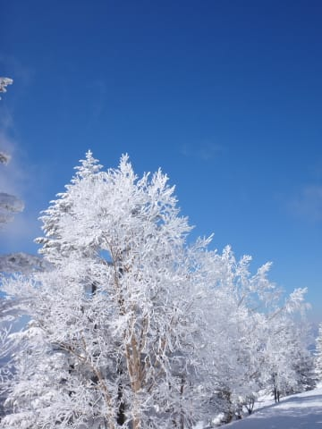

…娘を置いて，私一人だけ出てきた午後に限って，

にわかに掻き曇り，ガス＆雪＆ゴンドラ運休するほどの風に

なっちゃったというのは…

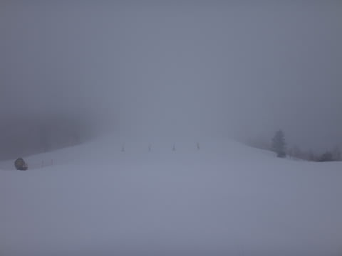

…も，もしかして．

日ごろの行いが悪いのは，私か…っ！！？←今まで気づいてなかったの！？？

PS.

どーでもいいけど．

娘．

やっぱりそれ，足折れてないかい？

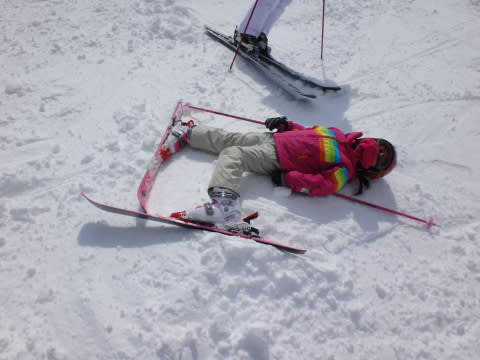

## 💬 コメント一覧

### 💬 コメント by (青いレーサー)
**タイトル**: 試乗レポート
**投稿日**: 2014-03-18 01:22:01

試乗レポートまとめサイトにリンクが張ってあるから仕方ないですね．

### 💬 コメント by (Skier_S)
**タイトル**: 青いレーサーさま
**投稿日**: 2014-03-18 01:49:30

コメントありがとうございます～．

そうなんですよ…まとめサイトから飛んできて

くれる方が多いみたいで…

…でも，試乗レポートでもスキー場レポートでも，

読んでもらえるだけありがたいです（感謝）．

### 💬 コメント by (れお)
**タイトル**: いいな～
**投稿日**: 2014-03-18 09:27:33

先週末サイコーな感じですね。いいな～、志賀行きたかった・・・。

今週は、金・土と志賀高原に行く予定です！

降雪もありそうですね。でも風も強そう。

今週の天気予報も楽しみにしてます♪

私も、Sさん探し頑張ってみます～。

### 💬 コメント by (aqura)
**タイトル**: 天気急変でしたね
**投稿日**: 2014-03-18 12:38:17

土曜日の夜出て、日曜日、一ノ瀬で、娘2号はスノボスクール、私はスキースクールに入っていました。天気急変しましたねU+1F602。焼額山がガスってきたなと思ったら、あっと言う間でしたね。今週末の連休にも行きたいなぁ。でも、仕事が……

### 💬 コメント by (Skier_S)
**タイトル**: 今週末も…
**投稿日**: 2014-03-19 00:57:31

>れおさま

いやー．

この週末も，日曜の夕方以外はいい感じでしたよ！

次の週末も，今の予想天気図のままなら，

いい雪で滑れるかも…

金曜日から3日間，私はいつも通り焼額第1ゴンドラを

ぐるぐるしていますが…

…探すほどのものでもないかと（笑）．

>aquraさま

親子そろってスクールですか！

私は人生一度も「スキースクール」というところに

入ったことがないので…

＃デモレッスンとかは受けたことあるけど

しかし，天気の急変はすごかったですね～．

ぜひ，今週末も！

