# 2014年10月，小学生の子連れでパラオへダイビングに行ってみた，その34…午後はカヤック＆シュノーケリング

📅 投稿日時: 2015-09-30 02:02:49

えー．

しばらく，ファミリーキャンプの

レポートが続きましたが．

…そして．

キャンプの次の週は，4泊5日で北海道の

旅に出ていた気もするんですが．

…ここで，またパラオ旅行記，復活です．

うーむ．

キャンプでもカヤックレポートをしましたが．

…ここでまた，シーカヤックツアーの

レポートです…

ということで．

久しぶりのパラオ旅行記へ，Go！

---

ということで．

お昼ご飯の後は，オプショナルツアーに行くわけですが．

今回お願いしたのは，「シーカヤック＆シュノーケリングツアー」．

出発前から，

『最終日の午後，ダイビングできないからまるまる時間があくけど，

　一体何をしようか…』

と，悩んでいて．

たまたまホテルにあったパンフレットに載っていた，シーカヤックツアー．

娘に，

S　「シーカヤック，乗ってみたい？」

と，試しに聞いてみたところ

娘　「乗りたい！乗りたい！」

という，たいへん大変前向きなコメントを頂いたので．

昨日，ダイビングショップから予約してもらいました．

…しかし．

私に似て，アウトドアな遊びには

大体興味を示すわが娘．

…やっぱり，シーカヤックにも惹かれたか…

＃将来どんな娘になってしまうのか…と，ちょっと心配にもなる

ってことで．

午後1時にツアーのピックアップの車に乗って…

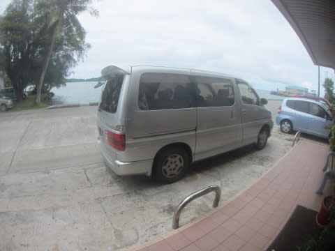

KBブリッジを渡っていくのですが…

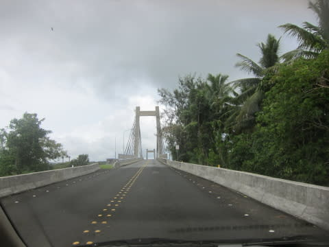

うーむ．

この橋に併設の水道管が壊れて，悲惨な目に

あってるのかっ！！！

…などということを考えつつ．

到着したのは，シーカヤックツアーを主催している

「Nature Island Resort」

とかいう，日本人向けツアーガイドのお店．

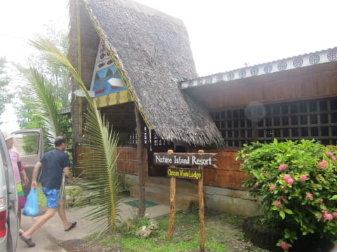

ライフジャケット＆マリンブーツを身に着けたら，

これからのシーカヤックのコースや見どころの

説明をうけて…

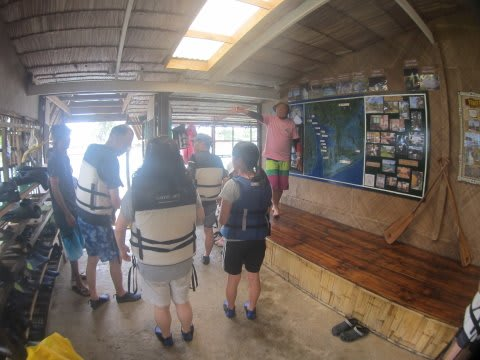

そして，シーカヤックツアーのスタートポイントまで，

ボートに乗って移動となります

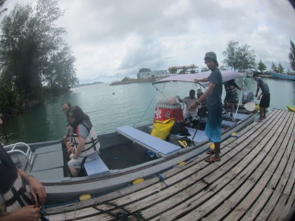

我々の乗るカヤックは，このボートの後ろに．

カルガモの子供のごとく引っ張られていってます…

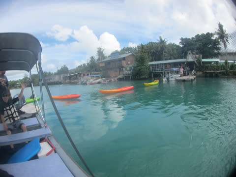

ってことで．

さっき上を通ったKBブリッジを，今度はくぐります．

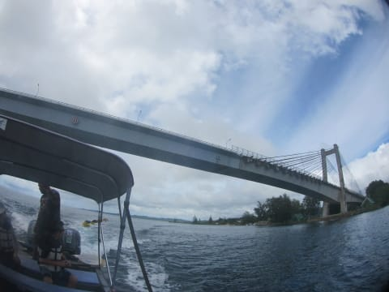

うーむ．

この橋に併設の水道管が壊れて…（以下同文）

KBブリッジをくぐった後，ボートで20分ほど

揺られていましたが．

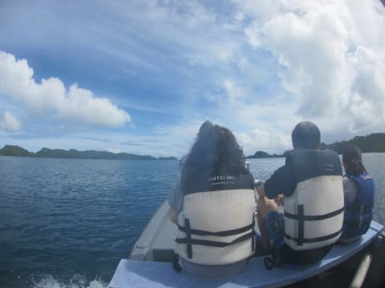

どうやら，シーカヤックのスタートポイントに

着いたようで．

ボートからカヤックに乗り移ります．

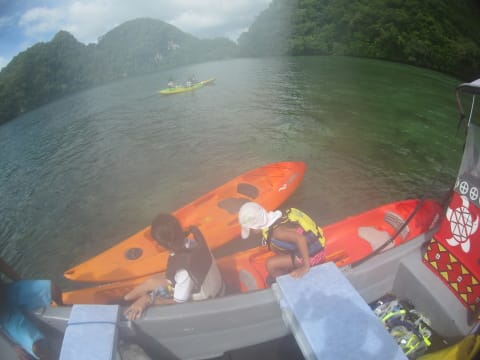

＃ちょっとレンズが曇ってる（残念）

わが家族は，タンデムのシットオントップの真ん中に

娘を乗せて，3人で1艇．

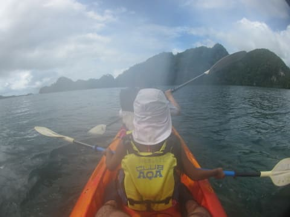

＃厳密には定員オーバー？？

娘もしっかりパドルをもらって，

嬉しそうに漕ぎ始めましたが…

…本来が2人乗りのタンデムカヤックなので．

3人でパドリングすると．

タイミングが悪いと，パドルがバコバコ

ぶつかるんですが…（涙）．

娘よ，

嬉しいのはわかる．

分かるんだが．

むやみやたらと漕ぐのはやめてくれ…

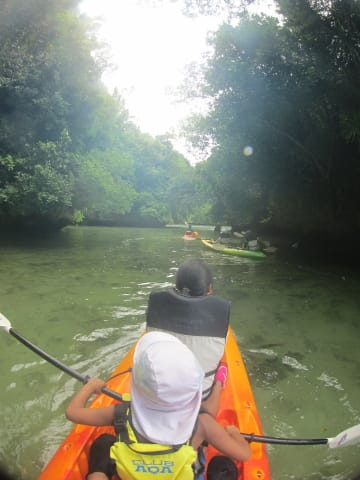

…でも．

なんだか，秘境っぽい感じになってきて．

楽しい雰囲気になってきましたね～．
