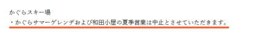

# え？かぐらサマーゲレンデ，2020年のこの夏は営業しないの…？？

📅 投稿日時: 2020-06-09 01:18:53

えー．

会社から顔写真を電子ファイルで提出するように

言われたので．

適当にスマホで撮って送ったら，

美肌モードがバリバリ効いていた

みたいで．

「Sさん…（実物と違って）えらいお肌ツルツルですね…」

と言われたSkier_Sです．

デカ目とか小顔モードとかにはなっておらず．

顔の形が変わってなかったので，ついつい

気づかずに送ってしまいましたが．

皆さん，気を付けましょう…←何に？？

ってなことで．

本題へ．

本日．

久しぶりにかぐらスキー場のホームページを

見に行ったら．

夏営業の案内が出ていたのですが…

（[かぐらスキー場ホームページ](https://www.princehotels.co.jp/file.jsp?id=315219)より）

ふーむ．

…苗場は夏営業するのね…

でも，やっぱり密な空間を避けるためか，

ゴンドラは営業しないのか…

…ふむふむ…

…うん？？？

え！

えええええ！？？

ええええ！！

今シーズン，

かぐらサマーゲレンデ，営業しないの？？

和田小屋もやらないの？？？

状況さえ収まれば，7月か8月から観光振興策も

やろうかと言っているのに．

まさかこの時点で，

早くも営業をギブアップするとは…（涙）

冷静になって，文書をじっくり読んでみると…

うーむ．

需要動向を鑑み…ってあるので．

需要が無いから営業しないってことなのかな…？？

かぐらサマーゲレンデ，行ったことないので

普段どのくらいお客さんが来ているのかは

知らないのですが…

普段からお客さんが少なかったのかな…

あるいは，この春に．

「なんで営業してるんだ！」

ってかなりいろいろ言われたみたいだから，

安全サイドに倒したのか…

とりあえず．

来シーズンのスキーシーズン，

このかぐらサマーゲレンデみたいに，

「スキーに来る人も減ってるし，

　営業して感染者出したら大変だから，

　スキー場はもう営業しませんね♡」

ってスキー場が出ないように．

次のシーズンまでにコロナ感染が収まって，

みんなが安心してスキーができるように

なることを，

全身全霊を込めて祈るしかないのかな…（涙）
