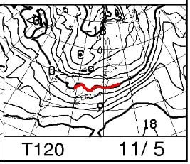
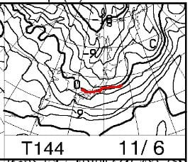
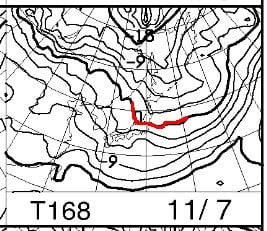

# 11月6日は冷えるよ！！…そして，2022/2023シーズンの初滑りを終えてみて

📅 投稿日時: 2022-11-02 02:08:30

🏷️ カテゴリ: [日記](cc4b5682fb7b8b144980957a978653fb0.md)

えー．

私が許可していないのに，地球は

勝手に11月の世界に突入するという

無茶をしてしまったらしく．

もう，2022年は残り2か月しかない

という恐ろしい事実が目の前に

突き付けられている今日この頃，

皆様いかがお過ごしでしょうか（時候の挨拶）

ってなことで．

こないだ正月スキーをしたばかりのような

気がするけど．

今週木曜，11月3日は．

ついに軽井沢スキー場と

ウイングヒルズ白鳥がオープンします！！

…そして，かすかな可能性として．

横手山がこの日のオープンを狙ってます…

まぁ，この日に横手がオープンできる

可能性は，おそらく日本代表が

ワールドカップで優勝するくらいの

確率かな，と思いますが…

とりあえず．

天気図を見ると．

11月3日は軽井沢もイエティもいい感じで

晴れそうです…！！

…そして．

11月5日からの850hpa気温図を見ると…

うむ？

赤い0℃線が，志賀高原近くまで

下がってきている気が…

翌11月6日を見ると…

をををっ！？？？

これは，

赤い0℃線は志賀高原より南で，

志賀には-3℃線がかかっているレベル！！！

11月7日も…

0℃線は志賀高原近くに滞在するので．

この3日間，横手山は人工降雪機が

ガンガン動かせそう！！！

そして，6日は天然雪もわずかに降りそう…

もしかしたら．

11月8日あたりに横手山オープンしたり

するかも…！？？？

多分．

そうなったら．

アイスクラッシュじゃない，人工降雪での

ゲレンデオープンの日本最早記録じゃ

なかろうか…？？

とりあえず，11月5，6，7日は

期待できる冷え込みですよ～！！

ってなことで．

イエティオープンからすでに2週間以上経ち，

私もすでに2日間滑走しているわけですが．

コロナ禍で夏にダイビングに行けなくなり，

スキーのオフシーズンに本格的に山歩きを

するようになってから，3シーズン目．

1シーズン目は膝痛を発症し，そんなに登れず．

昨シーズンは膝痛を克服したものの，

まだ様子見を兼ねて，コースタイムの短めの

お手軽登山も多かった感じですが．

今シーズンは，オフシーズンの4か月で

山に行った回数は9回と，そこまで多く

なかったものの…

結構コースタイムが長い山ばかりで．

さらに，

心拍数を落とさないようにひたすら

ハイペースで攻める

という，体力トレーニングのための

山歩きを続けた結果．

いつもなら，夏の間に落ちてしまう

筋肉が，それほど落ちなかったんですよね…

ってな状態で臨んだ，今シーズンの初滑り．

実に約4か月と10日ぶりにスキーを履いて，

滑ってみると…

うおおお！

やっぱり，いつもなら夏に衰える

筋力が落ちてない！！！

…踏める．

踏めるよ．

シーズン初日，1本目から板が踏めるよ！！

…そして，足場の悪い山道の下り坂を

（人がいないところで）走っていた

のが効いてるのか…

バランス感覚も衰えてない！

上体のブレが，いつものシーズンインより

抑えられてる！！

今シーズン，

イエティの初滑りの1本目から，

かなりいい感じで滑れたよ…！！！

そして．

初滑りの初日は，例年ならちょっと

筋肉の疲労感もあるんだけど…

今シーズンは，初日に朝9時から18時まで

滑り続けても，全然筋肉に疲労感がない…

というより．

7時間以上，山道を心拍数150キープで

移動し続けるのに比べれば，

全く運動した気にならない

感じ…

初日から8時間滑り続けても，

疲労感は全く無し．

筋肉痛やらそんなものも全く無し．

うむ．

シーズンが始まる前は

「ちゃんと滑れるのかなぁ…」

「長いことスキーやってないから，

　滑り方忘れてないかなぁ…

　板の前後を忘れて，間違えて逆向きに

　履いたりしないかなぁ…」←さすがにそれは無いでしょ

「シーズン初日から，朝イチからずっと

　休まず滑れるかな？？」

とか心配だったけど．

今シーズンは，本格的に山を攻めたおかげか，

シーズン初日の1本目から，バッチリ

滑れました～！！

いや．

今シーズン，心拍数を140以下に落とさない，

身体を責めるトレーニング山歩き（？）を

始めたおかげで．←かなり邪道な山の登り方のような気がするが…

体力は維持できたし．

筋肉もついたし．

さらに，下り坂は，足場が悪い石の上を

伝って走るとか，木の枝や障害物を

避け，一歩一歩瞬間的なバランスを

取りながら走る…ってことを繰り返した

おかげで．

バランス感覚と体幹の筋肉も維持できた

みたいだし．

いや．

昨シーズンまでの，そこまでペースを上げない

山歩きだとそこまで効果は感じなかったけど…

標準コースタイム10時間くらいの山を，

ハイペースで歩き続ける（ときおり走る）のは，

スキーのトレーニングにむちゃくちゃ良い

みたいです…！！

山歩きが，スキーにここまで効果があるとは

思わなかった，Skier_Sだったのでした…

いや…昨シーズン，膝サポーターとトレッキング

ポールを試したおかげで，山歩きの下り坂で

膝が痛くなるのを予防できるようになって

良かった…

## 💬 コメント一覧

### 💬 コメント by (metabo-joker)
**タイトル**: Unknown
**投稿日**: 2022-11-02 12:22:56

山歩き（走り？)が体幹トレーニングになってるんですねー。凄いですよ。

### 💬 コメント by (Skier_S)
**タイトル**: ＞metabo-jokerさま
**投稿日**: 2022-11-03 01:38:42

昨年までは山歩きがそれほどのトレーニングになってなかったのですが，

今シーズンから心拍数を上げて山を歩くようになって，すごいトレーニングになってきました．

足場の悪い坂道の下りを走るときのバランス感覚（2～3時間，ひたすら早歩き～小走りを繰り返しての下山），

登り坂を歩く，太ももからふくらはぎにかけての筋肉トレーニング．

そして平均心拍150を7時間ほどキープし続ける，そこそこ高負荷な心肺トレーニングなど…

（登り4時間の平均心拍154，下り3時間の平均心拍161とか…）

ファストハイクとか言われるこの山登りスタイル．

結構いいスキーのトレーニングになります…

### 💬 コメント by (一昨年から読んでいる者)
**タイトル**: Unknown
**投稿日**: 2022-11-04 11:51:02

マラソンあるので11月6日が冷えるという記事はうれしい限りです。次の筑波の論文ではＶＡＡＭは長期的にも効果があるようです。

Effects of regular exercise combined with ingestion of vespa amino acid mixture on aerobic fitness and cardiovascular disease

risk factors in sedentary older women: A preliminary studyggi_630 24..31

Hiroyuki Sasai,1,2 Tomoaki Matsuo,1,2 Minoru Fujita,3 Masato Saito3 and

Kiyoji Tanaka1

1

Division of Sports Medicine, Graduate School of Comprehensive Human Sciences, University of Tsukuba,

Ibaraki, 2

Japan Society for the Promotion of Science, and 3

Meiji Dairies Corporation, Tokyo, Japan

### 💬 コメント by (Skier_S)
**タイトル**: ＞一昨年から読んでいる者さま
**投稿日**: 2022-11-05 01:49:15

6日は冷えますよ！

で，論文情報ありがとうございます．

Abstractは読めましたが，本文が公開されておらず読めませんでした（涙）

アブスト読んで見るとアスリートではなく，普段運動してないお年寄りの女性が

サンプルなんですね…

VAAM摂取群は内臓脂肪が減ったというのは分かりましたが，なんでかの

理由の詳しい解析があるのかが気になる…

