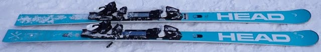
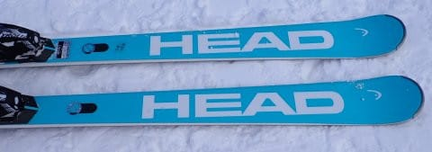
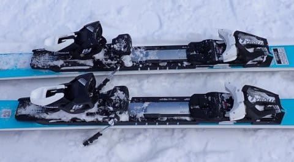
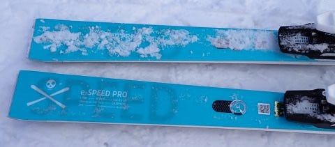
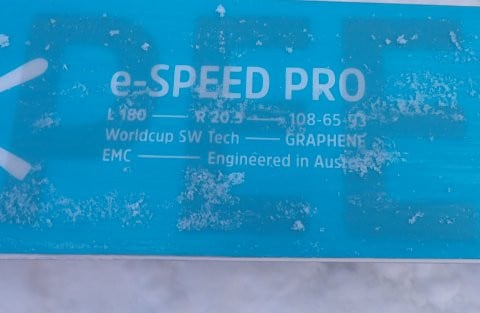

# 2024シーズンモデルのスキー板，試乗レポートその10…HEAD Worldcup REBEL e-SPEED PRO

📅 投稿日時: 2023-06-02 04:09:38

🏷️ カテゴリ: [スキー板試乗](c0bd8048615710cee890e403a36cc9a2b.md)

また，ここしばらく．

狙ったように週末に雨が降る日が続き，

４週連続雨にたたられてるような気が

するんですが…

今週末も台風の余波で，また雨ですね…

雨が降ると，月山に行ってもガスだらけで

楽しくないどころか，遭難する可能性が

あるので…

またこの週末も，家でじっと過ごさないと

いけないのかな…（涙）

しかし，なんで今年は，週末に狙ったように

雨が降るかな～（悲）

とりあえず．

今日も2024シーズンモデルのスキー板の

試乗レポート．

今回もヘッド編です．

では，どうぞ～！！

〇HEAD Worldcup REBEL e-SPEED PRO 180㎝

基礎大回り

GS板ほどではないけど，180㎝でR=20m という，

かなり大回りベースの板です．

FISCHERでいえばRCに近い位置づけの

モデルですが…

滑ってみたところ，結構張りが強い感じ．

長さが180㎝で眺めのところもあり，

割とまっすぐ進む板です．

ただ，スピードを出していき，しっかり

踏んでいくとトップがたわんで曲がって

行きます．

GS板ほどではないにしろ，割と張りが

強めなので，強めのブーツでしっかり踏む

必要がありますが，トップをたわませるように

押さえていけば，がっつりエッジグリップで

板が回っていき，気持ちいいハイスピード

大回りができます．

ゲレンデで履くにはe-GSよりe-SPEED

旋回半径も小さめで，楽ではありますが…

それでもしっかりスピードを出していった

ほうが気持ちいい板．

低速でいろんな小技を使うって感じの板では

ないので，これ1本でつぶしがきくオール

ラウンド性はないですが，大回りベースで

かなりハイスピード気味のクルーズ板と

すれば，高速安定性も高く，しっかりした

エッジグリップで気持ちいい大回りが

かませる板です．

180㎝という長さもあり，スピード安定性は

かなり高めで，GSのセカンドモデルとしても

十分行けるレベル．

ただ，この板は履く人のレベルと体力を

選ぶかな～…

あんまり体力・筋力がない人，スピードを

求めない人は履きこなせない感じ．

でも，体力がある人，板をしっかり踏める人，

スピードを出す人で，小回り系の板を

別に持っていて，大回りを楽しむ板が

ほしい人は，ハイスピード大回り専用

クルーズ板として楽しめるかも．
