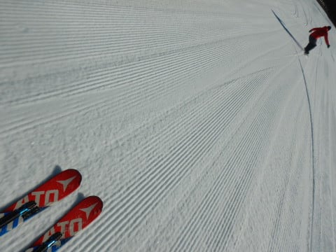
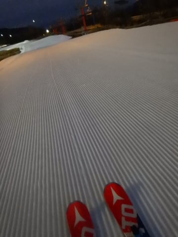

# 2021/11/20(土)のイエティ，詳細滑走レポート！…天気よく，コース幅も広がり雪の厚みは十分．リフト待ち3-5分

📅 投稿日時: 2021-11-22 01:18:02

🏷️ カテゴリ: [2022スキー滑走日記](cc9cb73e4320f6a97af6fccc37587a61a.md)

えー．

やはり本日も横手山は混んだようですね…

いつものおこみん特派員によると．

午前は20分待ち．

午後はちょっと短くなったけど

2時ごろまで10分近く，

3時ごろまでは5分待ちを超えていた

ようです…

ちなみに，コースはちょっと茶色い

ところも出てきたものの，

まだ雪は十分厚みがあるみたいで．

朝はしっかり硬かったものの，

午後は滑りやすかったようです…

ちなみに，おこみん特派員から

横手のコース動画も送ってもらったので，

見てみてください～！

…動画を見ると，Yetiよりコース幅も

斜度もあるし．

コース上の人も少ないし．

滑りやすそう…

うーむ．

リフトが混んでいるけどコースが

広くて空いてる横手か，

リフトはそこまで混まないけど，

コースが激混みで緩いYetiか．

究極の選択…

でも．

この雪が，明日の暴風どしゃ降りで

消えなければいいのですが…

23日も無事営業できることを

祈るばかり…

ってなことで．

横手山特派員レポートのあとは，

土曜のYeti詳細レポートという，

本日はゼイタクにも二つのスキー場

レポートです！

とはいえ．

…滑ってる本人もそろそろYetiに飽きてきた

くらいなので．

読者の皆さんもYetiのレポートに飽きて

きていることだろう…

と思いますが．

それでも今日もイエティレポートなのだ！！←身も蓋もない書き出しだな…

まず．

今日も朝は，コースオープンの9時の

あさイチシマシマを狙うわけですが．

今日は9時5分前にコースオープンした，

ピカピカシマシマゲレンデに飛び込み！

気温が低かったので，アイスクラッシュの

ザラメがそのまま均された，ちょっと

板が潜りかけて行く柔らかい雪だった

けど…

でも，やっぱり朝イチは最高っ…！

いやー．

この人がいない朝イチと，ナイター

最初の1本だけは気持ちいいので．

このためにイエティに来てると

言っても過言じゃないよな…

コース幅も先週よりはさらに広がり．

人がいなければ中回りくらいは問題なし！

でも．

2-3本滑るとゲレンデの人が増えていき…

そのせいで，柔らかめのバーンは

ちょっとザクザクした感じの雪に

なっていきました…

雪の厚みは十分あるので，もう土が

出てくるところもなく．

シーズン初めみたいに硫安をガンガン

撒いてないので，雪は終日柔らかめ

でしたね…

そうそう，コース幅が広がったので，

コース脇にこんな感じのパイプが2本と…

ボックスが1か所設置されてました！

…でも，ほとんど誰も使ってません

でしたが…

リフト待ちは，朝10時前にはこんな

感じで，クワッドリフトで3分待ち

程度かな．

天気は晴れ時々曇りで，気温自体は

低めでジャケットを着た方がいい感じ

だったけど．

日が射すと暖かく感じるくらいで．

昼間は雪がちょっとしっとりして

きたかな…

クワッドリフト待ちは午前中は2-3分，

午後になると2-5分程度．

やはりこのスキー場，午後のほうが

混みますね…(涙)

クワッドリフトと並行するペアリフトは

ほぼ待ち0ですが…

今日は時々2-3組の待ちがあったりして．

いつもはガラガラのペアリフトの乗車率，

今日はちょっと高めだったかな．

ってなことで．

ペアに乗ればリフト待ちはそれほど長く

ないものの．

やはり，ペアとクワッドの2本でコース上に

人が送られるので，コース上の人口密度は

高め…(涙)

まぁ，コース幅が広めなので，

それでもオープン直後に比べれば

まだマシかな？

最後の方は，多くの人が滑って

コース上はちょっと凸凹してきた

ものの．

ひどいコブになったり，穴が開いたりは

全く無かったです～！

…ってなことで．

16時のコース整備のためのクローズ時間

まで，昼休みもとらずひたすら滑った

後は…

17時のコース整備終了を待って…

コースオープンのシマシマに，Go！

誰も滑っていない，ピカピカのまっさら

シマシマ，いただきま～す！！！

いやーーー．

雪はちょいと柔らかめだったけど．

でも，コース幅も広がった，誰も

滑ってないバーンを滑る快感…っ！！

この1本が，今日来た目的の半分以上を

占めていると言っても過言ではない！！

…と，気持ちよく滑れたのも，

いつも通り2本ほど…

なぜか昼間よりナイターの方が

人が増えるこのスキー場．

じき，ゲレンデはすごい人口密度に

なっていき…（涙）

今日も，ナイターはペアリフトも

動いていて，ペアは待ち時間0だった

のですが…

クワッドリフトの待ちは，昼間より

長くなっていきました(泣）

さらに，暗くて人口密度が高い

ゲレンデはちと楽しくない…

というか，ちょいと怖いので．

今日もやはりナイターは1時間ほどで

切り上げたのでした…

まぁ，でも．

コース幅も広がって．

晴天の中，朝9時から夜6時まで

1時間休憩をはさんで8時間たっぷり

滑れたので．

とりあえず満足かな～．

…でも．

読者の皆さんもそうだと思うけど．

このレポートを書いている本人も．

そろそろYeti，飽きてきました…

でも，23日もオープンできるスキー場は

ないだろうから，またYetiだろう

なぁ…(ちょい涙）

## 💬 コメント一覧

### 💬 コメント by (Unknown)
**タイトル**: Unknown
**投稿日**: 2021-11-22 22:04:49

11/20にホワイトピアたかすもOPENしたようですね。

岐阜県の高鷲エリアがOPENすると、

関西の方々のシーズンインになるのかな。

K県民の徒然さんには岐阜は遠すぎて来れないですよね？？

寒気も来ますし、ゲレンデが賑わってくれると良いな～。

### 💬 コメント by (Skier_S)
**タイトル**: ＞Unknownさま
**投稿日**: 2021-11-23 00:18:03

ウイングヒルズに続き．ホワイトピアたかすもオープンしたようですね…

私にとって岐阜は遠すぎていけません（涙）

ホワイトピアも混むんでしょうねぇ…

