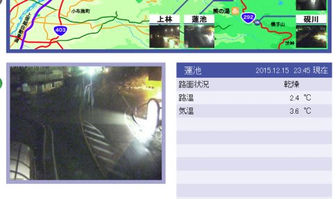
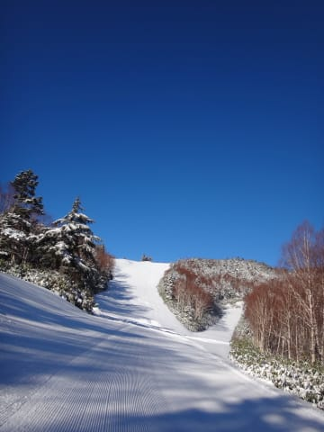

# 土曜日は，20000mクラブな方々と

📅 投稿日時: 2015-12-16 01:44:00

なんてことだ…

本日も．

只今の志賀高原．

雨

が降っているようです…（涙）

…今シーズン，なんだか雨が降りすぎなんですが…（泣）．

しかし，12月中旬の志賀高原，深夜で気温+3.6℃って…

どゆこと？？

ありえない…（落涙）．

…でも．

でも．

明日水曜は．

雪になるはずなのだっ！！！！！

そして，木曜日にかけて．

ぐんぐん冷え込んで．

木曜は一日，雪が降りつもるはずなのだ…！！！

そして，金曜日の朝までは降り続ける

はずなのだ……っ！！！

そして，今週はゴンドラぐるぐるできるといいなぁ…

って願望を述べたところで．

本題へ．

…それは，この土曜日．

快晴の焼額山を滑っていた時のこと．

Yetiでも一緒に滑った，奥志賀ゴンドラ一日40本越えの方と

たまたまお会いしたので，数本一緒に滑っていたら…

背後から迫る，異常に速い3人組が！

…これは．

2015シーズン志賀高原滑走標高差トップ10のうち，

3人の方が揃っているではありませんか…！

大体この方々は，自らのペースでひたすらひたすら

滑り続ける方々なので．

それぞれ，別々にお会いすることはあるけど…

こんな大御所が，3人そろって滑ってるなんて！

…これで，志賀高原の超常連5人が一堂に会するという，

大変珍しい状況になったわけだけども．

…もしかすると．

私以外のみんな…

20000mクラブの，すごい人たちばかりではっ！？？

20000mクラブ…

そう，それは．

[以前にも書いた](ea8a953c4b60b5eec845669ca5ba7bf0f.md)ように．

一日で滑走標高差2万mを滑るという．

それはそれはおそろしい素晴らしい方々のことを指す，

私が勝手に作った言葉．

…2万mとは．

八方尾根で言えば，兎平にかかっているアルペンクワッド．

あの標高差が280mなので．

アルペンクワッドなら71回．

標高差500mのリーゼンクワッドなら40回．

これだけを1日で滑ってしまう人たちであり．

…はっきり言って，普通の人間には不可能な，

スキー用に改造されたサイボーグしか

成しえない滑走量を誇る方々．

ちなみに私の最高記録は，せいぜい17000m程度であり，

サイボーグでない私（←ここ強調しておくところ）は，これらの人たちと

比べるとグレードが落ちます．

ランクが違います．

別世界の人間です…

ってことで．

何か突き抜けた方々4人+私という，

5人でしばらく一緒に滑ったのですが…

…速い…速いよ！

みんな，速すぎる…っ！

そして，当たり前だけど．

リフト10本以上滑ってるのに，

誰も途中で一度も止まってない…

おかしい．おかしいよ，すごい，すごいよ，この人たち…っ！！

恐るべきスピードで焼額山のゲレンデを落下していく，

わけのわからないすさまじい4人組！（＋ちょっと遅れてついて行く1人）

私も，おととしまで4年間，志賀高原シーズン滑走標高差ベスト10を

キープし続けていた滑走量を誇るはずなのに…

間違いなく，私が一番遅い…っ！（ってか，この場合，私が普通なんじゃないだろうか…）

一緒に滑ってみて，よく分かりましたが．

やはり，20000mクラブな方々は，違う…！

と，感動した一日だったのでした…

いやーー．

5人そろったのは，わずか1時間ちょっとでしたが．

これまでに体験したことのない，すごい刺激に満ちた

時間でしたよ！！

余談1．

数シーズン続けて，志賀高原シーズン滑走標高差トップを

獲得している某氏．

この某氏から，驚きの一言が…

「みんな速いな～．こんなペースで滑ると，疲れちゃうよ」

…え？

…えぇっ！！？

あなたが先頭を滑ってませんでしたっけ？？

ってか．

この方が，「疲れる」なんて日本語を知っていたとは…っ！！？？？

しょ，衝撃の事実…っ！

「もしかすると，20000mクラブな方も．

　サイボーグじゃなくて，人間だったのかも…」

と思ったのでした…

余談2．

この日．16時過ぎに焼額のラストリフトを滑り終わって．

「一の瀬は16:30まで営業だ！一の瀬なら，まだ20分くらい滑れる！」

と，急いで車で一の瀬に移動して，滑り始めたら．

このメンバー．ほぼ全員が一の瀬にいて．

「確かみんな，16時まで焼額にいたはずなのに…

　やっぱりみんな．30分のために，焼額から車で

　移動してきたのか…」

と感動したのでした…

＃いや，ホントにおかしいすごいんだから．この人たち…

＃確か，私が一番若いはずなんだけど…全然かなわない（涙）．

## 💬 コメント一覧

### 💬 コメント by (れお)
**タイトル**: 20000mクラブの人達スゴい!!
**投稿日**: 2015-12-16 11:42:14

Ｓさんが一番遅いって想像しがたいですね…。

でも、滑りは眺めて見たかった!!（怖いもの見たさで…。）

私が一緒に滑るのは絶対無理でしょう。

私も、いい加減、今週末ぐらいには初滑りしたいです。

暖かすぎですよね。

ということで、今週末の天気予報を楽しみにしてます～。(๑˃̵ᴗ˂̵)و

### 💬 コメント by (Skier_S)
**タイトル**: れおさま
**投稿日**: 2015-12-17 01:06:56

いやーー．

ホントにみんな，速いんですよ…

スピードが速いだけでなく，止まりませんから，全く…

今週末は，ちょっとゲレンデ状況は改善しそうです．

ドサドサ降るほどではなさそうなので，2ゴンが

運転してくれるかどうか…

### 💬 コメント by (若杉勲70)
**タイトル**: Unknown
**投稿日**: 2018-06-20 22:40:32

鮎のため福井でアパートを借りて、毎年飽きもせずにスキー資金を稼いでいる20000mクラブの若杉です。sさんのファンでもあるyumilinさんがi-skiに照準を定めて、北海道などの遠征を重ねた結果、なんと、優勝してスイス旅行ペアをゲット。ご主人は100000円のスキー用品ゲット。

ああいう人たち（sさんも同じ）のエネルギーはやっぱりスゴすぎますね。目標を持って、冬も夏もすごすって、いいですね。私は一月にくるまが追突された後遺症の生活にも慣れてきて、来冬は10000m目指して（あっという間の気がするけど）ゴンドラ一本でもsさんについていけるように、いまから楽しみにしています。鮎と違って、スキーはまだまだのびしろが期待できるので楽しみです。今後ともよろしくお願いします。

### 💬 コメント by (Skier_S)
**タイトル**: 若杉さま
**投稿日**: 2018-06-20 23:51:18

お久しぶりです～！

そろそろ釣りも本格シーズンインでしょうか．

そうなんですね！yumiさん，スイス旅行Getですか！！

夫婦そろって商品ゲットって，うらやましすぎます．

しかし，優勝ってすごいですね…

でも．

若杉さんも，私にとっては信じられないレベルの

すごい人なんですが（笑）．

奥志賀ゴンドラ48本はおそらく今後も破られない

伝説だと思います…

今シーズンはあまり一緒に滑れませんでしたが，

来シーズンはまた一緒にガンガン滑りましょう！

こちらこそよろしくお願いします～！！

