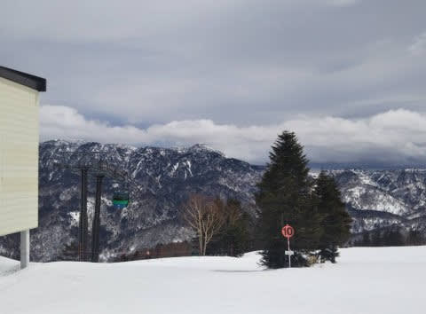
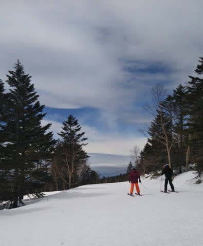
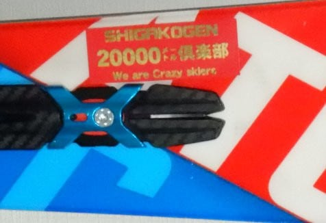

# 20000mゴールドの赤ステッカーが出来たよ！…そして，今週末の志賀高原，土曜は明け方雨なれど営業開始時には止みそう．日曜は明け方雪なれど，これも営業開始時には止みそう

📅 投稿日時: 2020-03-28 00:24:43

🏷️ カテゴリ: [スキー雑談](c1f9d2cb7478308da16419928ea3945e9.md)

ってなことで．

どうやら本日，

　朝からプラス5℃近い高温の

　曇り空でスタート．

　朝から緩んだ雪で，昼間は+10℃を

　超える高温に．

という予想通り，曇り空スタートの，

気温が異常に高い一日だった

ようですね（涙）

（某特派員さん，写真使わせてもらいました…）

そして，

　ゴンドラが止まるほどではないにしろ

　風も強めで，

と書いた通り，風が強かったようで…

ただ，一部予想を外し，焼額第2ゴンドラが

終日止まったようです…

さらに．

　昼ごろ～夕方にかけて，

　雨がパラパラ降り始める．

というところは完全に外れて，

終日雨は降らず．

それどころか，時折青空も雲の隙間から

覗けるほどの天気だったようです！

…天気はわるくなかったものの．

気温が高かったので，雪の滑りが

悪いところがあったようなのが，

ちょっと残念ですが…

で．

この週末の天気は．

28日（土）：明け方まで雨が降るが，営業開始時には止む．

　朝の気温は0℃をわずかに上回るか？

　曇り空スタートで，朝から緩み気味の雪．

　朝は風が強めだけど，ゴンドラが

　止まるほどではなさそう．

　昼間も曇り空が続き，気温が+3℃

　くらいなので，雪は重くなっていくけど

　壊滅的にザブザブ雪にはならないかな…

　リフトストップまで雨は降らずにもつ

29日（日）：土曜夜の降り始めは雨かもしれないけど，

　土曜夜～この日の早朝まで雪が降る．

　リフト営業開始のころに，ちょうど止むくらい．

　あさイチは，締まり気味の下地に重い

　湿った雪が2-3cm乗ったコンディション．

　昼間の気温は+2～3℃とそんなに

　上がらないものの，プラスに振れるので

　ずっしりと重い雪になっていきそう．

　昼ごろには日も射してくるので，

　午後はかなり雪が緩むかも…

　日当たりのよいところは板の滑りが

　悪くなるかな．

　でも，春スキーと割り切れば

　午後は日も射して暖かく，

　いい感じかも…

ってな感じでしょうか…

で．

本題へ．

志賀高原のごく一部で有名な

KonSukeさん作製の20000mステッカーですが．

なんと．この度，

20000m達成者向けゴールドステッカーに，

赤地バージョンが追加されました！！

これまで，黒バックにゴールド文字の

ステッカーだけだったものが，

鮮やかな赤色にゴールド文字の

バージョンも追加です！

…残念ながら，シルバーステッカーには

赤地バージョンは無いようです…

ってことで．

これから，志賀高原で赤いステッカーを見ても

「なに？これ？偽物？」

と思わないように，お願いします～！

## 💬 コメント一覧

### 💬 コメント by (ゆーき)
**タイトル**: Unknown
**投稿日**: 2020-03-28 09:07:50

ところで、こんなものを使うんでしょうけど、ルールって、

リフト乗ってるときは、オフにするとか、測り方のルールってありますか？まともに測ってみようかと思って。https://www.mountrip.net/entry/2019/01/13/200301

### 💬 コメント by (レインボー)
**タイトル**: Unknown
**投稿日**: 2020-03-28 21:00:29

ゆーきさん、はじめまして。

私は、ski truck 110円。

友人は、ski app 440円。

別の友人は、i ski 。

滑った結果は、てんでばらばらです。

言えることは、データはあくまで大まかな目安と思って愉しめばいいと思います。20000m挑戦の時のように、厳密なデータが必要な時は、メモが確実かと。

標高差はパンフレットに記載されていますから。

### 💬 コメント by (Skier_S)
**タイトル**: 憎きコロナウイルス
**投稿日**: 2020-03-28 22:37:06

＞ゆーきさま

もし，20000mチャレンジの公式記録としたいなら，

アプリはなんでもいいです．

アプリの標高差で20000m承認ではなく，

どのリフトに何本乗ったのかをあとで確認，標高差をそれから計算して

20000m超えていればめでたく承認…

というのがプロセスです．

なので，どのリフトに何本乗ったのかが，あとから確認できればOkです．

＞レインボーさま

補足ありがとうございます！！

