# 新しいスマートウォッチ，Garmin Fenix7Xを買ったよ！その11…スマホアプリ，Garmin Connectを使ってみる5

📅 投稿日時: 2022-08-31 02:56:18

🏷️ カテゴリ: [PC,カメラ&小物](c0d8caed13e597efe97b661a8ae56bed0.md)

えー．

VAAMの記事がまだ途中ですが．

あの記事は，

ものすごく書くのにエネルギーがいる記事

なので．

今日はちょっとGarminの紹介記事に戻ります…

…ってか．

あの記事を書くのに，論文を何本読み

込んだことか…

（これからVAAMの記事はもっとディープに

なってくけど…読者がついて来れるか心配）

ってなことで．

Garmin Connectの紹介記事ですが．

こっちも一体何本記事を書いているんだ？？？

という感じなので，そろそろ読者も

飽きているころでしょうが．

…果てしなく機能がありすぎるので．

飽きているのを覚悟でまだ続く，紹介記事．

（Garmin Fenix7Xのレポート全16回のもくじ

機能説明，登山用地図の作り方，登山で使ってみた…など

は[ここをクリック](e516b23a4874189de2e9208be87fa5184.md)）

今回は，Garmin Connectからのウォッチ

設定の続きです…！！

この，上のメニューから．

今度は「アクティビティ＆アプリ」を

選んでみると…

このウォッチで一番大事な，

アクティビティ時の表示内容とかが

設定できます！

まず，ウォッチのメニューにどの

アクティビティを表示させるかを

選べます…

私はスキー，ラン（使わないと思うけど…），

登山，ハイキング，BCスキーを

ウォッチで選べるようにしています．

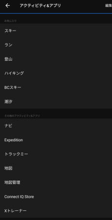

なんてったって．

対応しているアクティビティが

腐るほどあるので，これを全部

時計に表示させると，

選ぶのが一苦労ですから…

必要なものだけウォッチに表示

させるようになってます

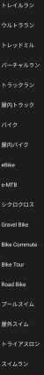

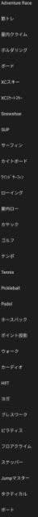

で，このアクティビティ．

例えば登山をさらに詳細設定

することができて…

この画面から，

「トレーニングページ」を選ぶと．

アクティビティ中の表示画面を

カスタマイズすることができます！

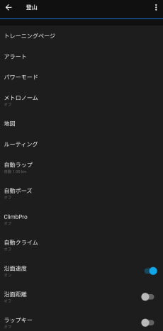

私の登山のトレーニングページは

こんな感じ．

時刻，高度，上昇・下降ゲージ，心拍ゾーンゲージ，

スピードグラフ，経過時間を1画面に表示するデータ画面と，

地図画面の2画面

を自動切り替え表示にしています．

「ページ追加」ボタンを押して，

ページを自由に追加して，

データページを3ページや4ページに

増やすこともできます！

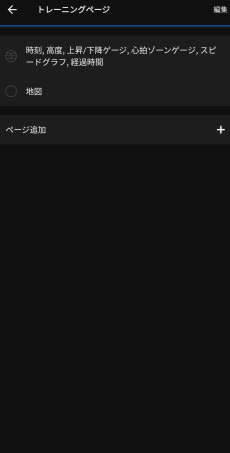

さらに，データのページも．

画面にいくつの項目を表示するかが

選べたり…

（最大1画面に8項目まで同時表示可能！）

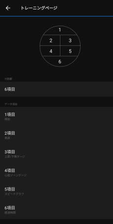

で，表示できる項目もそりゃ山盛りの

内容から選べて…

例えば，この項目の真ん中あたりに

「高度」ってありますが．

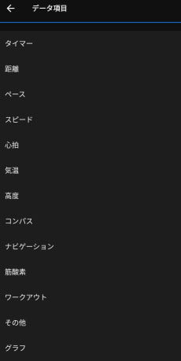

高度メニューだけでも，

さらにこれだけの項目が選べます…！

もう，一体何を表示させようか悩むほど．

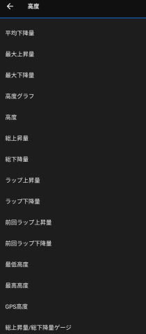

ナビゲーションメニューは

これだけの項目があって．

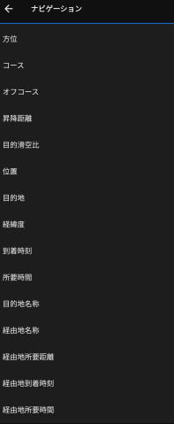

例えば，このメニューから，「経由地名称」と

「経由地所要距離」を選べば，

次の経由地が何て場所で，

そこまでどのくらいの距離か…

ってのも表示させられます．

それがこいつですね．

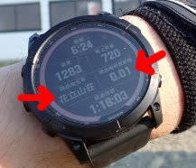

それ以外にも，

こんな風な標高と速度のグラフ画面を

作ったり…

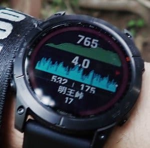

心拍数だけの画面を表示したりも

できます．

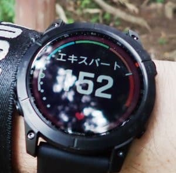

ちなみに，8項目同時表示にすると

こんな感じで，ちょっと表示が小さくて

見にくくなります…

あ，一番下は心拍数グラフです．

あと，矢印で示した小さな赤▲は，

これから進む方向を示してくれてます…

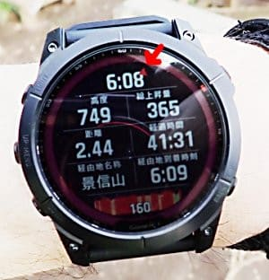

今はこの6項目．

一番上が現在時間，

左上が現在の標高，

右上がスタートからの上昇標高差＆下降標高差，

左下が心拍数，

右下が速度変化グラフ，

一番下がスタートからの時間

にしています…

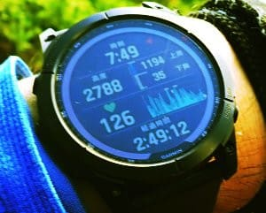

で．

ここで，私は登山画面にデータ画面と

地図画面を表示させているわけですが…

地図画面の内容は，ここのメニューから

編集できなくて．

この，ウォッチの設定メニューの

下の方にある…

なぜか，この「ナビゲーション」メニューから

設定します．

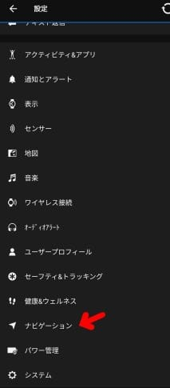

この「ナビゲーションメニュー」にも

「トレーニングページ」の項目があって．

それぞれのアクティビティで「地図」を

選んだ場合は，このメニューで設定した

内容が表示されます…（ややこしい）

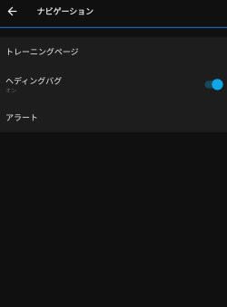

このメニューを選ぶと．

「地図」

「コースポイント」

「ガイド」

「高度グラフ」

が表示されますが…

地図はまぁ，オフにできませんが．

それ以外の項目は，On/Offが選べます．

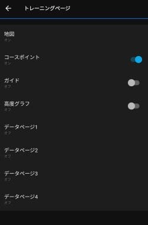

ちなみに，「コースポイント」画面は

こいつ．

事前にルートをウォッチに設定しておけば，

（事前のルートの作り方の詳しい

　やり方はまた後述します…）

この先通る各ポイントまでの距離が

表示されます．

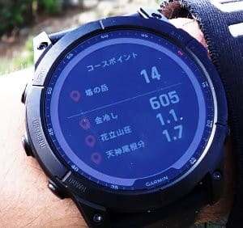

「ガイド」画面はこいつ．

読み込ませたコースの名前とゴールまでの

距離が表示されます．

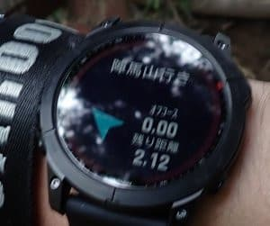

そして，高度グラフはこいつ．

事前の設定ルートの標高データから，

これまで経過したところが緑，

これから通るところが青色の

グラフで示されるので…

今後どのくらいの登りがあるのかが

分かって便利かな…

と思ったけど．

実際に山を歩くと，意外と見ません（笑）．

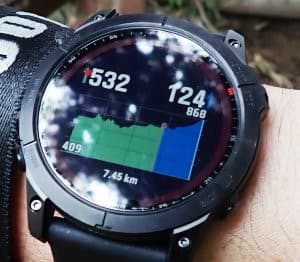

ってなことで．

私は「ナビゲーション」メニューでは，

アクティビティ時に

「地図」（オフにできない）

と

「コースポイント」

だけを表示する設定としていて．

「登山」メニューでは，

データ画面1枚と地図を表示する設定に

しているので．

登山中は，

「データ画面」→「地図」→「コースポイント」

画面と，3画面が自動スクロールで

表示されます．

あ，自動スクロールOn/Offや切替タイミングも

このメニューで設定できます…

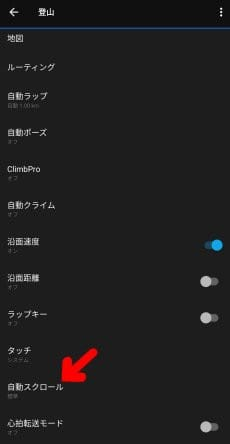

ちなみに．

このトレーニングページは，

アクティビティ毎に違う画面を

設定できるので…

例えば，スキーの時は登山と違う

こういう表示をさせよう！

と，好きなように編集できます．

（スキーの時の設定例）

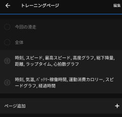

いや…

これ．

楽しめる．

ホントにこれ，設定だけでも遊びまくれる，

大変楽しいおもちゃです…

（続く）

## 💬 コメント一覧

### 💬 コメント by (原)
**タイトル**: ゴルフ
**投稿日**: 2022-09-01 20:45:13

ゴルフ⛳️には対応してないんですかね？

ゴルフ用のgarmin持ってます。

### 💬 コメント by (Skier_S)
**タイトル**: ＞原さま
**投稿日**: 2022-09-02 01:10:47

Fenix7Xですが，ちゃんとゴルフ機能は対応してます！

ゴルフ用のGarminが備えている機能は，多分全て載ってるんじゃないかと思います…

ただ，ゴルフをやらない私には無用の長物機能ですが（笑）

### 💬 コメント by (いわっち)
**タイトル**: トレランで活用
**投稿日**: 2024-05-07 15:02:30

ゼロからのルート作成時にコースポイント（ポイント名）はどのように設定しますか？

ガーミン945を使っています

### 💬 コメント by (いわっち)
**タイトル**: Unknown
**投稿日**: 2024-05-08 08:13:42

やり方わかりました

### 💬 コメント by (Skier_S)
**タイトル**: Unknown
**投稿日**: 2024-05-10 10:46:47

>いわっちさま

コメント気づくの遅れました…

解決したなら良かったです！！

