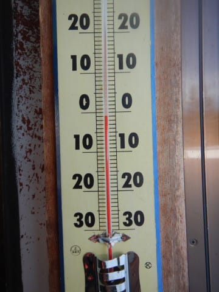
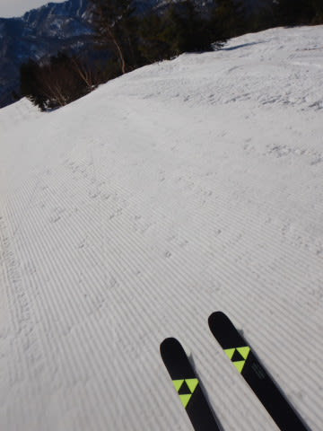
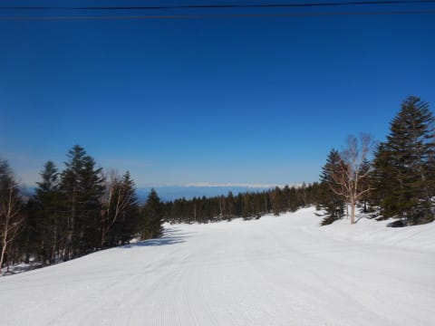
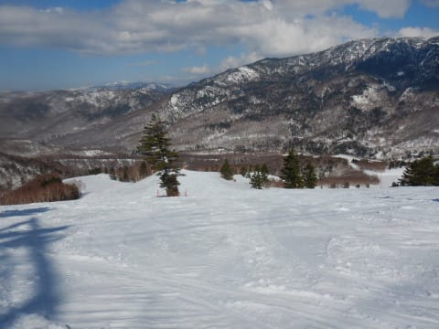
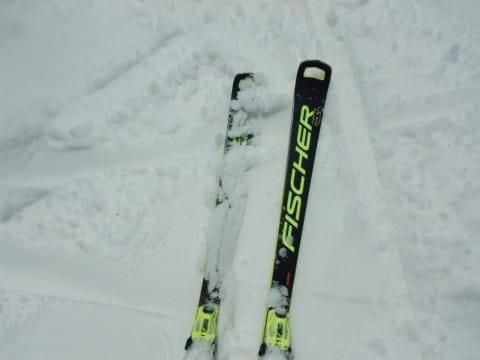
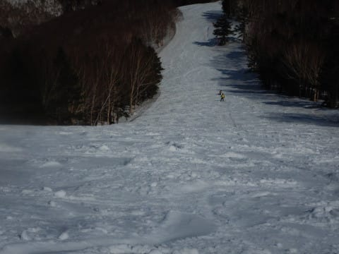
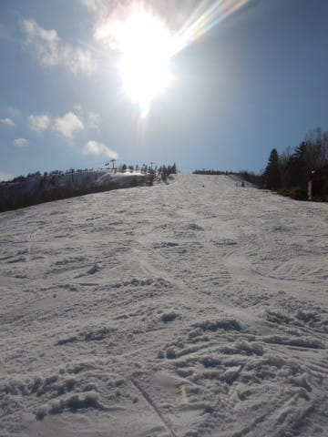

# え？結局滑りに行ったの？2022/4/17(日）日帰り志賀高原スキー場速報レポート！…晴天，朝は晴れてGood！昼には緩んだけど…

📅 投稿日時: 2022-04-18 01:41:27

🏷️ カテゴリ: [2022スキー滑走日記](cc9cb73e4320f6a97af6fccc37587a61a.md)

ってなことで．

昨日の土曜は夕食も摂らず必死に仕事を追い込んで．

昨晩の深夜12時前に．

「必殺・終わったことにする」

という荒業により，仕事を終えたことにして

倒れたように寝て．

…そして，朝3時半出発で日帰り志賀高原に

行ってきました～！！

…いや．

常識的には行かない．

普通なら行かないと思いますが…

行かないと死んじゃう病なので．

ってなことで．

さすがに帰りの運転は眠く，途中の

高速のSAで寝ちゃったのもあり，

帰宅は日付が変わったあと…

で．

「必殺・終わったことにする」

は，実際は終わってないので，

これからちょっと最後の仕事を

やっつけないといけないというのもあり．

いつもの速報モードで！

えー．

まず．

今日は朝7:15ごろに焼額山に到着し，

早朝開始1時間後くらいのゴンドラで

山頂に上がりますが…

久しぶりのマイナス気温！！

だもんで，早朝のバーンは久々の

硬めのシマシマ！！

7時半ごろだと，ちょうど表面が日差しで

かすかに緩み始め，しっかりエッジが嚙む

いい感じのシマシマ！

うはーーー！

これだけでも苦労してきた甲斐があった…（感動）

今日は終日天気が良かったので…

…この時期，天気が良すぎると雪が

あっという間に緩みます（涙）

この時期は曇り空がいいんだけどなぁ…

ただ，日差しは強かったけど．

平年より気温が低めの今日．

午前10時ごろまでは結構快適に

飛ばせましたよ～！！

最高気温は+5℃程度までしか上がらな

かったけど．

さすがに昼前には，強い日差しでかなり

雪が緩んじゃいました（ちょい涙）

でも．

この時期の日曜午後の定番．

ゲレンデはゴーストタウン化して，

人がほとんどいなくなったので…

バーンは最後でもこの程度の

荒れ具合．

午前はゴンドラ待ちはゲート内，

午後はほぼ飛び乗りの感じで．

さすがに4月も後半戦になったので，

ガラガラ！

バーンも無人で，好き放題飛ばし放題の

貸切りゲレンデを，ひたすらラストまで

滑り続けたのでした…

…いや．

今日はさすがに疲れてるし．

帰って仕事しなきゃならないから，

ラストまでは滑らないで，早く帰ろうと

思ったんだけど．

やっぱり営業終了まで滑ってしまいました…

そうです．

皆さん．

ここでいうセリフはこれです．

「やっぱりな…」

PS.明日の月曜は，朝は晴れてるかもしれないけど，

じきに曇り始め，午後は雨になりそう（涙）

そのまま夜まで降り続けます（泣）

そして来週日曜も高温の雨になるかも．

最近，雨が多い…

## 💬 コメント一覧

### 💬 コメント by (ほっぽ)
**タイトル**: Unknown
**投稿日**: 2022-04-18 06:44:32

Sさん

やはりラストまで滑り倒されたんですね😅

昨日は途中ご一緒ささて頂き、ありがとうございました。

私も土日と志賀高原でしたが、昨日は休憩無しの昼飯無しで１４時半に早上がり。

もう足が売り切れました😅

土日の滑走レポートをアップしてあります。

http://www2.tokai.or.jp/nana_hoppo/

### 💬 コメント by (ikkun)
**タイトル**: Unknown
**投稿日**: 2022-04-18 12:39:16

えー(・・;)人間性じゃない？  大丈夫ですか？

私しseasonticketだし近いし寝起きに決めて一時台迄の土曜日でした❗ 当然ビール呑んでね菅田を横目(笑)  好きな方々の想いは凄いんだなあと

### 💬 コメント by (Skier_S)
**タイトル**: ダメだ．眠い
**投稿日**: 2022-04-19 05:37:23

＞ほっぽさま

日曜はお疲れ様でした！

日帰りでしんどかったけど，行っておいてよかった…

途中で帰れずにやっぱり最後まで滑っちゃいました！

＞ikkunさま

志賀高原日帰りだと，滑走時間8時間ちょいなのに往復運転時間が9時間を超えるという，

車に乗ってる時間の方が長くなります（涙）

睡眠不足でこれは効く…

### 💬 コメント by (ikkun)
**タイトル**: Unknown
**投稿日**: 2022-04-22 20:04:48

サイボーグ？古(笑)

### 💬 コメント by (Skier_S)
**タイトル**: ＞ikkunさま
**投稿日**: 2022-04-22 22:50:47

人間です．

寝ないと死にます…

