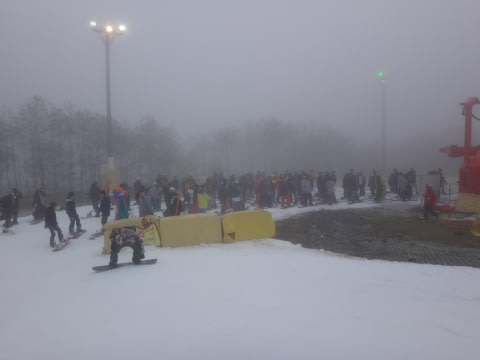

# 2016/17シーズンオープンから1週間…10月30日の日曜日，2日連続のYetiの混雑は？

📅 投稿日時: 2016-10-31 01:10:18

🏷️ カテゴリ: [2017スキー滑走日記](c7d777cecfc91bdf0fa464ad62c6d49ab.md)

ということで．

なぜか．

昨日の土曜日に引き続き．

…この日曜も，行ってきました，イエティへ．

そうです．Yeti日帰り2連発です．←アホとしか言いようがない

ただ，本日はいろいろあって，朝のスタートが遅く．

10時過ぎにゲレンデ到着だったのですが…

ゲレンデに着くまでの道は…

…

…雨だよ（涙）．

でも．

朝から降り続いたらしい雨は．

ラッキーなことに．

ゲレンデに着くころには，上がってました～！

私がゲレンデに到着したら，ちょうど雨が止むなんて…

やはり，私の日ごろの行いの良さのおかげかな！←昨日の天気はどう言い訳するつもりだ？

ってことで．

雨上がりの曇り空のゲレンデ．

11時くらいまでは，時折ガスも出て…

前が見にくいタイミングもありましたが…

ガスが出たのは11時まで．

それ以降は，ガスはすっきり上がりました．

で．

まだコース幅は狭いですが…

…人は，昨日より多いですね…

朝10時のリフト待ちはこんな感じ．

ただ，11時にクワッドリフトと並行する

ペアリフトが営業開始したので，

それ以降のクワッドリフトの待ちは，

終日この程度で．

まぁ，最大3-4分，ってところでしょうか…

ただ．

リフトが2本動き出して，輸送力が上がると．

…リフト待ちは減るけど，ゲレンデが混むんですね～（涙）

リフト2本分の人が送られるんだから，まぁ

当然と言えば当然ですが…

しかーし！

人は増えてきたものの．

午後1時過ぎには…

うむ？

晴れてきたよ！

ゲレンデに日が射してきたよ！

…でも．

日が射すということは．

いいことでもあり，悪いことでもあり．

うーむ．

がんばって硫安を撒いてあるバーンなんだけど．

…なんだか．

日が射して温まったので．

板に貼りつく，粘っこい雪になってきました…（涙）．

そして．

当然，雪は暖かい気温で融けてゆき…

あらら～．

ちょっと，雪が融けて，

薄くなった部分が出てきました…

うーむ．

天気がいいのはいいけど．

雪が融けて，板に張り付く雪になっていくのも

困りもの…

で．

今日は，午後になってもクワッドのリフト待ちは最大3分程度．

短ければ1分程度．ペアリフトは待ち0と，

いつもに比べればリフト待ちは少なかったものの．

…ゲレンデの人口密度は，例年のこの時期と

変わらない感じの．

気持ちよく滑るのは困難な感じだったかな～．

しかし．

今日の午後は．

リフト待ちも少なく，

いい天気で滑れたので．

ちょっとゲレンデは混んでいたけど．

午後は板も走らなかったけど．

まぁ，良しとしておきましょう…←要するに，滑れれば晴れでも雨でもいいのね

また明日，定番のコース動画アップします～！

PS．今日は，日が陰ると寒く，日が射すと暖かい感じで．

　日が射せばウェアのジャケットではなく，もう少し薄手の

　上着で十分でしたが．

　日が陰ると，普通のウェアのジャケットが欲しい感じの

　気温でした…

　硫安いっぱいで板のエッジも錆びるし．

　ところどころ汚れた雪もあるので．

　新しい板は持って行かない方が吉かな～．

## 💬 コメント一覧

### 💬 コメント by (yama)
**タイトル**: 昨日は
**投稿日**: 2016-10-31 06:44:56

ご一緒させていただきありがとうございました。あの後は晴れて富士山の山頂が見えるときもありました。2時半を過ぎるとリフト待ちもゲレンデの人も増えました。3～6時ぐらいはガスも出て視界も悪く、寒くなりました。S様と一緒に滑っていた時が一番天気が良かったです。ナイターは10本ほど滑って上がりました。

### 💬 コメント by (はなげ親分)
**タイトル**: まさかの!!
**投稿日**: 2016-10-31 14:10:32

日帰り連チャンですか…

てっきり長泉のホテルに宿泊かと思っていました。さすかS様、シーズンインからぶっ飛ばしてますね～

こちらは、何時もの様に月曜ナイターです。

Yama様、お会い出来れば良いですね♪

### 💬 コメント by (まいるまい)
**タイトル**: スタンプラリーは
**投稿日**: 2016-10-31 17:01:55

Ｓさん、お疲れさまです。

二日連続とは相変わらずすごいです。

私のシーズンはまだ先ですけど・・

スタンプラリーの後は福引き一回でポケットティッシュ一個でした

### 💬 コメント by (Skier_S)
**タイトル**: そうです．日帰り2連発です
**投稿日**: 2016-11-01 02:07:12

＞yamaさま

日曜はお会いできて良かったです～．

一緒に滑っていただき，ありがとうございます．

そうですか．

あの後は，ガスになったんですね．

私がいる時だけ晴れたなんて，

やはり私の日ごろの行いが…（違うってば）

＞はなげ親分さま

そうなんですよ．

日帰り2連発です．

御殿場なら，泊まるより

日帰りの2回の方が圧倒的に

安いので…

先週行けなかった分を取り戻しました！

…って．

この時期のYeti，そこまでして

滑りこみたいゲレンデではないですが…（笑）

＞まいるさま

スタンプラリーでポケットティッシュですか（＾＾

労力に見合わない商品でしたね…

そちらのシーズンインは，やはり白馬方面とかが

滑れるようになってからですか？

