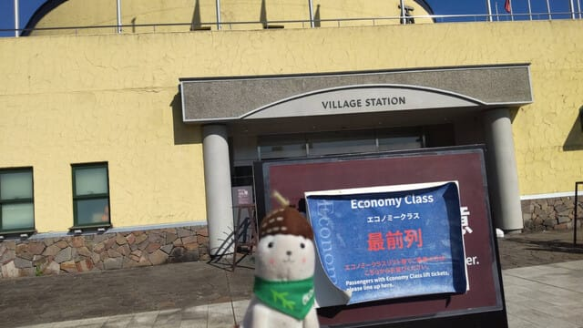
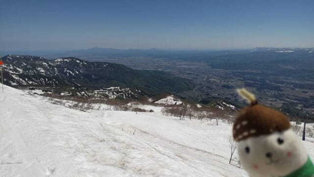
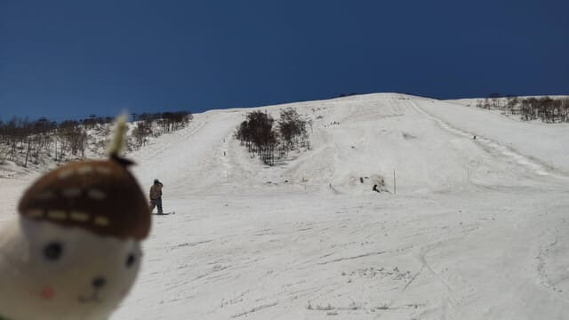
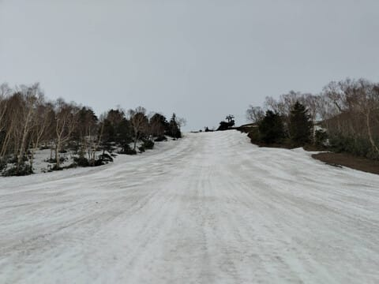
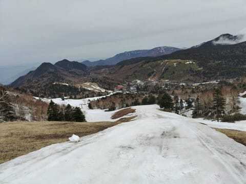
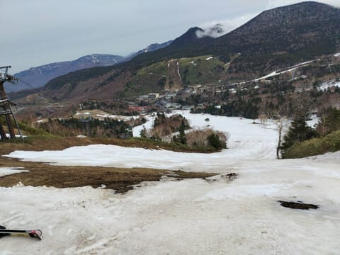
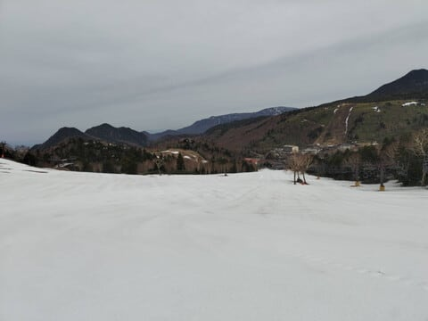
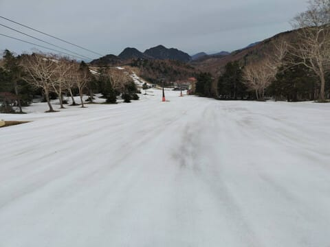

# 2日連続昼更新！5月8日(木)のARAIスキー場と5月9日(金)の熊の湯スキー場，特派員レポート！

📅 投稿日時: 2025-05-09 13:19:32

🏷️ カテゴリ: [日記](cc4b5682fb7b8b144980957a978653fb0.md)

ダメです…

どうやらGWの疲れか，夜起きてられず…

昨日は12時ごろまで仕事して，お風呂入ったり

なんだりした後，深夜1時半から

「さぁ，Blog書くぞ…」

と思ったけど．起きてられずに寝てしまい

ました…(泣）

ということで，2日連続の昼更新ですが．

昨日の8日木曜日，おこみん特派員は

志賀高原を離れ，ARAIに滑りに行っていた

ようです…！

朝イチは結構板も走り，膳棚クワッドの

コースは結構幅いっぱいに滑れたみたい

です！

これで，今週日曜が営業最終日？？

と思うほどの雪の量がありますね…

来週以降営業しないなんて，もったいない…

そして，本日9日(金)の熊の湯スキー場で

滑ってきた特派員もいたようですが…

7，8日とお休みだった熊の湯，本日から

営業再開です！

営業再開後は第2ペアの下半分だけ，

という予告でしたが．

なんと，山頂から馬の背も滑れたようで…

それだけじゃなく，イベントコースも

まだ滑れるみたいです！！

…ただ，山頂からのコースはブッシュや

石ころが多く，傷ついてもいい板で滑る

方がいいとのこと…

ただ，第2緩斜面はまだ十分雪が

ありそうですし．

第3側の緩斜面も，まだ滑れますよ～！

これで1日券(8:30～15:30)4000円なので，

熊の湯は割とリーズナブル化も…

11日の日曜日のみ，早朝営業（6:00～8:00）

が2000円で営業です！

ということですが…

土曜は暴風でリフトが止まるところが多そう…

そして雨も降りそう(泣)

うーん．私は日曜用事で滑りに行けないので，

はたして土曜に滑りに行けるのか…？？

今晩の天気図を見て，リフトが動きそうか

どうかで決めます…
