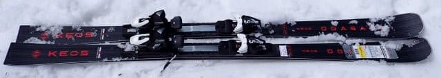
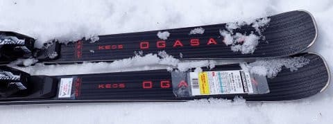
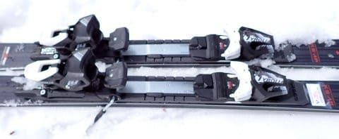
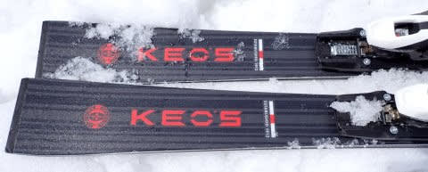
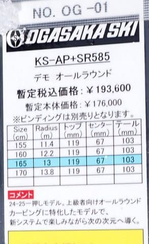
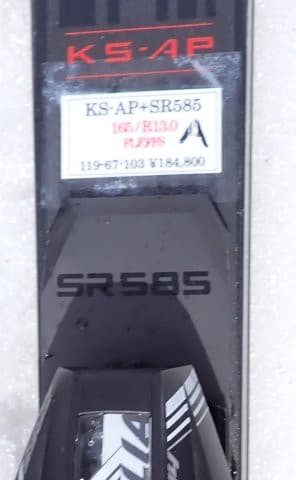

# 2025シーズンモデルのスキー板，試乗レポートその33…OGASAKA KEO's AP + SR585

📅 投稿日時: 2024-07-21 01:41:35

えー．

ここ2週間，いろいろ予定があって山を

走っていなかったので，

今日もいつも通り，金曜夜に仕事が終わって

日付が変わってから帰宅したというのに．

朝2時に寝て，睡眠時間2時間で朝4時前起きで

小仏～陣馬山方面に走りに行ってきて

しまったという…

2週間山に行ってないと，身体がなまる様な

気がして，なんだか落ち着かなくなるように

なってきた自分がヤバいかも．

で．

今日はもう今シーズン3回目のチャレンジと

いうのに，タイムがまだ昨シーズンのベストに

比べて登り5分，下り5分も遅くて．

めちゃくちゃ体力が落ちていると悲しんでいる

今日この頃（涙）

うーん．

冬にこれだけスキーをやっていても，

体力が落ちているのか…（泣）

昨年のタイムにまで戻せるのかなぁ…

しかし．

朝から山を走って，10時ごろには帰宅して

それから仕事をしようとしてるんだけど…

睡眠不足＆山を走った疲労のため，

昼間ずっと寝てしまい．

今日も一日仕事ができなかった…

ヤバい（泣）

でも．

今日もBlogを更新！

本日も2025シーズンモデルのスキー板の

試乗レポート．

今回はオガサカ編です！

〇OGASAKA KEO's AP + SR585 165cm

基礎小回り

説明書きにはオールラウンドと書いて

ありますが…

長さのバリエーションとサイドカーブ的に，

完全小回りベースの板ですね．

Keo'sシリーズは来シーズンも3種類の

ラインナップ．

整地カービングをメインにしたA〇，

不整地などのオールラウンド性も

もたせたP〇，

そして比較的ラディウスが大きく，

大回りベースのXXとありますが．

この整地を狙ったA〇シリーズが

AP，AD，AUと3グレードあるうちの

最上級モデルになります．

…しかし，知らぬ間に，KEO'ｓシリーズって，

ツインキールモデルはなくなって，全て

サンドイッチ板になっていたのね…

で．このAPは，プレートなし，FMプレート付き，

SRプレート付きが選べるようですが，

今回試乗したのは一番強いSRプレート付き．

履いてみると…

をを！かなりの旋回性！！

良く回ってきます．

どちらかというとトップを抑えるより，

テールを抑えていくと回っていく感が

ありますね…

返りもそこまで強くなく，抜けがいいというより，

最後までしっかり旋回してキレ上がってくる

感じの板です．

旋回性はいいけど，どうしようもなく回ってくる

板ではなく，傾きによって回転弧が自由に

コントロールできる感じで．

165cmというよりも長く感じるエッジコンタクトで，

トップとテールまでのエッジがしっかり効いた

感じでスムースにカービングの弧を描いて

いけます．

板自体は比較的たわみやすいけど，

柔らかいというよりは芯があるしなやかさ

といった感じで，スピードを出していっても

そこまで腰砕けになることはなく，

春の荒れた雪でも板が叩かれて不安定になる

ことなく滑っていけます．

…ただ，私のトップスピードを出すとやっぱり

ちょっとたわみすぎて，小回りスペシャルに

なっていく感じはありますが…

でも，しなやかにたわんでくれるし，

スピードに板が負けてたわみ切ってしまう

感じもないし．

あまり圧をかけすぎなければ，割と縦目に

落としていくこともできるし．

おそらくSRプレートのモデルであれば，

普通のゲレンデスキーヤーのスピード域で

弱さを感じることはない板かな．

角付けしただけで楽に気持ちよく

脳内麻薬系のギューンと回っていく

カービングに入っていく板で，旋回半径の

コントロール性も，角付けの強さで

操作できる操作性の高さもある感じで．

ずらしとか，低速の基本動作をやりたくなる

ような（？）オガサカの板っぽさは弱く，

気持ちよくゲレンデを脳内麻薬が出るに

任せてカービングし続けたくなる板．

オガサカの板なので，ずらしのコントロール

性もありますが…

ずらして滑るより，ひたすら気持ちよく

カービングで回っていたいと思わせてくれます．

トップスピードでの安定感は，SALOMONの

SL PROにはちょっと負けるかな…

とか思いながらも．

SL PRO並みの気持ちよさ，谷回りへの

スカーンと入れる安定感，そして気持ちいい

カービングでのキレがあって．

それでいて，ズレのコントロール性もある．

プルークとかの低速での演技とか指導とか

やるためにオガサカを狙っている人というより．

ゲレンデを気持ちよく滑る普段履きを求めている

人には，この板はかなりいいんじゃないかな？？

この板，私にとってはかなり満足度が

たかいいたでした…
