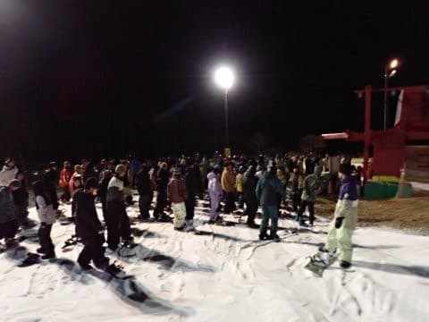

# 2023/11/18(土)のイエティ，速報レポート！…天気は晴れたけど強風，午後2時半ごろまでリフト動かず．ゲレンデ幅は広がったし夏タイヤでもOK

📅 投稿日時: 2023-11-19 04:24:46

🏷️ カテゴリ: [2024スキー滑走日記](c453f687e8a0f05679e95831d0a02cd0c.md)

ってなことで．

本日，横手山が無事オープンしたみたい

ですね…

まぁ，プレオープンで板は脱いでの

リフト乗り降りだし，20日からまたクローズ

といった状況ですが…

今日のゲレンデ状況を見ると，そこそこ

よさそうなゲレンデ状況に見えますね…！

（[横手山Facebook](https://www.facebook.com/yokoteyama2307/)より）

…ただ．

志賀高原に高い忠誠心を持つはずの特派員が，

誰も今日は志賀高原に行ってないので，

詳細は分からずです…

どのくらい混んだのかなぁ…

ってなことで．

私は今日…というか，もう日付が変わったので，

昨日の土曜日．

予告通りイエティで滑ってきました～！！

…でも．

なんだか，かなり残念な感じの一日でした…（涙）

そもそも，昨日の記事で．

久しぶりに5時間寝られそう！！

とか書いてたけど．

…その後，娘につかまってしまい．

眠い中，深夜3時まで娘に勉強を教える

はめになってしまい．

前日も睡眠3時間ちょいだったのに，

今日も睡眠時間2時間半でイエティに

行くことになってしまったという，

出だしからかなり厳しい状況だったの

ですが…

ただでさえ睡眠不足で眠い中，

何とか朝9時前にイエティについたら…

なんと．

強風でリフト営業見合わせ！！！（激涙）

（[スノーパークイエティFacebook](https://www.facebook.com/YetiSnowtown/posts/pfbid02fTYYnbpwtDiUQ9FGbZ7v4WLiMnhRsn42JZN29eQ4PbHp731d9HXS1r7XL9zFkimRl)より）

せっかく睡眠時間を削って早く来たのに…（涙）

…でも，まぁ天気図を見てもそこまで強風には

ならない感じだったから．

まぁ，しばらく待てばオープンするだろうと

思っていたところ．

1時間待っても，2時間待ってもオープンせず．

昼を過ぎても全くリフトが動く気配なし（泣）

せっかく寝ないで来たのに，これは

何の仕打ちだ…！！（止まらない涙）

昼頃にはもうあきらめて帰って

寝ようかと思ったけど．

そもそも仕事の関係上，日曜に滑りに

来るのは不可能なので，ここで帰ると

今週のスキーはあきらめることになり．

イエティを後にした直後にリフトが動き

始めるようなことがあれば，

「もう少し待っていれば滑れたのに…っ！！」

と，無茶苦茶後悔するだろうし．

とりあえず，

今週の仕事のご無体ストレスをスキーで

発散しないと死ぬ

という理由で，睡眠不足をおしてここまで

来ているので．

ここで帰るわけにいかない

という謎の義務感で粘っていたところ…

通常オープン時間から遅れること5時間半．

午後2時半過ぎに風が弱まり，やっと

営業開始！！

（[イエティホームページ](https://www.yeti-resort.com/)より）

午後2時半オープンとわかってれば，

5時間半家でのんびり寝てられたのに…

と悔しがりながらも．

コース幅も広くなり，気温も氷点下近く，

雪がしっかり締まったオープンの一本は

いい感じ！

先週日曜から比べると，コースはかなり

広がりました…

一週間でここまで広がるとは，イエティの

造雪能力おそるべし…

オープン直後は，あきらめて帰った人が

多かったから，比較的すいてたけど…

オープンから1時間経つか経たないかの

3時半には，ナイター券の利用可能時間になり，

あっという間に人が増えてきて…

リフト待ち5-10分と，なんだかいつもの

リフト待ちの混雑になってしまいました（泣）

…今日は強風で営業休止のニュースを見て，

イエティに来ない人が多いだろうから

混まないだろう…

我慢して待った人がガラガラのイエティを

滑れるはず！！！

という目論見は外れたよ…（泣）

ただ，リフトが強風で減速運転というのも

あり，輸送量が少なくコース上の人口密度は

いつもよりちょっとだけ低めだったというのが，

せめてもの心の救い…

そして，今日は午後2時半オープンだったので，

夕方4時からの整備タイム無しにそのまま

ナイター営業に突入！！

…ただし．

ナイターになると，さらに混雑が悪化したん

ですが（涙）

うがーー！！

今日は寝られなかったし，

リフト営業は遅れるし．

営業開始したらすぐ混むし．

だめだ…

今日はダメな日だ（あふれ出る涙）

ってなことで．

リフト待ちが昼間よりひどいし．

18時には10分待ちを越えてきちゃったのもあり．

営業見合わせの影響で今日は混まないん

じゃないかという見積もりが，大きく

外れた悲しさ…

激烈に見積もりが甘すぎたか…（涙）

寒いし混んでるしリフトも遅いというのもあり，

今日は18時過ぎに切り上げることに（涙）

あぁ…まだ3時間半しか滑ってないのに…

ダメだ．

今日はダメな日だった…

しかし．

天気は良かったものの気温が低く，

昼間は時折雪がぱらつくほどに冷え込んだ

本日．

ナイターのころには，Bゲレンデでアイス

クラッシュじゃなく，人工降雪機が動いて

ました！！

もし，ナイター後にメインのAゲレンデ側にも

人工降雪を打ってくれれば，明日は

コンディションよくなりそう…

とりあえず．

Yetiは，先週の悲しい雨での営業休止から

復活後，順調にゲレンデは拡幅しています！！

ってなことで．

今日は滑り出しが遅かったにもかかわらず．

遅くまで滑るのをあきらめて，早めに家で

ゆっくり寝るつもりだったのに．

イエティからの帰宅後にまた娘につかま

ってしまい．

…また，深夜3時まで勉強に付き合う，

優しい私…

そんなこんなで，今日は朝6時前に起きたのに，

今はすでに午前4時過ぎ（泣）

睡眠時間2時間半で，その後活動時間22時間

なんですけど…

もう寝ます．

寝ないと死ぬ．

おやすみなさい…
