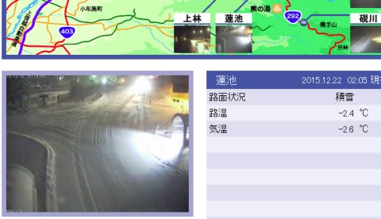
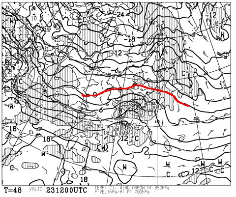
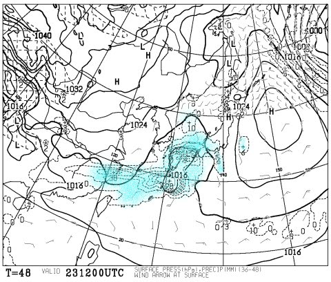
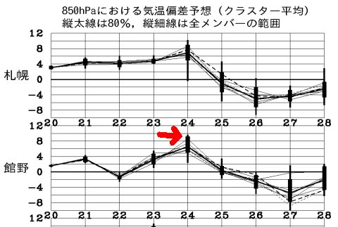
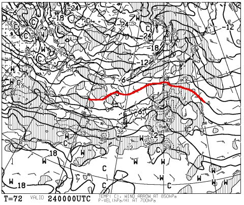
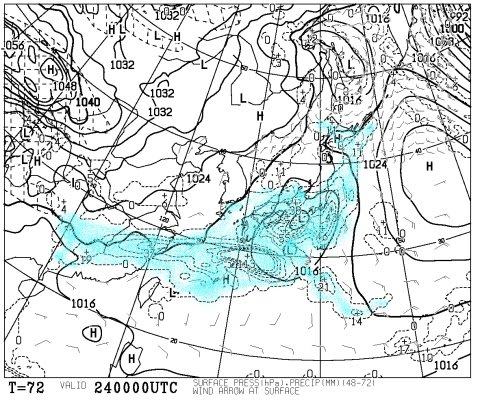
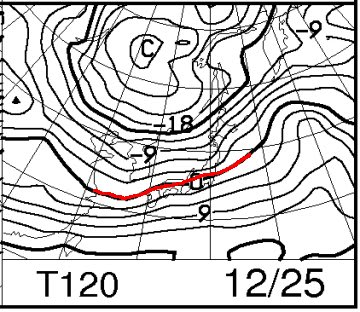
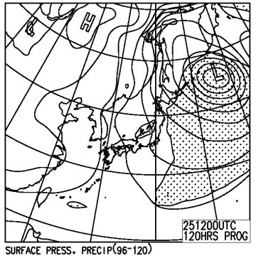
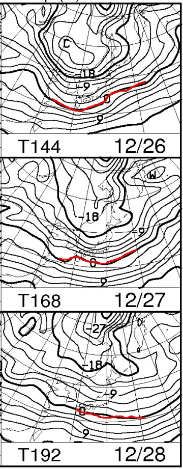

# 今週は，雪が積もるのか？…23日と今週末の雪を予想してみる

📅 投稿日時: 2015-12-22 03:03:42

よく聞かれるのですが．

気象関係の仕事もしてなければ，

気象予報士の資格ももっていない，Skier_Sです．

冬～春の志賀高原の天気しか予想できないという

かなり偏った能力しか持ってませんので（笑）．

ってことで．

今週は，水曜日が祭日なので．

ちょっと変則的に，月曜だけど天気予想をば…．

…で．

志賀高原は，現在．

期待の雪が降っているようですが…

この雪は，明日の朝までは積もりそうですが

…そのあとは，あまり積もらなさそう…（涙）．

明日の昼間は，降ってもチラチラ程度．

うーーーーむ．

23日までの劇的改善は望めそうにもありません（激涙）

なぜこんなことに…

きっと．

日ごろの行いの悪い人がいるはずっ！！

ちゃんと「自分が悪い」と申告しなさいっ！！←だから，それは自分でしょ

で．

23日の祭日ですが．

まぁ，朝のうちは晴れそうですね～．

昼ごろから，雲が多くなってくるかな．

で．

23日夜9時の850hpa図は…

はうぅっ！！

赤く印した0℃線…東北まで上がっちゃってますよ！？？

…これは，降れば，雨？

…しかし．

23日夜9時の地上天気図がこんな感じで．

水色に塗った降水域は，ぎりぎり志賀高原にかかってないので．

夜までは，なんとか降らないでもってくれそうですね…

＃きわどいところだけど

そして．

やってくるのは，壊滅的な24日．

…この矢印で示した24日の気温，なんですか？？？

平年から6度以上高くなりそうなんですけどっ！！？？

この，24日の850hpa気温図は．

こんな感じで，0℃線が東北北部まで上がっちゃってるし…

そして，24日の地上天気図は．

…何だこりゃ．

水色で塗った降水域が，日本全国を覆っているので…

…

…

雨

ですね…（激烈な涙）．

それも．

24日は一日中，雨です．

ヘタすると，25日まで雨が続きかねない…（涙）

ダメだ…（泣）．

ダメだよ…これは．

24日，かなり壊滅的な雨で，ゲレンデは大打撃を

受けるでしょう…（屍）．

しかし．

ここで，わずかな希望がっ！

25日の夜には…

850hpaの0℃線がようやく信州まで下がってきて…

そして，地上天気図も冬型に！

これは．

25日の途中から，雨が雪に変わり．

雪が積もり始めそう…！

そして．

26日～28日にかけて．

をを！

0℃線は日本の南まで下がってくれます！

そして，26，27日と冬型の気圧配置が続くので．

雪が降りそうっ！

これで…

これで何とか，ゲレンデは一気に改善するか！？？

ってことで．

まとめると．

23日（祭）：朝は晴れ．前日の夜に積雪は無いので，人工雪に圧雪．

　朝の気温は低く，締まった固い雪．午後に向かって雲が増えていき，

　気温も上がる．夕方まで雨は降らずにすむはず．

24日（木）：壊滅的な雨が終日続く（悲）．

25日（金）：朝まで雨か…あるタイミングで雪に変わり，

　そこから積もり出す

26，27日（土日）：冷えて，雪が積もるっ！！（はず）

って感じですが．

この26，27日の雪で．

焼額第1，第2ゴンドラが揃って動くことを願うばかり…

…雪の降り始めがもう2-3日早いといいんだけどなぁ…

＃26，27日の雪で，28日からやっと滑れるようになる…という可能性も

とりあえず．

25日．早くから雨が雪に変わり．

そして，ドサドサと積もって．

26日にはゴンドラがちゃんと動くように，

全身全霊で祈ります…←26日からゴンドラが動いたら，それは私の祈りのおかげ…ということで

## 💬 コメント一覧

### 💬 コメント by (Goku)
**タイトル**: お祈りが届いたようですね。
**投稿日**: 2015-12-22 16:46:30

明日から２ゴンが動くようですね。

今から笑いが止まらない！

### 💬 コメント by (Skier_S)
**タイトル**: Gokuさま
**投稿日**: 2015-12-22 22:16:39

いやーーーー．

来ましたね．

人海戦術でのオープン．

…でも，コースは地雷原だと思います（笑）．

昼ごろには，去年の12月第一週並みの

はげはげバーンになる予感…

でも，行きます．

私も2ゴンに会いに，日帰り700km往復です！

