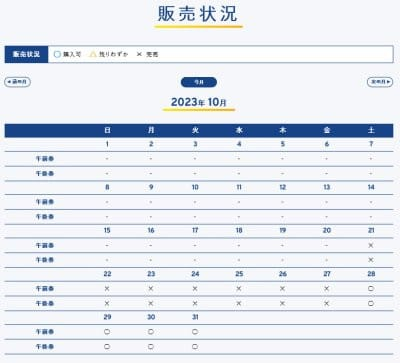
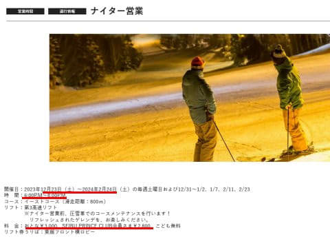

# 菅平高原スキー場の2024シーズンオープン，10月21日から延期になったみたい…そして焼額のナイターは3000円に値上げ

📅 投稿日時: 2023-10-11 08:13:32

えー．

相変わらずクリティカルな状況が続くので．

いつもより遅い時間の更新！

（そしていつもよりちょっと短め）

ってことで．

焼額の常連メンバーから情報が流れて

来たのですが…

アイスクラッシュで10月21日オープンを

目指していた菅平，造雪機の不具合が続き，

10月21日のオープンをあきらめたようです…

すでに，10月21日から27日までのチケット

販売を取りやめていて，28日以降のチケット

しか買えなくなってます．

（[菅平スノーリゾート　早期営業案内ページ](https://sugadaira-snowresort.com/earlyseason/)より）

今のところ，11月上旬オープンを目指すと

言っているようですが…

オープン日は未定です．

うーん．

やっぱり，最初の年はいろいろトラブルが

つきものだし，予定通りのオープンは厳しかったのか…

ちょっと残念．

で．

我がホームゲレンデ焼額は，ナイター営業の

案内が出てました～！！

例年通り，12月年末年始前の週末から

2月いっぱいまでの土曜と3連休の中日，

正月期間の営業で，

営業時間も18時から20時とこれまでと変わらず．

（[焼額山スキー場ホームページ](https://www.princehotels.co.jp/ski/shiga/informations/night_ski_1/)より）

ただ…

お値段は上がって，一般3000円，

プリンスクラブ会員が2800円です…

うーん．かなりの値上がり（涙）

2月で4回ナイターがあることを考えると…

ナイターも使える2月からの焼額2ndシーズン券，

さらにお買い得感が増してくる…

ヤバい．

次のシーズンも，シーズン券2枚持ち

してしまうのかも…？？
