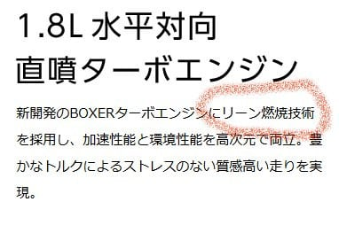

# SUBARU LEVORGの次期モデルのプロトタイプが公開されたよ…！

📅 投稿日時: 2019-10-24 01:24:34

ということで．

現在開催されている東京モーターショー．

本日，そこでLEVORGプロトタイプが

公開されたようで．

スバルのHPに，LEVORGプロトタイプの

情報が公開されてました～！！

…当然，現行LEVORG乗りとしては気になるので．

さっそく[SUBARUの公式Webページ](https://www.subaru.jp/levorg/prototype/?rtoasterbox=pfa_pc)にて，

情報を見てみますが…

うーむ．

フロントマスクのデザインは大きく

変わりますね…

（[スバルLEVORGプロトタイプサイト](https://www.subaru.jp/levorg/prototype/?rtoasterbox=pfa_pc)より引用．以下も同様）

ちょっとゴツゴツした，アグレッシブな

造形になりましたが…

これは，好き嫌いが分かれそう…

リアの造形も大きく変わりますね．

そして，サイドビューは…

ホイールアーチが円じゃなくなったので，

かなり印象が変わりますが．

基本的なキャビンの造りや

コンセプトは変わってない感じ…

しいて言えば，リアクオーターウインドウの

下端が後ろに向かって跳ね上がった

ところが，現行との大きな違いでしょうか．

そして．

エンジンは1.8L一本ですか…

米国向けアウトバックに乗っている，

2.4Lターボが載るかも？

という噂もありましたが．

今回のLEVORGは1.8Lのみの

ようですね…

そして，アイサイトが新世代に

進化して．

高精度GPSと組み合わせることで，

渋滞時のハンズオフが可能になるようです…！

ハンドル握ってなくても良くなるなら，

すごい欲しいかも…！！

さらに，四つのレーダーにより，

出会い頭衝突や右左折時でも，

自動ブレーキが効くようになるとか，

かなりの進歩がありますね…

…ってあたりが，SUBARUの公式ページから

読み取れる情報でしょうか．

…しかし．

この徒然スキーヤー日記のポリシーとして．

こんな，公式ホームページの情報をそのまま

再掲するだけの記事では終わらせないのだ！

この程度の情報なら，公式ホームページを

見れば済む話で，このBlogを見る必要は

無いのだ．

公式HP以上の追加情報が無いのならば，

このBlog記事にする意味は無いのだ…っ！！

ということで．

現行LEVORG乗りとしては．

現行LEVORGと次期LEVORGプロトタイプの，

もう少し細かい比較をするのだ！！

…ってなわけで．

現行LEVORGのサイドビューと．

新型LEVORGのサイドビュー．

同じ縮尺にして，

レイヤーで重ねて…

こんな感じでぴったり重ねてみて，

両車のディメンジョンやら形状を

比較してみました～！！！

…これを見て分かったのは．

最初に写真を見た瞬間から，

「あれ？リアオーバーハング，短くなった？」

と思い．

また，リアドアの下端も長くなっているように

見えたので．

「…これは，ホイールベースが伸びたか？

　リアシートを広くした分トランクを

　短くして，全長を変えないままリアシートを

　広くしたのかな…？？」

と，勝手に推測していましたが．

どうやら．

両車のホイールベースは同じです．

前輪と後輪が，ぴったり重なってます．

ただ，

新型の方がリアオーバーハングが短い

という見積もりは当たっていて，

リアタイヤから後が短くなってます．

その分，

新型の方がフロントオーバーハングが長い

ようで，フロントタイヤから車の先端までが，

新型の方が長いです…

で，新型のリアオーバーハングが短くなった分，

ちょうどフロントオーバーハングが長くなったようで，

車の全長はほぼ同じです．

ふーむ．

鼻が長くなった分，お尻が短くなったのね…

トランクにしわ寄せが行くのか…

フロントは長くなっただけじゃなく，

ボンネット先端も高くなってます．

うーむ．

衝突条件の厳格化による，フロント

クラッシャブルゾーンの要求なのか，

対人衝突時の傷害回避のための，

フロントボンネット高の確保なのか…

で．

フロントガラスからルーフにかけてのライン．

両車恐ろしいほど一緒です．

このあたりの，設計要件は変えてないようです．

デザイン上，ルーフのリア下がりが強く

なったように見えますが，これは

デザインの賜物ですね．

リアクオーターウインドーの上端を

後下がりにすることで，

ルーフを低く見せているようです．

ついでに言うと，

ウエストラインは両者全く同じで，

フロントドアガラス，リアドアガラスの形状もほぼ一緒．

さらに，

フロントタイヤ…フロントガラス…ドアミラーの位置関係も一緒

です．

フロントタイヤを設計起点とした，

ドライバーポジションが全く変わって

ないことが，これから読み取れます．

…ってなことで．

両者のディメンジョンや各部寸法は，

オーバーハングを除くとほぼ同じなので．

室内の広さも，フロント・リアシート合わせて

現行と全く同じと思います．

地上シート高などの，ドライビングポジションも

全く変わらず．

トランクは多少長さが短くなるかも…

ホイールベースも同じなので，

基本的にパッケージングは

現行LEVORGの正常進化版なんでしょうね．

設計要件を変えないまま，SGPで

培った最新技術で設計しなおした車，

という感じでしょうか…

外寸から読み取れるのは，せいぜい

この程度まで．

あとは，エンジンも1.8Lに変わるし，

プラットフォームはSGPに変わるし．

（第2世代SGPということで，

　インプレッサ・XV・フォレスターからは

　変わるらしいです…）

走りに関しては大きく変わってくるのかも？？

しかし．

1.8Lエンジン．

直噴ターボでリーンバーンって…？？

確かに理論的には，過給リーンバーンは

熱効率が上がるけど．

三元触媒使うなら，リーン域では

燃焼温度むちゃくちゃ下げてNOx生成を

抑えなくちゃならないので．

リーン域はA/F25を超えてくるところを

使わなきゃならないし…

…まさか，NOx 吸蔵還元触媒？？

確か，これってすごいお値段が高かったので．

一時期トヨタが使った以外，

三元触媒で行けるクールドEGRが

流行ってリーンバーンが

死に絶えてしまい．

最近使った例を聞いたことが

無いけど…？？

確か，スバルエンジンはEGR率30%を

超えた領域を使っているので．

（私が読んだ数年前の論文だと，EGR率25%を

超えると，燃焼速度が遅くなりすぎ．

P-V曲線の立ち上がりがなまって

熱効率が悪化すると書いてあったものだが…）

過給リーンバーンでこれ以上の

熱効率ゲインを得ようとすると…

やっぱりA/F22以上の超リーン域を使うのか？？

うむ．

直噴でうまいこと成層燃焼させて，

リーン領域でも過給して，ポンピングロス

削減しつつブーストと燃料噴射量で

トルクコントロールすれば，理論的には

燃費がかなり良くなるんだけど…

（ちなみに，これでA/Fを30以上という

　超リーン域になるまで燃料噴射量を

　減らしてトルクコントロールするのが

　マツダのSKYACTIV-X）

とりあえず．

この1.8Lターボエンジン．

どのくらいのA/Fで動かすのか

知りたいところ…

…

ってな感じで．

車のパッケージングはコンセプトキープで

来たけど．

あまり誰も注目していない1.8Lエンジン．

結構チャレンジングなエンジンだということが

分かりました…

うーむ．

とりあえず，実物が出たら乗ってみたいな！

## 💬 コメント一覧

### 💬 コメント by (tamaWRX-8)
**タイトル**: 興味津々
**投稿日**: 2019-10-25 09:39:10

こんにちは（＾＾）

次期レヴォーグ、WRX乗りとしてもとても気になります！

見た目的にはフロント、リア共に黒い樹脂部品の割合が増えたので、ゴテゴテしてスマートさが無くなった感じ・・・。

ホイールアーチも多角形では無く、円形で良いと思う。

前端が現行より分厚くなって三菱のランサーみたい・・・。

見慣れていない事もありますが、個人的には現行型の方が格好いいと思います。

まぁ、良くも悪くも無骨なデザインはスバルの伝統なのですが女性受けは悪そうですね（＾＾；）

また動画で見た感じだと、ウインカーがフロント：LED、リア：電球だったのでちょっと残念・・・。(頑張ってフルLEDにして欲しかった)

次期型のエンジン気になりますよね～！

現行FA20DITのダウンサイジング版かと思いきや、リーンバーン技術採用を謳ってますし！

年々厳しくなる燃費規制に対し、このエンジンがどの程度の燃費性能を示してくれるのか！？

また、現行乗りを納得させる馬力が出るのか！？

こうやって悶々と妄想してるのが楽しいですよね笑

### 💬 コメント by (Skier_S)
**タイトル**: ＞tamaWRX8さま
**投稿日**: 2019-10-26 03:59:13

最近のスバルデザインは，複雑な立体を組合せたかなりビジーな面造形になってきて，

単純なカタマリの面の張りだけで勝負するMazdaデザインと好対照をなしますよね…

どちらがいいかは一概に言えず，単に好き嫌いの問題だと思いますが（笑）．

次世代エンジンは誰もあまり話題にしませんが．

かなりアグレッシブな変化なので，すごい気になります．

リーンバーン，低負荷時の燃費が上がるので実燃費には結構効きそうですが…

燃費とドライバビリティを両方改善するためのライトサイジング化＆リーンバーン化なら，

カタログ数値の馬力を1.6Lと同等程度に抑えて，低速トルクを上げてこないといけないのですが．

カタログ数値好きの日本人ユーザーは，カタログ数値の馬力が

1.6Lと同じってのは許してくれないでしょうね（笑）

ってな感じで．

私もいろいろ妄想をしているうちが楽しいです（笑）．

ホントにどんなエンジンになるのか．

それが楽しみでしょうがないです…

### 💬 コメント by (ほっぽ)
**タイトル**: レヴォーグ
**投稿日**: 2019-10-26 18:25:26

Ｓさん

もしかして次の車検が縁の切れ目でししょうか。(^^;

私もＳさんレヴォーグ購入資金を準備しておかないといけないか。(^^;

新型レヴォーグ、元スバル乗りも気になっています。

安全性能、環境性能は高まっているでしょうね。

ただ私のようにたまにサーキットで全開走行したい人には

ダウンサイジングされた1.8Lターボより2.0Lターボ300psの方が魅力的かもと思っています。

そうなるとターゲットは高年式過走行で割安なＶＭＧレヴォーグになります。

Ｓさんのように丁寧に扱われた過走行車は心配なく乗れることが分かり、

最近ではレヴォーグに限らず、高年式過走行車ばかり眺めています。(^^;

イエティもOPENしましたが、昨夜は落雷に雨と出撃見送り、

私のシーズンインは２８日のナイターからになりそうです。

### 💬 コメント by (Skier_S)
**タイトル**: ＞ほっぽさま
**投稿日**: 2019-10-26 19:45:25

うーむ．

まだ，いつ乗り換えるかは決めてません…

次のLEVORGやOutbackがどのくらい魅力的か，

あるいは何か物欲を刺激する車が出てくるか…

というところにかかっています（笑）．

結局，オープン日のYetiは悪天候で諦めた人が

多かったみたいですね…

私は明日出撃してきます！

### 💬 コメント by (オデッセイ、レガシィ、レヴォーグと同じく乗り継いだヤツです)
**タイトル**: Unknown
**投稿日**: 2020-02-12 12:29:52

お久しぶりです。

いろいろブログも参考にさせていただき、私の諸般の事情もあって、レヴォーグ1.6GT-S B型から、2.0GT-S最終F型にこの度乗り換えました。

長らく1.6GT-Sに乗っていたので、2.0GT-Sは、エンジンだけでなく、色々な違いがあることを感じています。奥さんにはシートヒーターが好評です。

やはり野太いトルクが、色々な局面で違いをもたらしてくれます。アイサイトも進化してますね。視界拡張は、画質がいまいちなのが少々残念です。カーナビは、時代の流れでスマホ感覚の操作になり、快適です。

### 💬 コメント by (Skier_S)
**タイトル**: ＞レヴォーグ乗りさま
**投稿日**: 2020-02-13 02:24:40

2.0GT-S購入おめでとうございます！

もう納車されてるのですね…

前の1.6GT-SはA型でしたっけ？

A,B型と比べると，F型はかなり完成度が上がっているのが分かるかと．

アイサイト，インフォメーションディスプレー，ヘッドライト，後退時のセンサー＆自動ブレーキ，ナビも8インチ化等，

いろいろな進化がありがたいですよね．

私は視界拡張オプションを付けなかったので，視界拡張は分からないですが…

画質がイマイチなんですね．

2Lでもエコランすれば，志賀高原の往復でリッター15kmは走ってくれますし…

あ，雪道でのアクセルオンの時の挙動が，1.6Lとの大きな違いかも．

しかし，VMレヴォーグを2台乗り継ぐとは…

