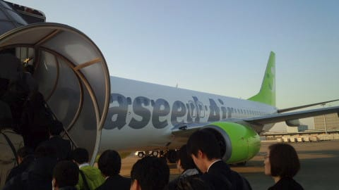
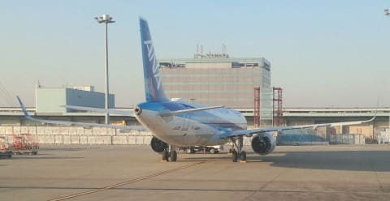
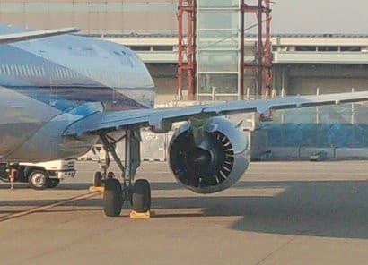
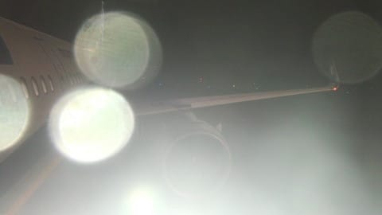
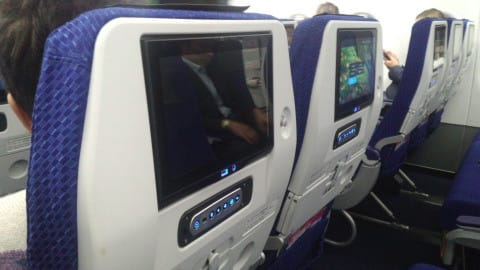
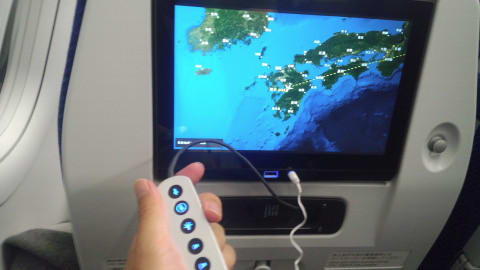

# 今日は朝5時出発で出張に行ってきた

📅 投稿日時: 2017-11-08 02:00:10

🏷️ カテゴリ: [登山・旅行](c1d637a11a25b457ac978d197adbdafc5.md)

えー．

本日．

朝4時過ぎ起きで．

某所へ出張に行ってきたのですが…

まぁ，普通なら．

「そんなところまで日帰りで行くか！？？」

というところに，日帰りで行ってきました．

その際に．

乗った飛行機の窓から見えたのが…

をを！

あれは，1か月ほど前に導入されたばかりの

A321neoではないかっ！！

うーむ．

PW1000シリーズのギアードファンエンジン．

バイパス比11越えってだけあって，

エンジン直径のほとんどがファンだよ…

コンプレッサー＆タービンのエンジンコアは

ものすっごい細い…

…昔は，バイパス比5で高バイパス比と呼ばれた

ものだが…（遠い目）

エンジンも静からしいし．

国内線仕様でも，全席10インチディスプレイ付きっていうし．

乗ってみたいなぁ…

…

と，思っていたところ．

帰りの飛行機は…

この写真だと反射で良く見えないけど．

シャークレット付きのA321？

NHのA320シリーズって，ceoはシャークレット付いて

ないはずだよな…

と，エンジンを見ると．

PW1000シリーズだっ！

ということで．

最新鋭機のA321neo，さっそく乗ってきました．

国内線エコノミーでも，ディスプレイがついていて．

TV番組やらオーディオやら楽しめるとは…

USB充電もできるし．

さらに，Wifiも使えます．

これって，フィリピンエア―の国際線よりいいな．

で．気になるエンジン音ですが…

スゲー静かだっ！！！

ジェットエンジン特有の高周波が響かない！

これが，ギアードファンエンジンの実力か…っ！！

ってことで．

A321neoに乗れて喜んだものの．

今日は朝5時に家を出たのに，帰りは最終の飛行機だったので，

帰宅は夜12時すぎ…（涙）．

活動時間19時間の一日でした．

こんなところまで，普通は

日帰りで行くもんじゃないな…（涙）

## 💬 コメント一覧

### 💬 コメント by (かず)
**タイトル**: 飛行機詳しいですね～
**投稿日**: 2017-11-08 22:39:56

最近ブログデビューしました　Sさんと違って不純な動機ですが　笑　まだ小出しで5日しか書いてないのでかっこついてきたら　覗いて下さい

### 💬 コメント by (まうちゅう)
**タイトル**: Unknown
**投稿日**: 2017-11-08 23:35:11

高バイパス比なんて用語、私は最近、たまたま仕事で知ったばかりでした。

車や航空機など詳しいですね。次は船舶でしょうか？

### 💬 コメント by (Skier_S)
**タイトル**: 飛行機大好き
**投稿日**: 2017-11-09 00:54:55

＞かずさま

また，ブログのURL教えてください．

見に行きます～！

＞まうちゅうさま

高バイパス比なんて単語が仕事で出てくるとは…

ジェットエンジン関係のお仕事なんでしょうか…？？

私は基本的に乗り物は大体好きです．

車もバイクも好きですし，鉄道も好きだったりします．

でも船は…あまり詳しくありません．

…てか，船って車や飛行機，鉄道と違って

あんまりマニア要素無いですよね（笑）

一応，2級船舶免許は持ってたりするんですが…

