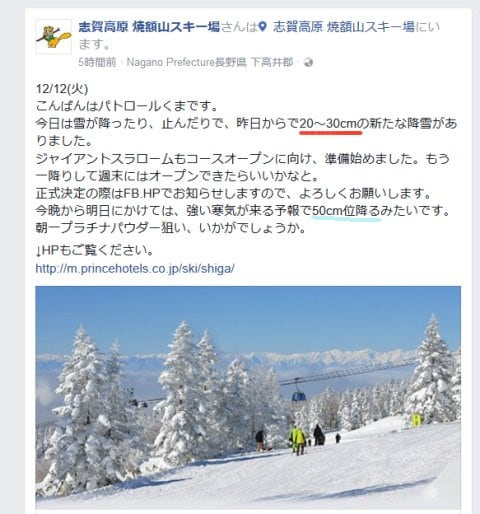
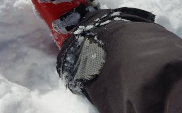
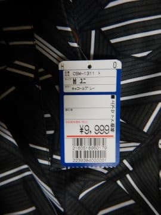

# そして，物欲選手権再び…物欲選手権番外編2

📅 投稿日時: 2017-12-13 01:14:24

どうやら，本日．

…焼額でも，20～30cmほど積もったようです！

うーむ．

志賀高原，せいぜい10cmほどしか積もらなさそうな

天気図だったんだけどなぁ…

まぁ，今晩も志賀高原はそれほど積もらなさそうな

感じですが．

明日水曜から明後日木曜朝にかけては．

志賀でも，結構積もると思いますよ～！！

ジャイアントスラロームコースも準備してるとの

ことなので．

このままいけば，今週末は1ゴン運転のはず！！

＃土曜の天気がまだ微妙だけど…土曜午後，雨にならなきゃいいなぁ…

＃…日曜は終日雪降りの天気になりそう

ってことで．

本題へ．

この間，[物欲選手権](e38b4d4ca6ea3af24cebf3838ab8c791d.md)をやったばかりですが．

…そうです．

買い忘れた何かを買いに行ってきました…

その時の話題をば．

----

アナウンサー　「みなさんこんにちは．

　本日は，

　第1回 スキーヤーの物欲を刺激するスキー用品屋に来て，

　物欲にまみれたスキーヤーが買い物をせずに

　我慢できるか選手権　

　をお送りします！」

解説　「…また微妙に名前が変わってる気が

　するんですが…この選手権…」

アナウンサー　「Skier_S選手．

　スキーパンツを買わなくては…

　ということなのですが．

　スキーシーズンが始まると，神田まで行く時間が取れないため．

　家からそれほど遠くない某スポーツ量販店に来ているようです」

解説　「って…

　今回も参加選手は，Skier_S選手なんですね…

　で．

　スキーパンツを買うことが確定してる

　ということだから，『我慢できるか選手権』にならないと

　思うんですが？」

アナウンサー　「いえ，まだ買うと決まったわけではありません！

　買うのかどうかを，ハラハラドキドキしながら見守るのが

　この選手権です！」

解説　「…いや…ハラハラドキドキって…

　誰もハラハラしてませんから．

　今回の結果はもう見えてますから」

アナウンサー　「…さて．Skier_S選手．

　昨年のGWに大きな穴が開いてからも，

　それからさらに20日近く履き続け．

　普通の人間ならとっくに履き替えるであろう，

　履くのも恥ずかしくなってしまうような，

　このスキーパンツ．

　ここでこのスキーパンツを新しく買ってしまうのか？

　それとも買い替えずに我慢できるのか？？

　この勝負を，しっかり見届けましょう！」

　

解説　「…この状態で我慢した方が，いろんな意味で

　ネタになってしまうと思うんですが…」

アナウンサー　「Skier_S選手．

　さっそく，スキーウェアのコーナーで

　型落ちのパンツを片っ端から見てますね～」

解説　「もう，神田に行けなくて，近所のスキー屋で

　買おう…というくらい切羽詰まった状態ですから．

　かなり真剣に見ていますね～」

アナウンサー　「でもやはり，神田と比べると

　お値段が高めで，ちょっとためらってるようですね…」

解説　「Skier_S選手は，スキーパンツは1万円以下の

　激安品をいつも買ってますからね」

アナウンサー　「そうですね．

　このお店，最も安いパンツでも1万5000円以上

　するような価格に，ちょっと引いているようです…」

解説　「板はホイホイと買うというのに，

　スキーパンツは1万円を超えると買うのを

　ためらうんですから…

　不思議な価値観を持ってますよね」

アナウンサー　「おや？？

　Skier_S選手，動きが止まりました．

　安売りウェアの棚で，立ち止まりましたよ！？？」

解説　「…これは，上下セット9999円という，初心者向けの

　激安ウェアのコーナーですね…」

アナウンサー　「年間数10日滑るレベルの人が

　対象にはなってないだろう格安ウェアを，

　なんだか真剣に見ているようですが…？」

解説　「一番安いスキーパンツより，このウェア上下

　セットの方が安いという，謎のお買い得商品ですからね…

　でも，ジャケットの内ポケットが無かったり，

　フードが縫い付けで取り外しできなかったり，

　この格安ウェア，かなりお値段相当のつくりですが…」

アナウンサー　「まさか，このレベルのウェアを買うとは

　思えないのですが…

　Skier_S選手，この格安ウェアを買ってしまうのでしょうか？？」

（続く）

## 💬 コメント一覧

### 💬 コメント by (かず)
**タイトル**: 先週は中止にしました
**投稿日**: 2017-12-13 13:57:33

今週の天気予報見て今週金土日に変更しました　金曜初滑りです　雪今日がピークですかね？

### 💬 コメント by (タカ)
**タイトル**: 物欲
**投稿日**: 2017-12-14 00:31:13

番外編来ましたね。三本目の板購入の流れになると思いますが。あ、本日仕事の合間に近くのスキー用品店入ったところ17SXVARビン付で定価の半額で売られてましたので秒で買いました。買蔵さん出る幕もない早業でしたので自分も驚いてます(笑)物欲って恐ろしいですね

### 💬 コメント by (Skier_S)
**タイトル**: また忘年会で帰宅後寝てしまってたので朝更新
**投稿日**: 2017-12-14 06:33:57

＞かずさま

あ，先週は滑らなかったのですね…

雪は，志賀高原ではむしろ木曜午前が

ピークかもしれません．

＞タカさま

え？？？

17SX　VARビン付きで半額？

それは安い…

しかし，秒で買いましたか．

私よりすごい物欲ですね（笑）

### 💬 コメント by (Unknown)
**タイトル**: Unknown
**投稿日**: 2017-12-20 02:46:26

「ええい、SX はいい、激安ウェアを映せ、上下セット9999円の激安ウェアの戦いぶりを・・・」

激安ウェアのティザー広告が気になって仕方がないので、タグ品番から探してみました。

https://www.alpen-group.jp/shop/commodity/SALP0482D/CO3120EU00002

https://item.rakuten.co.jp/timely-fashion/csm1311-1/

お忍び衣装として焼額山に登場することはあるのだろうか？

### 💬 コメント by (Skire_S)
**タイトル**: Unknownさま
**投稿日**: 2017-12-21 03:39:52

あら…

9999円上下セットのウェアが気になる人が

いたとは…！

リンク先の商品，確かに私が買ったのと

同じ柄です…

ジャケットはあまりにも私の要求レベルに

達しなさ過ぎているので，お忍び衣装としての

焼額山登場は無いと思います…

