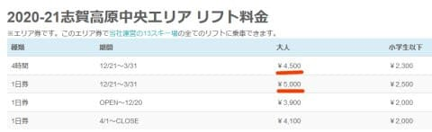
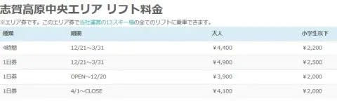
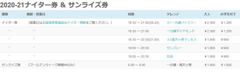
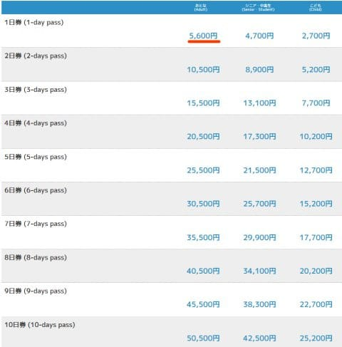
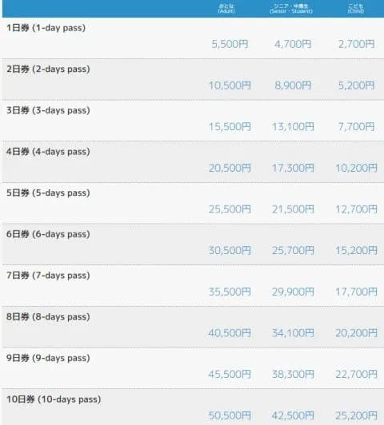
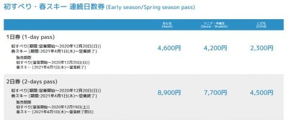
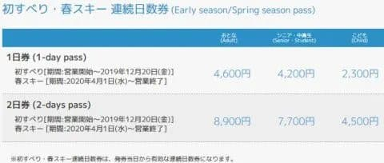
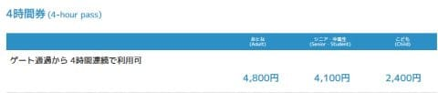

# 志賀高原スキー場の2021シーズンのリフト券料金も出てきたよ！…ごく一部，微妙に値上げ（涙）

📅 投稿日時: 2020-10-16 01:19:40

ということで．

11年目に突入した，徒然スキーヤー日記ですが．

今日も相変わらず，ゆる～い感じで更新…

えー．

[志賀高原中央エリアのスキー場マップが
2021年のものに切り替わる](eaf76ee257996f6cc2cf594ced2531159.md)のと同時に．

索道協会と中央エリアのリフト券料金も

2021シーズンのものに切り替わっており．

志賀高原全山＆中央エリアのリフト券

料金が明らかになりました～！！

…では，早速見てみましょう…

まずは，中央エリア券ですが．

2021シーズンの料金は…

うむ！！？？

4時間券が4500円，

1日券が5000円？？

（[志賀高原中央エリアホームページ](http://shigakogen.co.jp/highlight/896-2)より）

あれ？

エリア一日券，5000円もしたっけ？

…と．

昨シーズンの料金表を見ると…

…やっぱり．

4時間券が4400円，

1日券が4900円．

それぞれ，100円ずつ値上がりしてます（涙）

（2020シーズン中央エリア料金表）

ただ，12月20日までの初滑り料金，

4月1日からの春スキー料金は

昨年から値上げ無し

です！！

そして．

2021シーズンのナイター＆サンライズ券の

料金を見てみると…

（[志賀高原中央エリアホームページ](http://shigakogen.co.jp/highlight/896-2)より）

うむ．

こちらは，完全に昨年通り．値上げ無しですね．

良かった…

昨年一気に値上げしたからな…

で．

今度は，全山共通券を見てみますが…

ううむっ！？？？

こちらも一日券が5600円！？？

（[志賀高原索道協会，リフト料金ページ](https://www.shigakogen-ski.com/lift-tickets)より）

昨年のリフト料金を見ると…

やっぱり一日券，5500円だったよね！？？

（2020シーズン料金）

一日券，微妙に100円値上げです（涙）

でも，それ以外，

2日券～10日券は昨年通り

なのが，まだ良かったと言うべきなのか…

全山共通券も，初滑り・春スキー料金を見てみると．

（[志賀高原索道協会，リフト料金ページ](https://www.shigakogen-ski.com/lift-tickets)より）

これは，昨シーズンと同じですね…

（2020シーズン料金）

4時間券も昨シーズンと同じ4800円．

（[志賀高原索道協会，リフト料金ページ](https://www.shigakogen-ski.com/lift-tickets)より）

全山共通券は，

トップシーズンの1日券だけ100円値上げ．

あとはお値段据え置きのようです…

ってなことで．

一日券のみ100円アップという．

ビミョーな値上げになった志賀高原の

リフト料金．

でも，GoToトラベルの地域振興券も

使えるようになったみたいだし．

なんとかこれ以上志賀高原のリフトが

減ることがないよう，お客さんが

来てくれるといいな…

そして．

今シーズンも当たり前の如く，志賀高原

全山共通シーズン券を申し込んだ私にとって．

普通のリフト券料金を知る必要が一切ない

のに，しっかり調べて記事を書いている

…ということに気づいて，「偉い！」と

言ってくれる人が出てくれることを待っている，

Skier_Sなのだった…←そこ，あからさまに読者に要求するところじゃないから

## 💬 コメント一覧

### 💬 コメント by (ノーザンレインボー)
**タイトル**: Unknown
**投稿日**: 2020-10-16 06:03:16

sさん

10執念、おめでとうございます。情報収集の細やかさ、さすがです。

私は昨シーズン白馬に浮気しちゃいましたけど、今シーズンは志賀高原のシーズン券に出戻りました。やっぱり志賀高原が最高だなと感じた昨シーズンでした。

そんな訳でsさんが発信してくれる志賀高原情報に心躍らせています。これからも天気予想などの志賀高原情報をとても楽しみにしています。

### 💬 コメント by (アリス)
**タイトル**: 「偉い」
**投稿日**: 2020-10-16 11:05:44

Skier_S様

シーズンパス購入者には無関係な事ですが、一日券情報ありがとうございます。

今シーズンは志賀高原へは宿泊込みスキーを自粛するつもりでシーズンパスは見送りにしたのですが、一日券の値上がりが残念です・・・

サンライズですが、2020-2021シーズンは焼額山はFT以外は無料でしたよね？今年の情報ありますか？

昨年度プリンス関係者の話によりますと、サンライズ無料にしたことで索道協会から単独での抜け駆けをかなり突っ込まれたらしいです。

### 💬 コメント by (Skier_S)
**タイトル**: Unknown
**投稿日**: 2020-10-17 02:46:25

＞ノーザンレインボーさま

お祝いコメント，ありがとうございます～！

いや．今シーズンは志賀復活ですね？

朝イチ焼額でお待ちしてます～！！

＞アリスさま

…唯一のお褒めのコメント．

待ってました…

ありがとうございます（笑）．

焼額の今シーズンの早朝営業ですが…まだ正確な情報は得ていません．

まぁ，志賀高原のリフト券についてはいろいろ確執と闇がありますから，

あまりつつかないことにしています（笑）

### 💬 コメント by (Unknown)
**タイトル**: Unknown
**投稿日**: 2020-10-17 10:28:14

毎週志賀に逝ってるシーズン券以外の皆様は、宿代+リフト券のセットがお薦め

後藤旅行が使える間はリフト券代も35％引き+15％の振興券の対象になります

### 💬 コメント by (さだ)
**タイトル**: Unknown
**投稿日**: 2020-10-17 16:11:59

志賀高原には、埼玉から毎年行ってます。

リフト券、また値上がりですか。

長野駅からの長電バスも最近毎年のように値上がりしてるように思いますが、こちらもまた上がるのかなぁ。

### 💬 コメント by (Skier_S)
**タイトル**: 雪が降ったよ！
**投稿日**: 2020-10-17 22:07:40

＞Unknownさま

地域振興券は，お昼ご飯のレストランとかでも使える店が

あるようなので，シーズン券の人にとっても結構使えます…多分（笑）．

＞さださま

毎年志賀へお越しですか！

今シーズンも，ぜひ焼額までお越しください…

リフト券はわずか100円ですが，やっぱり値上げは痛いですよね．

でも，2日券以上は値上げ無しですし，GoToトラベルの地域振興券も使えるし．

そのほかのリフト券割引施策もあるようなので，

そちらに期待…！

### 💬 コメント by (西舘)
**タイトル**: Unknown
**投稿日**: 2020-10-18 09:26:50

うんうん、Sさん偉い！

無料でなれるタイムズ会員券を見せると5100円で一日券が買えるらしい。

なので6日以上志賀高原で滑るなら回数券を購入した方がお得。

でも、11日以上滑るなら、再び基本料金5〜6百円を納めねばならん。

更に、百円しか違わないのに中央エリア券にする意味無いですよね。複数日券も無いし。

ずれてる、ずれているよ中央エリア、降雪始まってからコンクリート打ったら品質悪いよ、要らないよ、それより西舘中央陥没なんとかしてよ〜号泣（西舘のみでの20000mの夢が霧散した）

地域共通クーポンは長電バスでも使えるようなので、我が家はランチと帰りのバス代と（お宿で受け取るのて行きは使えん。もしくは複数回分買えればいいけど現時点では不明）、長野駅で諸々買って帰ります。最悪コンビニでかいものします。

関東からの人は、あさまが半額で乗れるという噂を聞きました。JR東日本独自の取り組みだそうなので、2月以降も当面大丈夫らしいです。

いいなぁ、東海はケチだよ。

### 💬 コメント by (Skier_S)
**タイトル**: ＞西舘さま
**投稿日**: 2020-10-18 23:54:25

ちなみに，JAF会員でも500円引きです．

まぁ，JAF会員は年会費が要りますが，入っている人も多いと思いますので…

あと，中央エリア券は確かに割引が無いので，100円差になっちゃいますね（笑）．

でも，ホントに西館中級コース，直さないんでしょうか…（涙）

で，長野まで新幹線半額ですか！？？

…まぁ，車で来る我が家は関係ないですが（笑）．

