# 志賀高原焼額山スキー場，12月3日のオープン延期通知（涙）…そして気象庁12月1か月予報は気温が高めの予報に変化（泣）

📅 投稿日時: 2022-12-02 01:50:07

本日．

焼額山スキー場のFacebookを見たところ…

…ん？？？

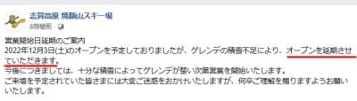

（[焼額山スキー場Facebook](https://www.facebook.com/yakebitaiyama/posts/pfbid0MwhCHFAqWpyLDi4oPQL71EVzVPzPJiStLkEEzU1GjQabL7MhYsxBTLhi287zY7Zkl)より）

え？

ええ？？

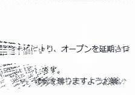

ええええええ～えええ～えぇぇぇ！？？

延期だぁ～！！？？

ついに…

ついに，わがホームゲレンデの焼額．

12/3予定のオープン日の延期を公式に

アナウンスしました…（涙）

なんてこった…

焼額に通い始めてかなり長いこと

経ちますが．

焼額が12月第1週にオープンしなかった

のは，初めての経験です…

まぁ，今日の夕方のゲレンデ状況がこれだから．

確かに，明後日にオープンできるとは思えない

よね…（こぼれ落ちる涙）

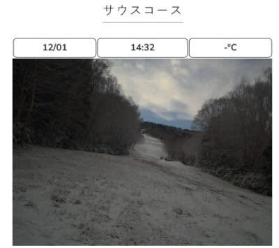

ただ．

そんな中でも，横手山は予定を前倒しして，

本日12月1日の午後1時過ぎに，何とか

営業を再開したようです…

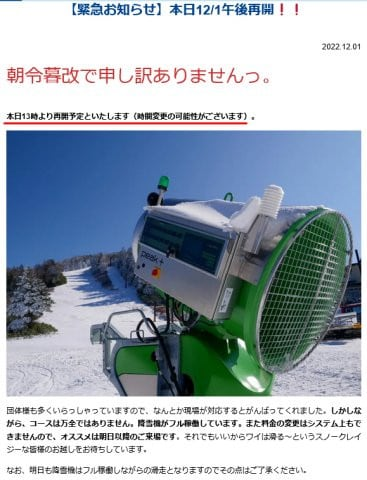

（[横手山ホームページ](https://yokoteyama2307.com/news/18876/)より）

…いや．

今シーズンの横手山，すごいなぁ…

そして，イエティは明日金曜のナイターからの

再オープンを目指しているようです…

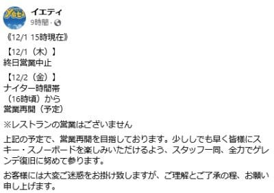

（[イエティFacebook](https://www.facebook.com/YetiSnowtown/)より）

だもんで．

12/1時点で本州で営業しているのは

・軽井沢

・（昼から）横手山

・ホワイトビアたかす

の3カ所だけで．

…昨日の記事では抜けてましたが，ホワイトピアが

やってるようです…毎日読者Kさま，コメントありがとうございました

12/2ナイターから

・イエティ

が営業予定．

これ以外，現時点でオープン日を宣言

しているスキー場はありません…

とても12月と思えない…

私の知る限り，最低の12月入りかもしれない…

というか．

間違いなく最低の12月ですね…（あふれまくる涙）

熊の湯は，明日朝に12/3のオープンが可能か

判断するとのことですが．

今晩は一応冷えて，明日は終日雪が

ぱらつきそうなものの．

天然雪は積もって10cm程度だろうし，

果たしてどうなることやら…（涙）

これからしばらくの850hpa気温を見ても．

赤い0℃線は志賀ギリギリくらいにとどまる

くらいで，志賀高原がガン冷えになる

様子もないし…（泣）

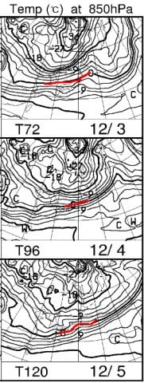

うーん．

12月8日まで，大雪になる冷え冷えデーの

可能性はゼロっぽい…（激涙）

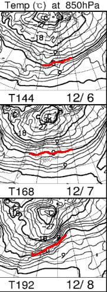

まぁ，志賀高原の標高なら，人工降雪が

動かせる気温がずっと続いてくれそう

なのがせめてもの救いかな…

そして．

今日は木曜日．

気象庁の一か月予報の発表日！！

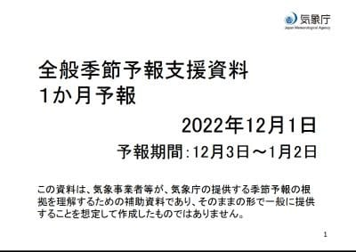

だもんで．

さっそく一か月予報を見てみると…

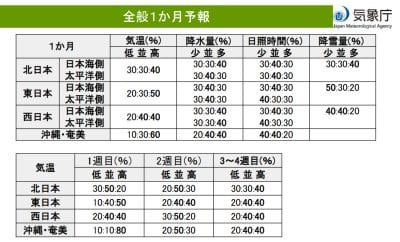

…ぐはぁ（屍）

第1週（12/3-9）は，気温が高い確率50％

第2週（12/10-16）も，第3～4週（12/17-1/2)も，

気温が低くなる確率は20％と低いよ…（激泣）

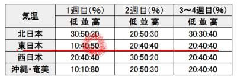

おかしい…

3か月予報では，12月は冷える予想だったのに…

全然予報当たってないじゃないか…

FCVX14を見ても，12月はそんなに冷える

気配がないし．

なんか，12月はダメっぽい…（あきらめの心境）

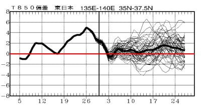

でも．

[気象庁数値予想図](https://www.jma.go.jp/bosai/numericmap/#type=nwp)の，

[FCAS19](https://www.jma.go.jp/bosai/numericmap/data/nwpmap/feas519_12.pdf)から[FCAS26](https://www.jma.go.jp/bosai/numericmap/data/nwpmap/feas526_12.pdf)あたりを見ると．

…なんだか，12月9日あたりから11日くらい

にかけて，激冷えの冬型になりそうな

予想図です…！！！

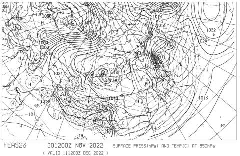

この，12/11の予想天気図を拡大すると．

赤い850hpaの0℃線，太平洋の遥か南に

下がって，志賀高原には水色の-9℃線が

近づいています！！！

そして，地上天気図では縦縞の冬型です…！！

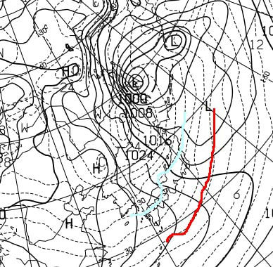

…これは冷える！！

そして，積もる！！！

もし，11日がこの予想天気図通りなら，

志賀でも太ももパフくらいに積もって

不思議じゃない天気図です…！！

…ただ．

こんな先の264時間予想図が当たる

確率は高くないけど…

でも，来週以降の冷え込みに期待…！！

でも．

9，10，11日の積雪って…

来週末にも間に合うかどうか，

ギリギリじゃないですか！！

出来れば来週末に間に合うよう，

もっと早くに降ってほしいところ…

…しかし．

そうだった．

その前に，この冷え込みの予想を

現実にするためには．

手練れの暖まれ暖まれ踊りの踊り手を

確実に見つけ出して，この世から

抹消しないといけないんだった…

## 💬 コメント一覧

### 💬 コメント by (レインボー改めブラボー75)
**タイトル**: Unknown
**投稿日**: 2022-12-02 21:10:12

ブラボー75です。サッカーが面白すぎて改名。もう湯田中に待機しているんですが、明日の熊の湯でスタートします。激混みとの噂ですが、小学生と滑るので、混んでてもノーぷれびれむ。

週明けの、野沢かヤケビか熊の湯に期待です。エス様が、大好きなお仕事に精を出されておられる間に、私はいやいやスキーに精を出させていただきますね。

### 💬 コメント by (カンタロス)
**タイトル**: Unknown
**投稿日**: 2022-12-02 21:44:33

Sさま、こんにちは。

我らが、狭山スキー場を忘れてますよ!（笑）

屋根という最強の耐雨能力をもっているので、元気に営業してます。

### 💬 コメント by (炎の北海道民)
**タイトル**: Unknown
**投稿日**: 2022-12-02 22:51:41

こんばんは。

年々シーズンインが遅くなっている様に思われますが、札幌国際スキー場はいい感じの様です。お先に天然雪頂いてきます笑。

### 💬 コメント by (Skier_S)
**タイトル**: 今週末スキーは諦めた
**投稿日**: 2022-12-03 01:50:41

＞ブラボー75さま

明日の熊の湯は混むと思いますよ～！

私が滑れないので，明日は晴れの予想ですが，

いやいや滑りに行くブラボー75さまのために，天気が悪くなる呪いをかけておきましょうか…？（笑）

＞カンタロスさま

あ！！！

忘れてました！！！ホントにすっかり忘れてました…

でも，オープンがかなり遅くなった狭山．今シーズンお客さんいるんでしょうか…

＞炎の北海道民さま

この12/1以降の冷え込み，北海道はかなり強烈でしばらく雪が

降り続けそうですから…

北海道がうらやましい！

ホントなら，本州までこの寒気が降りてくるはずだったのに…

この時期に日本の南に居座るサブハイが憎い…

