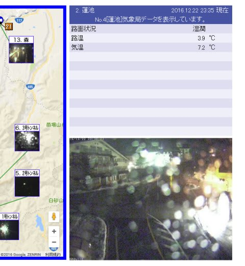

# この3連休も志賀高原で滑ってるよ！

📅 投稿日時: 2016-12-23 00:05:09

🏷️ カテゴリ: [日記](cc4b5682fb7b8b144980957a978653fb0.md)

ということで．

明日から3日間スキーに行くというのに．

こんな時間に帰宅…（涙）．

大丈夫か？自分！？？

で．

やはり今日は，予想通り．

高温南風がかなり強く吹き付け．

強風で焼額ゴンドラは動かなかったようですね…

そして．

大変悲しいことに．

ここも予想通り．

只今，志賀高原は雨が降っているようです（涙）

（[北信建設事務所HP](http://www.q0.ws302.smilestart.ne.jp/index.htm)より）

…しかし．

夜12時近い志賀高原で，気温+7.2℃って…

どゆこと？？？（激涙）

こういう予想は当たらなくていいのに…

で．この雨は明け方には止みそうで．

朝まで降り続けることはなさそうなのですが．

…ただ，そのあと．

ぐぐぐっと冷え込むというのに．

ばっちり西風のため．

…志賀高原，雪，降らないかも…（涙）．

いや，全く降らないってことは無いとは思うんですが．

チラチラ程度で，全く積もらないかも…

その場合．

23日は朝からアイスバーン祭りか！？？？

…残念ながら，そうなる可能性は…高そう（涙）．

23日夜から24日にかけての積雪で，

24日にはいいコンディションに回復することを祈るばかり…

とりあえず．

今週はすでに，焼額の白樺コースがオープンし．

一の瀬山の神も動き出しているようで．

ブナもリフトが動いたようです．

…そして，23日からは

寺子屋，東館ゴンドラ，西館，ジャイアントが動き出すので．

蓮池，丸池をのぞいたほぼ全面滑走可能になりますね～．

とりあえず．

23日はアイスバーンかもしれないけど．

23日夜から24日にかけての積雪に期待！！！

…では，あと2時間後に出発です～

＃1時間ちょいしか寝られない…
