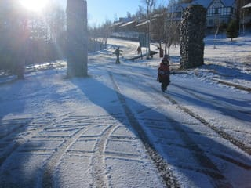
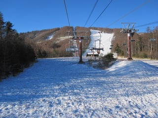
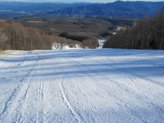
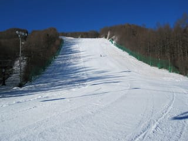
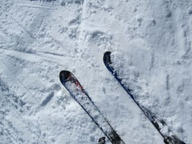
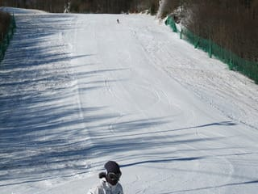
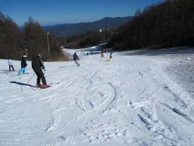
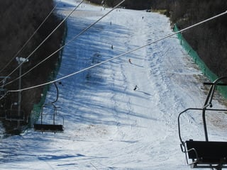
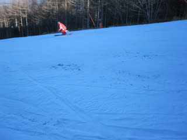
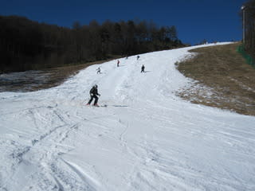

# 12月4日　小海リエックスは良かったよ！

📅 投稿日時: 2010-12-04 22:16:38

気温：午前マイナス．昼は0度前後？

天気：晴れ．午前早いうちは強風

雪質：ほぼ100％人工降雪．

積雪：20cm程度．ちょい薄め

リフト混雑：ほぼ待ちなし！！！！

路面状況：朝はスキー場そばの1kmほど凍ってます．

この週末．

アサマ2000にいこうかと思っていたんですが…

先週は1時間でリフト3本しか乗れない激混み．

今週オープン予定のスキー場がほとんど雪不足のためオープンせず，

状況の良いアサマは，今週もおそらく混むだろうなぁ…

ということで．

アサマ以外に状況がよさそうなスキー場を探していたところ…

なに？

小海RE-EXは高速クワッドが予定通り営業開始？？

2kmのコースが滑れる？？？？？

…うーむ．2kmと長いけど，廊下状で快適じゃないかも．

まぁ，混雑はしないだろうし，リフト2500円らしいし…

いっちょ行ってみるか，と．

前日の夜に予定地を変更しました．

朝…

道路は，スキー場手前1kmほど，まだらに氷がついてますが，

そんなに心配なくスキー場まで到着．

んで．

朝8時からクワッド1本，ペアリフト1本が営業開始．

快晴の日差しの中，早速クワッドで山頂へ．

人がいない！

がらがら．

貸切のゲレンデをかっ飛ばせます．

それも，2kmのロングコース．

雪は硬いかなぁ…と思ったけど．

比較的やわらかく，しっかりグリップする雪．

この時期に，こんな人のいないロングコースを大回りで下りてこれるなんて…

斜度も20度強あるので，十分満足．

コース幅は20m程度かな？

十分広いとはいえないけど，ほかの人がいないので，

幅いっぱい使って快適に大回り可能．

予想以上に快適！！！

うひょひょひょひょ！！！！

最高っ！

リフト待ち完全に0．

っつーか，ゲレンデで人と干渉することもほとんど0．

さすが，朝10時ごろになるとちょっとゲレンデに人が増えてきましたが，

それまで2時間快適なロングクルーズ．

しかし，11時を過ぎてくると…

雪が薄いので，ちょっとブッシュが出てきました．

んで，ゲレンデの人も増えてきたので，ちょっとよけながら滑らないと…

13時を過ぎると…

本格的にブッシュが出てきました．

ちょっと危険．

ところどころブッシュをよけながらすべる感じ．

んで．

人工雪の下地の硬いところがところどころ出てきて，

急斜面はアイスバーン化．

小回り道になってきました．

14時ごろには，アイスバーンとブッシュの危険地域が

かなり広がり，快適度はDown.

そのかわり，ゲレンデの人が減ってきました…

という感じで．

午後は雪の状態が厳しくなってきたけど．

天気が良い中滑れて良かった…

リフト待ちはまったくなく．

高速クワッドでロングコースを効率よく滑れて．

朝イチは貸しきりコース．

午前中は人も少なく．

この週末としては，かなり状況の良いスキー場だと思います…

超穴場じゃないかな？？？？？

とりあえず，満足．

なかなか良いぞ，リエックス．
