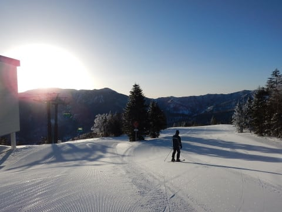
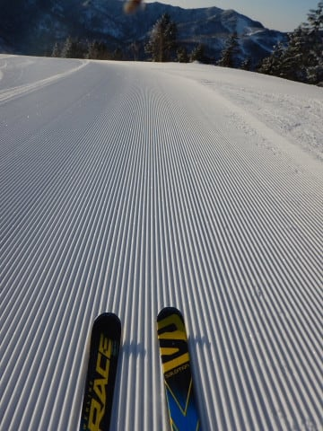
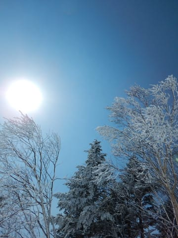
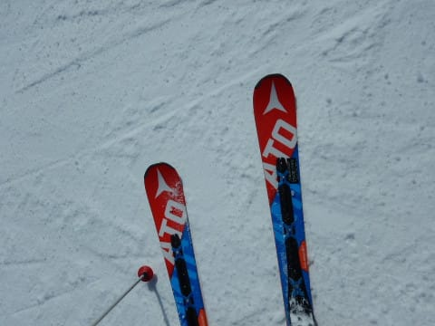
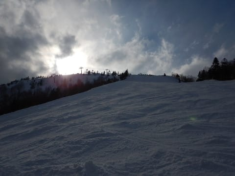
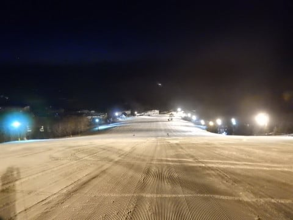

# 3月11日(日)の志賀高原は…時折雲が飛んできたものの，晴天！朝は硬かったけど，日が当たる部分はかなり緩んだ春の雪

📅 投稿日時: 2018-03-11 23:28:41

🏷️ カテゴリ: [2018スキー滑走日記](c11b88dc181f34079ab41db74a3587646.md)

えー．

昨日はスキーに行けなかったのですが（涙）

本日日曜日，志賀高原へ復活しました～！！

まず．

朝．

志賀高原へ上る道は…

時折凍結があるものの．

この時期の志賀高原としては，

驚くほど雪が少ない道路…

雪が少なくて車の運転は楽だけど，

これだけ雪が少ないといろいろヤバい感じ…

で．

いつも通りの焼額第1ゴンドラに到着

しますが．

うむ？？？

時計を見ると…朝6時半？？

はい．そうです．

今日は．

朝2時（深夜2時ともいう）という超早い時間に家を出て．

朝6:30開始の，焼額第1ゴンドラの早朝営業から

参戦です～！！

今週から，第1ゴンドラの土日の早朝営業が

始まりましたが．

…朝，早朝のゴンドラ開始前に並んでいたのは30人ほど．

普段の朝イチゴンドラより多かったかも…

＃早朝リフト券を買っている間にゲートオープンしてしまうという

＃失態により，並んでいる写真なし（涙）

で．

朝日が昇る中，ゴンドラで山頂に向かうと…

早朝営業開始時の，山頂の気温は-8℃．

…ふむ．

まぁまぁ冷えてますな．

そして，朝日をあびるゲレンデは…

うはははは！

シマシマっ！！！

早朝朝イチの掛け値なし，

誰も滑ってないぴかぴかシマシマっっ！！！

なんと…

なんと気持ちいい！！

バーンはこの時期としては結構硬め．

アイスバーンとは言わないけど，結構ガリガリ君な

感じに固まった，スピードの出るバーンです…

でも．

この時期の早朝．

人が少なくて，コースもクリアだし．

ゴンドラも飛び乗りだし．

人が少ないから，シマシマもずっと

崩れないし…

いや，最高！！！

早朝最高！！！！

（早朝営業中は2ゴン側に降りれないようになっている）

という感じで．

人が少ない，貸し切り状態の1ゴンGSコース＆

オリンピックコースを2時間堪能すると．

8時半の通常営業開始時間…

そのころには，太陽も高く上がり．

シマシマもほぼ完全につぶれちゃってます…

うーむ．

やはりこの時期は，早朝がいいかな…

で．

通常営業開始後は．

早朝は硬めだった雪も，ちょうどいいくらいに

緩んできたけど…

でも，10時ごろには人がちょっと増えてきて…

10時ごろに一瞬，1ゴンもゲートの外までリフト待ちが

伸びたものの．

これ以降，ほとんどゴンドラは待ちなしの

飛び乗りが続き，

ゲレンデの人数も，先週までより減ったかな…？

そして．

昼に向けて，さらに日差しが強くなっていきますが…

気温は最高でもぎりぎり0℃に上がる

程度だったので，

雪は先週のようなひどい状況にはならず．

北斜面は比較的締まった雪で，

ところどころ下地が硬いバーン．

ただ，日が当たる東～南斜面の一部は，

3月下旬のズッシリと重い雪…

という，バーンの向きや場所によって，

全く異なる雪質が入り混じるという，

微妙な状況…

ところどころ硬くてツルッとする斜面が続いたと思ったら，

向きが変わると一気に重い雪に突っ込むという．

うーむ．

微妙…

天気はおおむね晴れだったけど．

時々雲が飛んできて，太陽が隠れ…

太陽が隠れると，雪が硬くなって滑りにくい…（泣）．

とはいえ．

いつもの日曜のとおり．

昼を過ぎると人がぐぐぐっと減って，

貸し切り状態になっていき…

バーンはガチガチ過ぎでもなく，

先週のようにドボドボで張り付く雪でもなかったので，

まぁ，良かったかな…

柔らかくなった部分は，夕方はかなりの

凸凹になっちゃったけど．

…うん．

先週に比べれば，

良かった！

先週よりはずっと良かったのだっ！！！←普通の3月2週に比べればよくないけど，

比較対象のレベルを下げるというポジティブシンキング手法で乗り切るっ！！

…ってな感じで．

今日は早朝6:30から，日が暮れる営業終了の16:30まで．

計10時間．

休みなくひたすら滑り続けました…

いや．

滑った．

満足～…

…

…

…

あれ？？

これは何だ？

ナイター！？？？

早朝を滑ったはずなのに，ナイター？？

日曜なのに，ナイター！？？？

…そうです．

実は，月曜に休みを取っちゃいました～！

だもんで．

毎日開催の一の瀬ファミリーナイターに参戦！

また，シマシマをいただきま～す！！

…ちょいと固まり気味の，ボロボロ崩れる雪で，

快感度は低かったけど…

でも，満足．

ってな感じで．

今日は早朝からナイターまで，計12時間滑る

ことができました～！！←我ながらアホだ…

もう，たっぷり滑った～．

おなかいっぱい，って感じで．

土曜日に滑ることができなかった憂さを晴らせた

Skier_Sだったのでした…

ってことで．

明日もまだ滑ってます！！

## 💬 コメント一覧

### 💬 コメント by (しんちゃん)
**タイトル**: お世話になりました
**投稿日**: 2018-03-12 00:20:49

本日、早朝営業初体験でした。

ピカピカシマシマバーンを滑り続けられるあの2時間は、快感の連続でした。

通常営業が始まると、子連れﾌｧﾐﾘｰ組と一緒に滑って楽しい時間を過ごせました。早朝2時間ガッツリ滑った後は子供たちと滑って、体力的にちょうどよかったかもです。（子供たちの滑走スピードが激速でしたが･･･）

帰りも休みながら、無事にたどり着きました。

皆様お世話になりました。

P.S.13:45頃チウに寄ったのですが、13:30ラストオーダーで、レストランは片付けられていました（泣）

道の駅やまのうちで須賀川蕎麦頂いちゃいました。

（うまかった～(^^♪）

### 💬 コメント by (Goku)
**タイトル**: さすがです！
**投稿日**: 2018-03-12 10:15:26

早朝からナイターまでですか！

さすが20000m倶楽部会長、この日も余裕で20000突破ですね。

私は何だかシーズン途中から、コンディションがいい時はいつも滑れないパターンに陥ってます(T_T)

来週は土日とも滑れるけど果たして？

### 💬 コメント by (かず)
**タイトル**: Unknown
**投稿日**: 2018-03-12 11:06:01

ほんと超人ですね　早朝した土曜日眠くて13時に終了しました　日曜は奥志賀スタートで向こうメイン　今日まで冷えてますね　僕は今後の気温次第では昨日がラストかもしれないです

### 💬 コメント by (michi)
**タイトル**: Unknown
**投稿日**: 2018-03-12 11:48:27

昨日もたくさんの方と滑れて楽しかったです。

早朝からナイターまで、普通の人の2日分は滑ったと思います（爆）あの滑りを12時間ですからやはり凡人ではなく、サイボーグに近い身体ですよ！

しかし昨日は皆さん早朝からお揃いだったようで通常営業の8:30でも遅刻のような気分でした（笑）

### 💬 コメント by (masa)
**タイトル**: はじめまして
**投稿日**: 2018-03-12 12:50:16

昨日1ゴン前でお声をかけさせて頂いた者です。

SXに板をチェンジしていてお忙しいところ、子供の分までステッカーを頂きありがとうございました。実は20年ぶりにスキーを履いた3シーズン前からSさんのブログの読者でした。その正確な天気予報を参考にゲレンデに通っております。

今後とも宜しくお願いします。

### 💬 コメント by (olaf2125)
**タイトル**: まさに超人S
**投稿日**: 2018-03-12 13:02:34

AM2:00に出発して早朝からナイターまでって…

ひょっとしたらSさんて極稀にいるといわれる寝なくてもいい人ですか？(･･;)

私は軟弱にも土曜日のヤケビのザクザクに負けて日曜日は寺子屋に潜んでいました (^^;;

### 💬 コメント by (はっち)
**タイトル**: 頭文字Sってもしかして
**投稿日**: 2018-03-12 19:14:45

Super XXX の 頭文字ですか？

(XXX に何が入るかは…)

### 💬 コメント by (KENKEN)
**タイトル**: 幼稚園児に負けた。
**投稿日**: 2018-03-12 22:08:31

一緒に滑って頂いた皆さんありがとうございました。

2時起きの早朝スキーも堪能しましたが、流石に午後からはぐったり😣💦💦💦でした。

同じ早朝からリフトストップまで元気に滑った幼稚園児のKちゃんに圧倒的敗北です。

でも良い子の皆は早朝からナイターまで滑るよう(な終わった人)になっちゃダメだよ😃😂😓。

### 💬 コメント by (はなげ親分)
**タイトル**: コンプリート！
**投稿日**: 2018-03-13 00:04:09

Ｓ様

お疲れ様です！

おっと・・・

疲れ知らずの神様でしたね、失礼しました（笑）

朝、昼、晩あのペースでのコンプリート見事です！！

私は普通のレジャースキーヤーなので、2日連続の早朝スキーで日曜日はお疲れモードに入ってしまい２時過ぎに予定通り早退です。

### 💬 コメント by (Skier_S)
**タイトル**: 平日スキー，最高っ！！
**投稿日**: 2018-03-13 02:16:58

＞しんちゃんさま

日曜はお世話になりました～！

早朝営業，良かったでしょ？？

でも，チゥー，間に合わなかったのですね．

次の宿題ですか…

どうせ間に合わないのなら，もう少し滑って

行っても良かったのかも…(笑)

また次のヤケビ参戦をお待ちしています～！

当然，早朝から参戦ですよね(笑)

＞Gokuさま

やっちゃいました…早朝からナイターまでぶっ続け．

土曜滑れなかったので，ついつい憂さを晴らすべく

滑り倒してしまいました…

21000mほど滑りました．

しかし，確かにGokuさんがいない日に

いいコンディションになることが多い気が…

来週もいいコンディションだといいですね！

＞かずさま

え？？？

これでもうシーズンラストですか？？

早すぎませんか…？？

私なら禁断症状で死んじゃいます…

＞michiさま

日曜は，土曜滑れなかった反動でアホのように

滑ってしまいました…（いつもアホのように滑ってるというツッコミ多数）

これからの時期，早朝もいいですよ～！

早朝でも，いつものメンバーが揃ってますから(笑)

＞masaさま

日曜は声をかけてくださりありがとうございました～！

そして，コメントありがとうございます～！

20年ぶりのスキーから3シーズンですか…

復活したシーズンは，道具が変わっていて

驚いたのではないですか？

また今後も，天気予想を参考にしてやってください．

また焼額にお越しの際は声をかけてくださいね～！

＞olaf2125さま

この週末はお会いしませんでしたね…

と思ったら，寺子屋に行ってらしたんですか！

…あ，ちなみに私は寝ないとダメな人です．

ただ，人より睡眠時間が短くても我慢できる感じです．

いや，眠いんですけど，寝る時間がもったいないというか…

寝ると滑る時間が短くなるので（爆）．

＞はっちさま

…きっと，

Sは．

Superお気楽スキーヤー

の略かもしれません←違う

＞KENKENさま

日帰り早朝お疲れ様でした(笑)．

しかし，早朝からラストリフトまで，

お昼休み以外滑り続けたKちゃん，凄すぎましたね…

私もナイターまで滑る気はあんまり

無かったんですが，ついついナイターに

繰り出しちゃいました…

某氏のゴールドチャレンジが無ければ

ナイターは滑ってなかったかも(笑)

＞はなげ親分さま

疲れましたよ…私も(笑)．

さすがに朝2時発で，早朝からナイターまでやると

思ってませんでしたので(^^;)

活動時間22時間，さすがにかなり疲れましたが…

今日もコンディションが良かったので，

ついついお昼抜いてラストリフトまで行っちゃいました．

日曜は2時上がりだったのですか…

夕方はコンディションが結構ひどかったので，

早朝から滑って早上りが正解だった気がします．

では，また来週！

