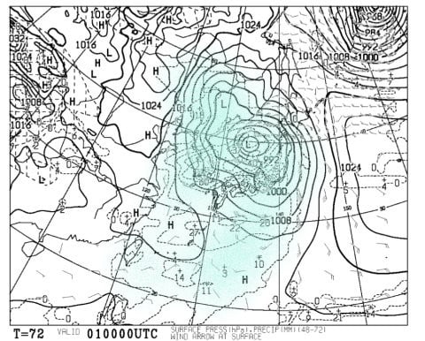
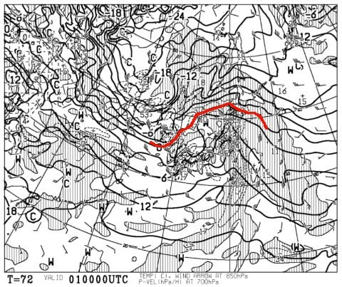
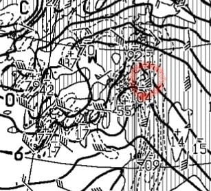
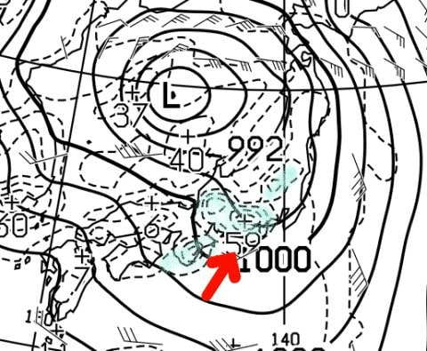
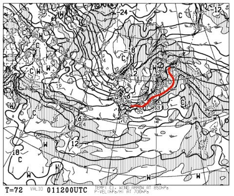

# 緊急速報！3月1日は壊滅的な天気かも…

📅 投稿日時: 2018-02-27 07:41:55

🏷️ カテゴリ: [スキー天気予想](c6554f5c3c106093b511a8daae23757e8.md)

ダメだ…

昨日も帰宅後，Blogを書こうとして

机に突っ伏したまま朝まで寝てしまった

Skier_Sです…

もう会社に行かねばならない時間じゃないかっ！！（涙）

とりあえず，ニュースなんかでやっているので

ご存知の方も多いと思いますが．

3月1日の天気，すごいです（涙）

かねてより，28日から気温が上がりそう，

と書いましたけど…

低気圧の接近が一日遅れて，1日がピークとなりそう．

3月1日朝9時の地上天気図を見ると…

なんだこれは～っ！！！！

台風並みのすごい低気圧なんですけど！？？

で，日本全域に降水域がかかってます…

そして，同じく朝9時の850hpa気温は…

ダメだーーーっ！！！！

0℃線は志賀高原のはるか北…

それどころか，志賀高原には+6℃線が！？？？

これは…

1日の朝，志賀高原は山頂でも+5℃以上に

上がるよ…（涙）

歌っても踊っても，転がっても飛んでも，

降るものは確実に液体ですね（大泣）

そして，850hpa図を拡大すると．

赤く印した部分，なに？？？

風速70ノット…！？？？

風速35m/sですか…（涙）

激荒れです．

超強風です．

雨＋激烈高温の強風で雪がすごいことになるし，

強風のためゴンドラどころか，リフトも全滅．

営業は無理でしょう…

ただ，地上天気図を拡大するとこんな感じで，

水色で塗った部分が10mm以上の降水が予想される

部分なんですが．

赤矢印の南西の風が強く入るので，

風がぶつかる高い山脈の南側に

降水が集中して，志賀ではそれほどの

降水がなさそう…ってのが救いですか…

雨が降ってもザーザーぶりにならず，

せいぜいシトシト降り続ける感じ．

夜9時になると，850hpa図の0℃線も

何とか志賀の南まで下りてきてますが．

夜になってようやくマイナスに冷える

程度で，昼間はずっとプラス気温を

キープしそう…（泣）

そして，冷えてからは西風になるので

志賀はそれほど降らなさそう（涙）．

だもんで．

まとめると．

3月1日は，朝早く…というより，

日付が変わったあたりから雨が

降り始める．

ザーザーぶりにはならなさそうだけど，

一日中雨混じりの強風が吹き付け，

気温は+5℃以上まで上がる激烈南風．

リフトはほぼ全滅．

激烈高温の強風＆雨で雪はすごいことに…

夜になってようやく冷え始め，雨で融けた

ゲレンデはガチガチに．

夜は雪に変わるが，それほど降らないので

せいぜい表面にうっすら積もるくらい…

固い下地は隠れきってくれないでしょう（涙）．

と，書きたいところですが．

ここはあえて

3月1日の志賀は，晴天ピカピカの冷え冷えでしょう

と書いてみると，

その通りになってくれないかな…（懇願）

いや．

この週末が恐ろしい…

## 💬 コメント一覧

### 💬 コメント by (olaf2125)
**タイトル**: 3月もなんとかこのままで…
**投稿日**: 2018-02-27 08:54:42

日曜日のオリンピックコースはホントに良かったですね。

3月1日の大荒れの後、Sさんの念力でできるだけ早めに元に戻して下さい。

後2枚残ってる早割り一日券を消化せねばなりません。

よろしくお願いします。m(__)m

### 💬 コメント by (はっち)
**タイトル**: いえいえ
**投稿日**: 2018-02-27 12:31:09

そこは春スキーも考慮して「大雪」と予想、ではなく断言して下さい！

### 💬 コメント by (seeker_NT)
**タイトル**: もしかすると
**投稿日**: 2018-02-27 14:11:22

今回は金曜から月曜まで3泊4日でした。天気は月曜が一番良かったかなと。。皆さん同様、至福の週末でした。

ちなみに、17時前後に山を降りる際に坊平橋の手前で雪猿さんがたくさん出没して下山途中の皆さんが車を止めて写真を撮っていました。

うーん、一昨年の超雪不足の時もこの時期から同じ光景を目撃したような記憶がするのは気のせいでしょうか？

### 💬 コメント by (Skier_S)
**タイトル**: ダメだ…来週も高温の雨（涙）
**投稿日**: 2018-02-28 03:02:35

＞olaf2125さま

この週末は良かったですね～．

でも．この先の天気図を見ると，

かなりやばそうな感じです…

うーむ．

3月下旬に上手く冷えて，また

ゲレンデコンディションが回復

するといいんですけど．

とりあえず，早割券を消化するためには，

ゲレンデ状況が回復するよう，

踊り続けてください…

＞はっちさま

もう，大雪です．

きっと，3月下旬は毎日1mずつくらい

積もるはずです！！←だから，積雪20m越えるから…

＞seeker_NTさま

金～月の3泊4日ですか！

いいタイミングでしたね～！

しばらくお会いしてませんが，

焼額にはいらっしゃらなかったのですか？

…しかし，超雪不足の時と同じ現象ですか…

嫌な予感がしますね（涙）．

せっかくGWは1ゴンが営業してくれるので，

GWまで雪がたっぷり残るよう，ひたすら

踊り続けるしかなさそうです（泣）．

