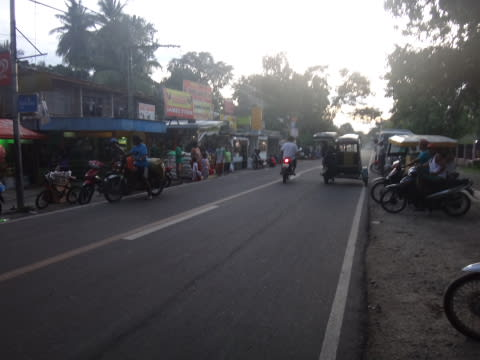
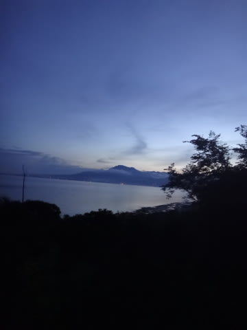
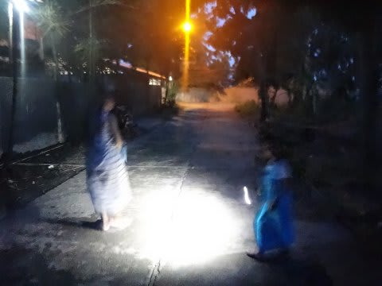
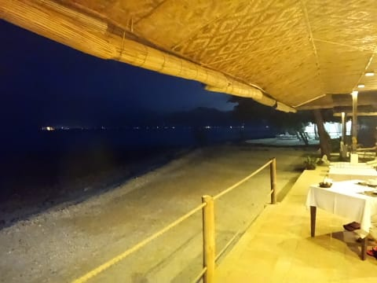
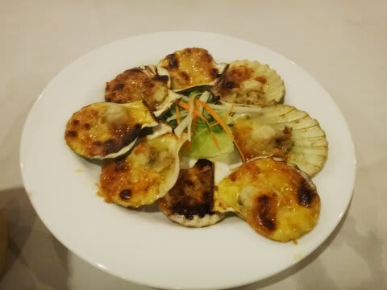
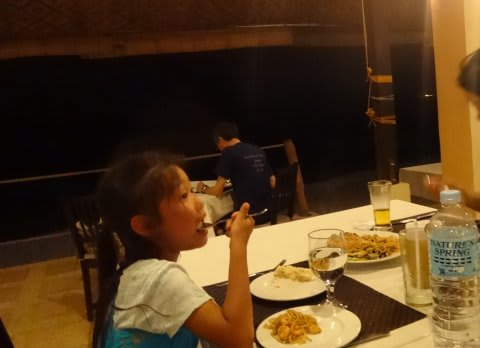
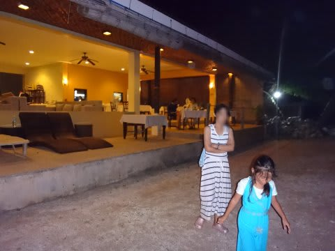
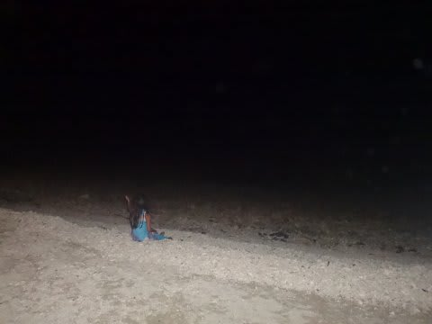

# 2014年8月　オスロブagain…再び，子連れでジンベエザメと泳ぐぞ！　その13

📅 投稿日時: 2014-09-19 00:50:35

ってなわけで．

街中観光に出たわけですが．

残念ながら，この日はホテルを出たのが遅く，

市場とスーパーを見ただけで，残念ながら

日が暮れてタイムアウト．

海辺のホテルへ，坂道を歩いて戻っていきます．

ホテルまでの道，街灯がないので，

夜遅くになりそうだったら

懐中電灯は必須ですよ～！

＃よい子は暗くなる前に帰りましょう

ってことで．

結構おもしろそうだったサンタンダーの街．

細かな観光は，明日の宿題ということで．

また明日も街へ繰り出そう！

とおもった，わが一家だったのでした…

で．

ホテルへ戻ってきたら，

とっぷりと日が暮れていて．

どんぴしゃで夕食タイム！

今日もホテルのレストランで夕食です．

＃街中で観光客が入れそうな感じのレストランは

＃なかったので…

この，貝のグラタン風やら，

そのほかにも，中華風焼きそばやら．

娘も気に入ったようで，バクバク食べてます．

夕食後は，レストラン前のビーチに出て…

砂浜に座り込んで，じっと星を見ていた娘．

月のない夜だったので，

ものすごくきれいに星が見えて．

はっきりと天の川が見えたんですが．

…どうやら，それを雲だと思っていたらしい娘．

私「娘～，あれが天の川だよ」

娘「どれ？どれ？」

私「あの白っぽく見えるの」

娘「…雲しかないよ」

私「…あれは，雲じゃないよ…」

天の川という言葉を知っていても，

実物を見たことが無いんだなぁ…

ということを痛感．

娘にいくつか星座を教えて．

流れ星もいくつか見つけて．

なんだか．

親子でゆっくり星を見て．

豊かな時間を過ごした気になった，

この日の夜だったのでした．
