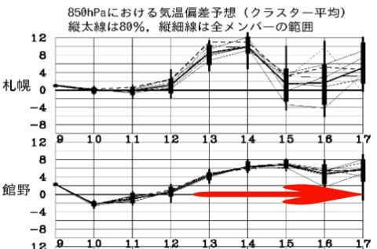

# 明日は志賀高原へ復活！

📅 投稿日時: 2018-03-10 20:26:26

ということで．

本日はいろいろな用事でスキーに行けなかったのですが．

明日から志賀高原に復活します～！

今日のコンディションは概ね予想通りで．

朝は昨晩から10cmほどの新雪，

すぐに下地の固いのが出てくるようなコンディション

だったようで…

明日の天気は，朝から晴れ，時々雲が飛んでくる

タイミングもあるけど，そこそこ冷える一日．

全く積雪の積み増しがないので，朝イチは

しっかり締まったいい感じの圧雪でしょうけど，

すぐ下地のガチガチバーンが出てきて

固くなりそうです…（涙）．

とりあえず，今日は早めに寝ます．

明日の朝は1;30起きなので…

やっぱり5時間ほどしか寝れない（泣）

では，明日志賀高原でお会いしましょう～！

PS.

しかし．

この週末は良さそうだけど…

週明けから，また平年比+6℃という異常高温が

4-5日続きそうです…（涙）．

ヤバい…

この春は，ヤバい…（泣）

## 💬 コメント一覧

### 💬 コメント by (Goku)
**タイトル**: Unknown
**投稿日**: 2018-03-10 20:35:01

関東某県に滞在中のGokuraku skierです！

明日はヤケビ早朝からスタートですか。

いいな～！

私もスキーに連れてって～‼

### 💬 コメント by (Skier_S)
**タイトル**: Gokuさま
**投稿日**: 2018-03-10 20:51:08

せっかく近くにいらっしゃるのですから，

うちの車に乗っていきますか？（笑）

深夜2時出発です～！

…冗談です．

用事がスムースに終わるよう，応援しています…

### 💬 コメント by (Goku)
**タイトル**: 寝過ごした
**投稿日**: 2018-03-11 06:25:32

では、あそこの7・11で待ってます！

しまった寝過ごした～

もう朝になってる～

と言うことで、朝礼参加の皆様にGokuraku skier本日も欠席とお伝えください。

PS：私が某県に行くと、志賀高原のコンディションが良くなる。って思うのですが気のせい…

### 💬 コメント by (Skier_S)
**タイトル**: Gokuさま
**投稿日**: 2018-03-11 23:31:17

あらーー．

寝坊ですか．

残念です．

今日ご一緒できれば，早朝からナイターまで

いけたのですが，残念でしたね！！…←普通はそんなことやらないから

では，来週お会いしましょう！

### 💬 コメント by (若杉勲70)
**タイトル**: お元気そうで何よりです
**投稿日**: 2018-03-12 23:57:30

残念ながら今年はなかなかSさんにお会いできません。追突された後遺症と通院のため半日でやめてしまううえ、毎日私は2ゴンスタートなので微妙に時間がずれてしまうんですね。お互い大慌てでゴンドラに乗るだろうからなかなか接点ができないようですしね。

そうそう、先日Sさんの板を見かけたという、このブログの愛読者さんに奥志賀でお会いしましたよ。毎日覗いておられるようです。千葉県柏市のかたで、アトミックのデモをはいておられました。20000mシールをもらって頂きましたよ。

昨日から信頼できる医者に診てもらおうと帰宅しています。昨年までではあり得なかったことです。スキーラインの力はすごい。

それから先日ファミリーで小回りしては何度も止まる赤いヘルメットを見かけました。あの人ならそんなに止まるはずはないと思っていたら、リフトの私の下で急停車。やはり呪縛の解けたコンスケさんでしたよ。

### 💬 コメント by (Skier_S)
**タイトル**: 若杉さま
**投稿日**: 2018-03-13 01:51:16

お久しぶりです~！

1ゴンスタートの私とは，なかなかタイミングが

合いませんね…

追突の後遺症，結構長引いているようですね…

せっかく帰宅されたのですから，しっかり

治してください！

