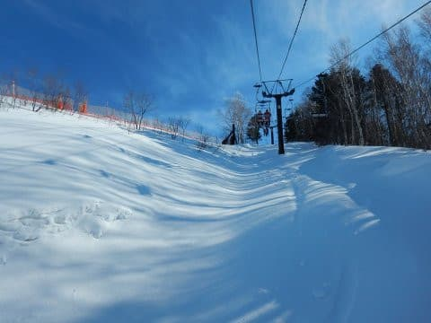

# 久々のスキーネタ！暑い夏に一瞬の涼を…志賀高原でウインチ付き圧雪車で圧雪するコース，どこにウインチを掛けているのか？？

📅 投稿日時: 2019-08-16 02:04:51

🏷️ カテゴリ: [スキー雑談](c1f9d2cb7478308da16419928ea3945e9.md)

えー．

7月まではかなり涼しかったのに．

8月に入ると，異常に暑い日々が続いている

今日この頃ですが．

このBlogは．

「スキーヤーBlogだ！！」

と，ことあるたびに言っている割に．

7月に夏モードになってから，

ダイビングネタと車ネタばかりになり．

全くスキーネタをやってないじゃないか

という，スキーヤーBlogとしては

致命的な事態に陥っていることに

気づいたわけなので．

ここいらで，ちょいと涼しげな

気分になってもらうため，

久しぶりにスキーネタを

行ってみましょうか…

えー．

皆さんご存知のように．

スキー場のコース整備に，

圧雪車で圧雪をかけるわけですが．

急斜面では，圧雪車が滑り落ちない

ようにするためと，

雪面への十分な押圧力を得る目的で，

ウインチ付き圧雪車で圧雪をかけます．

こんな感じで，特殊なウインチ付き圧雪車で，

斜面の上に引っ掛けたワイヤーを引っ張りながら

急斜面を登っていきます…

志賀高原で，ウインチ付き圧雪車による

圧雪を掛けているコースは，

私の認識では，

・一の瀬正面バーン

・焼額オリンピックコース

・奥志賀エキスパートコース

の3か所なのですが．

…それぞれのコースで．

この，ウインチのケーブルを

いったいどこにひっかけているのか．

気にしている方は，ほとんど

いないと思います…

ということで．

まずは，一の瀬正面バーンから，

一体どこにウインチをかけているのか，

見てみましょう～！

一の瀬正面バーンのウインチ架けは，

ここにあります．

向こうに，ファミリークワッド

降り場が見えてますが．

ゲレンデの一番てっぺんに，

こんな感じで．

ひっそりと茶色に塗られた

鉄の棒が，地面から突き立ってます．

雪に埋もれて分からなく

なっちゃわないよう，

目印の竹の棒が立ててあって．

鉄の棒にはワイヤーのわっかが

取り付けてあり．

このわっかに，フックを掛ける

ようです…

そして．

次は奥志賀のエキスパートコース．

これは，すぐ分かります．

第3高速ペアに乗ってすぐ．

うむ？

左側に，何か見えてきましたね～．

そうです．

これがエキスパートコースの

ウインチ架け．

これも地面に突き立った鉄の棒に，

リング状にしたワイヤーが

ぶら下がってます．

観察力の鋭い人なら，

奥志賀第3に乗ったすぐに表れる

こいつに気づいているはずで．

「これは一体何だろう？？」

と思った人も多いのでは…

で．

最後は，焼額のオリンピックコース．

これは…

すごく見つけにくいですが．

オリンピックコースに上から滑りこむと，

上から見ると右側，

この写真では，左のコース横に．

うむ？なんだか，半分雪に埋まった

ワイヤーロープがありますね…

そうです．

これが，オリンピックコースの

ウインチ架け．

ここは，鉄の棒が高く突き出た

形ではなく，なぜか雪面に埋もれた

ワイヤーを掘り出して，

木の棒に括りつけて

雪に潜らないようにしています…

…全く目立たないので．

おそらく．

焼額のオリンピックコースに，

こんなものがあると気付いている人は

ほとんどいないと思います…

…ってなことで．

次シーズン．

志賀高原に行った際には，

ぜひウインチ架けを探してみて

ください～！←いや，そんなのわざわざ探そうって人，いないから

以上，久しぶりに涼しい気分を

お届けする，スキーネタでした！

## 💬 コメント一覧

### 💬 コメント by (はなげ親分)
**タイトル**: Unknown
**投稿日**: 2019-08-16 17:57:39

ヤケビのナイター時、３高乗車中にオリンピックコースの圧雪作業を見ながらワイヤーはどこに固定しているのだろうかと思っていました。一の瀬正面バーンの固定場所はすぐに見つけられましたけどヤケビはとうとう判らずじまいでしたので、S様のおかげでモヤモヤが晴れました～

来シーズン、早速探してみます（笑）

### 💬 コメント by (しんちゃん)
**タイトル**: Unknown
**投稿日**: 2019-08-17 01:25:07

サンバレーで圧雪車がリフトの支柱に引っかかって抜けられず立ち往生してたのを見たのですか、結局、どうやって助かったのでしょうか？このウィンチ式圧雪車が出張して助けたのかと想像していますが、何かご存じでしょうか。

（既にブログで紹介されてたらすみません）

ウィンチ式圧雪車の話で、思い出してしまいました。

### 💬 コメント by (Skier_S)
**タイトル**: 圧雪車の運転は大変
**投稿日**: 2019-08-17 02:51:02

＞はなげ親分さま

ヤケビのウインチ架け，ホントに分かりにくいところにあります．

ただ，積雪が多い時期はワイヤーを出すためにかなり雪を掘って，

雪の壁のようになっているので，むしろ雪が深い時期が気づきやすいかも…

お暇でしたら，探してみてください（笑）．

＞しんちゃんさま

うーん．

私も，あの圧雪車がどうやって助かったのか，全く確認していないんですよ…

やっぱり，圧雪車で引っ張ったんですかね～…？？

### 💬 コメント by (yumi)
**タイトル**: Unknown
**投稿日**: 2019-08-17 03:47:48

Ｓさぁ～ん⛄️🎇🏝️

久々のスキーネタですね🎉⛷️🎵

私も 奥志賀第３リフト下の棒、

「あれ、なんだろう？」の ひとりです😅

Ｓさんの認識と一緒で、志賀高原の３ヶ所をウィンチで引っ張ってるのは 知ってましたが・・・

ある夫婦の会話 👇️👇️👇️

妻：「なぁ～・・・

あの、先っぽのワイヤーって どこに 引っ掛けんのぉ～⤴️」

夫：「ええぇ～・・・

その辺の、木ぃ～ とかに 引っ掛けるんとちゃう⤴️❓️」妻：「ふ～ん🤔」

Ｓさん‼️

解決 しました🎵

### 💬 コメント by (Skier_S)
**タイトル**: >yumiさま
**投稿日**: 2019-08-18 00:52:57

yumiさんは今さら涼しい気分は不要かと思いますが，こちらは酷暑なので冬景色を（笑）．

奥志賀第3リフトのウインチかけ，やっぱり見ててもなんだかわからない人が

多いんですね…

しかし，木に引っ掛けるという発想は私にはありませんでした（笑）．

### 💬 コメント by (Unknown)
**タイトル**: Unknown
**投稿日**: 2019-08-25 15:40:51

パーフェクターの上部と東館のオリンピックコースの上部とジャイアントもウィンチらしいですよ

### 💬 コメント by (Skier_S)
**タイトル**: ＞Unknownさま
**投稿日**: 2019-08-26 01:45:27

え？？

パーフェクターの上部，ウインチだったんですか…

知りませんでした．

そして，東館の上の急斜面と，ジャイアントもやっぱり

ウインチだったんですね．

急斜面だからそうかな～…と思いながらも，

ウインチ架けが見つからず，イマイチ確証が得られてませんでした．

情報ありがとうございます～！

