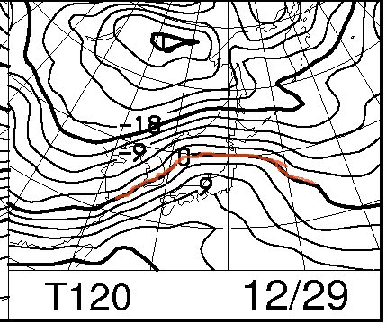
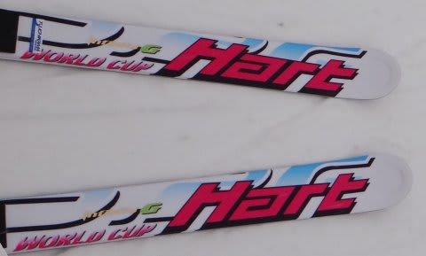
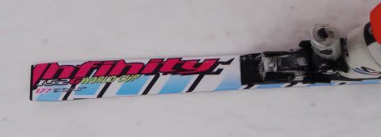

# Hartの板を履いたよ…Infinity 5.2G WC　177cm

📅 投稿日時: 2012-12-26 00:46:57

🏷️ カテゴリ: [スキー板試乗](c0bd8048615710cee890e403a36cc9a2b.md)

あーーー．

しまった．

本来，後日アップする予定の推敲中の記事を．

間違えて，昨日アップしちゃってた…(涙)

ということで，昨日ここを覗いた人は

「あれ？スキーインプレッション？24日のゲレンデレポートはないのか…」

って思った人もいるかもしれませんが．

この前に，ちゃんと24日のゲレンデレポートがありますので．

ご確認を…(拝）．

ってことで．

昨日間違えてアップした記事を推敲してアップしなおしました．

あーーー．

あと．参考情報ですが．

29日の予想…悪化してるじゃん（涙)．

志賀高原でも，プラス6度以上に上がります．

…雨です．降ります．ひどいです…

どうして週末を狙って降るんだ…っ(心の叫び)．

ってことで．

昨日アップした記事を再度アップロード．

あー．

ショートの板の方のレポートは，後日．

----

以前から何度か書いてますが．

ブーツサイズが合えば，他人の板を履かせてもらうのが趣味(？）の私ですが．

ちょっと前，

[某スキー仲間の方](http://blog.goo.ne.jp/suma_shikao)の板を履かせてもらいましたので，インプレッションをば…

履かせてもらった板は，Hartの板．

GS用のInfinity 5.2G WCと，小回りベースオールラウンドのCircuit 9.2ST．

今回は，GS板のInfinity 5.2G WCの方のインプレッションです…

長さ177cm，R=23ということで．

GS板としては短めのモデルですが．

うむ．

ウッドコアっぽい板．

張りは強く，しっかりしたエッジグリップ．

ポジションはひたすらセンターでいいですねー．

荷重ポイントは，かかと目．

前後動は全く不要．

谷回りで前に動きすぎるとグリップしないかな．

スイートスポットをしっかり抑えれば，ターンの早い段階からがっつりグリップして，

きれいにたわんでたわみに乗って曲がっていきます．

さすがGS板だけあって，かなりのスピードでもフレックスが窒息することなく，

安心してスピードを上げて，大きな横Gをかけていけます．

増えていくGに対しても，しっかりグリップして板が耐えてくれます．

…でも．

スイートスポットがちと狭め，

スイートスポットを外すとグリップせず，板が外に逃げていくので．

何回かに一回，谷回りで板が向きを変えてくれず，「うぉっとっ！」って感じで

バランスを失いましたが…

…この板，おそらくスキーヤーを上手にしてくれるのではないかしらん．

ポジションが正しければかなりの性能を発揮するけど，

そこをはずすとアウトなので，乗り手は必然的に正しいポジションに

導かれていくという…

しかし．

うまくスイートスポットに乗れば，谷回りからしっかりとたわみ，きれいな

ロングターンに入れます．

たわみ開放は比較的ゆっくり返ってくるので，谷回りで板が吹っ飛んでいくことはなく．

重みをかけたまま，しっかりと切り替えを作れます．

で．

この板．

購入時にベースビベル1度というチューンをしているからか．

かなり動かしやすい．

ずれ・切れの出し入れが自由にできます．

しっかりずらして小回りにも入れられます．

おそらく，ゲレンデで使うには177cmくらいがベストですかね～．

とりあえず．

前半がかなりルーズに感じた，[前回の試乗](ee0cfc1bf77d15e4c7d585d227499bef7.md) のR=27とは全く違って．

R=23のこの板は，かなり早い段階からしっかりエッジがグリップして，

比較的楽にターンを作っていける，

しっかりとしたグリップ感と高速安定性を持ってるけど．

割と乗りやすいロングターン板でした…
