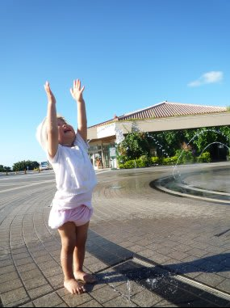
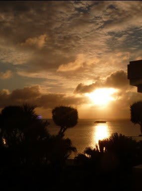

# 2009年7月の初子連れダイビング旅行記

📅 投稿日時: 2012-07-08 23:37:25

って感じで．

夏モードにスイッチしたのはいいとして，だ．

まだ今シーズンの初ダイビングには行っていないのだな．

ってことは．

まだ，今シーズンのダイビングレポートが書けないわけなので．

その間は，昔のダイビングレポートでも載せてみましょうか…

時は2009年7月．

場所は沖縄本島，恩納地区．

妻が出産後，初のダイビング旅行…

つまり，初子連れダイビングに行ったときの旅行記です．

あれですよ．

なにぶん，このときは．

まだ子供は1歳10ヶ月．

オムツも外せてないし，まだ子供というよりは赤ちゃんっぽい時期．

子供が生まれてから，長距離の飛行機移動は未体験．

一体何が起こるのか？

病気とかとんでもないトラブルが起こらないか？

なれないホテルで泣き続けないか？

…それより，両親は無事ダイビングにいけるのか？？

などなど．

出発前，心配事は尽きなかったわけで．

…娘が飛行機やらダイビング旅行やらに慣れまくった今となっては．

「そんな時代もあったね」と，めぐるめぐるよ時代はめぐる的な

感じもありますが．

なんにしろ，わが一家にとって記念碑的な旅行でありました．

ということで．

次回からは，初子連れダイビング旅行記＠沖縄が始まります．

お楽しみに…

…お楽しみに…

楽しみにしている人がホントにいるのかっ？？

(いつもと同じ心配)

PS.今シーズン初ダイビングは今週末の予定．

　先週まで月山で滑っていたのに…
