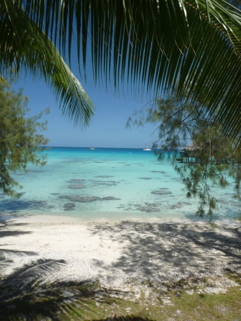

# 2009年　初の海外子連れダイビング旅行記　30　On the way home

📅 投稿日時: 2012-10-02 00:17:37

🏷️ カテゴリ: [ダイビング日記](ce3a7a8d424d112fce83ee85c81a0e344.md)

ルロットで満足の夕食を食べて，ホテルに帰ったのは9時過ぎ．

ちょっと早いけど，明日が早いので早々におやすみなさい～．

で．

朝4時半ピックアップ．

眠い目をこすりながら空港へ…

娘は熟睡中なので，抱っこして移動です．

搭乗手続きを済ませ，朝日が昇る前に待合室へ．

朝早いのに待合室のお土産やさんはしっかり営業中．

…そんなに品数は多くないけど，必要十分．

待合室に着いたころには，娘も起きてて活動中．

で．

今回も当然，子連れということで，ぶっちぎりの優先搭乗．

ゲートが開く前から，ゲート内部で待たせてくれ，

怪我をした人と一緒に，一番最初に飛行機に案内されます．

いやー．子連れって強いなぁ．

さて．

さて．

ここからが最後の難関．

12時間のフライトが待ってます．

行きより1時間長いフライト時間．

12時間椅子に座りっぱなし．

大人でもきつい．これは．

こんな公卿…じゃない，苦行に，娘は耐えられるのか？？

と思ったところ．

朝早くに起こされた娘は，半分以上寝てました．

途中で起きたけど…

ここで「秘密兵器」登場！

ポータブルDVDです．

これでアンパンマンを見せておけば，アンパンマンが大好きな

娘は3時間は黙っていてくれます．

すごいぞアンパンマン．

子供のヒーローってだけじゃなく，

大人を楽にさせてくれる，大人にとってもすばらしいヒーローだっ！

…でも，どうして子供ってこんなにアンパンマンが好きなんだろう…

それからは，シールブックなどを繰り出して

いると，早くも着陸2時間前．最後の機内食．

食事を食べて，満足そうな娘．

ああ．これで無事帰りの12時間乗り切ったか…

と思ったところ．最後15分ほど，飽きてきたのかさすがに

ぐずりました…

でも，着陸前に外の景色を見せると落ち着いてきました．

まぁ，12時間のフライトでぐずったのがわずか15分なら，

十分許せる範囲かな～．

そして．

ついに成田に到着．

あああ．夢の世界から，現実に戻ってきた…

その後しばらく．

会社にいても，目を閉じるときれいな海が．

しばらく仕事が手につかなかったのは，言うまでもない…

