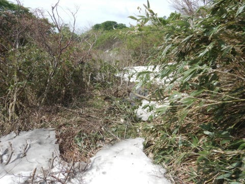
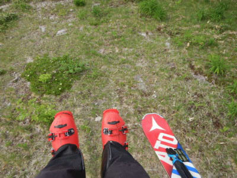

# 月山では，古いATOMICブーツで滑ってみたけど…そして土日に月山行ってる場合じゃなかった（涙）

📅 投稿日時: 2021-06-15 12:11:55

🏷️ カテゴリ: [日記](cc4b5682fb7b8b144980957a978653fb0.md)

…ということで．

この土日に月山を滑ってきたわけですが．

その反動が今来てます

土日休んでる場合じゃなかった…（涙）

だもんで，昨晩更新できませんでした．

（昼休みに更新中）

日曜詳細レポートは今晩書きます！

私の精神力がもてば，という前提付きですが…

コメント回答もしばしお待ちを！

で．

これだけじゃ寂しいので．

ちょっと月山でのエピソードを一つ

書いておくと．

泥沼歩きや藪漕ぎが求められる，

この時期の月山．

とても新しいブーツをもっていく気には

ならないので，古いATOMICブーツを

履いて行ったのですが…

このブーツを履いて100m滑っただけで．

「…今まで，よくこんなフィットしない

　ブーツで滑ってたことよ…」

と，いろんな意味で感動したのでした．

いや．

このブーツもちゃんとシェル出しやら

削りをちゃんとやってもらい，

インソールもSIDASのやつをいれてるん

ですが．

当たりだしをする際にちょっと余計な

ところまで拡げちゃってるとか，

自分の足首のボリュームに対して，

ATOMICのシェルが緩すぎるのに，

そこら辺のインナーやタングのボリューム

調整がされて無いとか…

この緩さゆえに，板が捉えた動きと

足の動きにラグがある感じで，

板の捉えがルーズになるし．

カント調整のせいなのか，谷回りで

板が雪面を掴みに行くのがワンテンポ

遅くなった感じ…（涙）

…前のブーツを履いてみて．

そこらへんをちゃんと調整されている

今のブーツの良さと，いいブーツで

滑るとより楽しいことを再確認した，

Skier_Sだったのでした…
