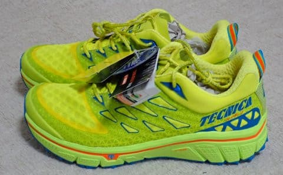
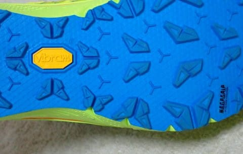

# たまたまスポーツ屋に行ったら…山歩き用の超お買い得トレランシューズを買ってしまった

📅 投稿日時: 2022-10-12 02:23:40

🏷️ カテゴリ: [日記](cc4b5682fb7b8b144980957a978653fb0.md)

えー．

[すでに報告したように](eeb5ae14fe16748a6d9b2d8f1a814b82d.md)，

先週，とある山に行った際，山用の靴の

ソールが剝がれてしまい，販売店に一旦

送り返し，初期不良かどうか確かめてる

状況なわけで…

とりあえず，現段階ではその靴が

初期不良で無償交換になるのか，

あるいは

「お前の使い方が悪いんじゃ！」

と突き返されるのか分からないわけ

なんですが．

どっちにしろ，メインの靴がメーカー

送りになっている現在．

山歩き用の靴がないとどこにも

行けないなぁ…

と，思っていたところ．

先週日曜．

娘のシューズを買いにとあるスポーツ屋に

行ったところ…

たまたま，2017年モデルの売れ残りの

激安トレランシューズがあったのを発見！

え？？

なんだか，信じられないほどお安い

お値段なんですけど…？？

大丈夫なのかな？これ…

と，手に取ってみたところ．

なんと．

サイズはちょうど私にピッタリ

じゃありませんか！！

これは，

神が私に買え，と言っているのか？

と，試し履きしてみたところ…

ソールのクッション性もいいし，

グリップも悪くないし．

アッパーの柔軟性もあって，フィット感も

良いし．

なんでこの靴が売れ残ってるんだ？？

というほどの良い靴だったので．

…

…ついつい買ってしまいました～！

テクニカ，トレランシューズ作ってたんだ…！！

と驚くくらい，マイナーなシューズですが．

なんと…6580円と，激安！！

なんか曰く付きなんじゃないか？

と心配になるほど安いです…

調べてみると．

かなり古めのモデルではあるものの，

定価は2万円近いようで．

決して安物ではないようです…

普通のローカットのトレランシューズで，

ゴアテックスも入ってないモデルですが．

ソールの厚みがあり，クッション性は

結構高いです！

ソールはちゃんとビブラムのメガグリップ．

でも，パターンを見ると，ラグがそれほど

深くなく，泥より岩場を狙ったソールかな？

とりあえず，HOKAのSpeedgoat Mid GTXも

軽いと思ったけど．

ミッドカットのゴアテックスシューズよりは

さらに軽量！

低山をハイペースで歩くにはもってこいかな？

まぁ，かなり前から

「トレランベースのシューズ，

山歩きにすごい良いし．

お値段が高いメインの山歩きシューズを

使わなくても良いようなお手軽低山用に，

安いローカットのトレランシューズが

もうひとつあってもいいかも…」

と思っていたんですが．

こんな絶妙なタイミングで掘り出し物に

出くわすとは…

うん．

やっぱり，私の日ごろの行いがいいからだな！！←違う．断じて違う．

…良い買い物をした…

ってなことで．

来週の22，23日の週末ははもうYetiがオープン

するはずなので←まだ何も案内が出てないけど…ホントか？

そのオープン前の週になる今週末．

天気が良ければ，試し履きをして

こようかと思ってます～！

…このシューズ．

私から放射される山登り用の靴を劣化させる電磁波

にやられなければいいんだけどな…
