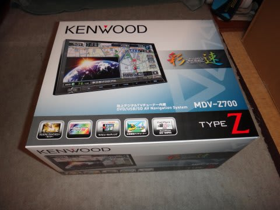

# プロジェクトX第2章…ナビとETCが届いた

📅 投稿日時: 2013-06-14 01:14:12

あー．

明日，朝が早いのですが…

がんばって夜中にBlogを更新する自分．えらい！＜誰も褒めてくれないので，自分で自分を褒めてみる

とりあえず．

通販で申し込んだナビが届いたのだ．

購入したのは，KENWOODの催促ナビ…ではなくて，彩速ナビ，

MDV-Z700．

なぜ，こいつにしたのかというと…今回は，HDMI入力付きのナビがどうしても

欲しかったのだ（どーしても欲しかった理由はまたあ・と・で（はぁと））←眠いので文章が一部変になってますが…このあたり，また後日に！

で，HDMI入力があるナビで，こいつが一番安かったのだ．

…といっても，バックモニターカメラとセットで9万円近くという，

かなりお高めのお値段でしたが…(涙)

＃普通は10万近くするらしい…

というわけですが．

ナビだけでは車につなげないので，必要物品を一通りそろえます．

まず，当然ナビ本体．

これらのケーブルが，本体とセットになってます．

そして，バックモニターカメラ．

…軟弱ものの私は，これがないと運転できません(笑）．

さらに，ETC本体ですね．

…これは，通販で申し込んだ先に，車検証と免許証をスキャンして

メール添付すれば，セットアップ完了状態で送ってくれました．

そして…

車両接続用ハーネスキット．

オーディオカプラー接続コネクタ(電源，イルミ電源，ACC電源，スピーカーなどの車両側オーディオカプラに接続)

オプションカプラ接続用コネクタ(車速パルス，リバース，パーキング信号用の車両側オプションコネクターに接続)

アンテナ変換コネクタ(アンテナ線コネクタに接続)

の，3点セットです．

…いつも思うけど，このあたり各社で共通仕様にしてほしいなぁ…

で．ETC接続ケーブル，KNA-300EX．

ステアリングリモコンおよびETCとナビをつなぐ，接続ケーブルです．

私のBR/BMレガシィはステアリングリモコンがついてないのですが，ETCと

つなぐためにこのケーブルが必要になります．

…どうでもいいんですが，KENWOODは自前でETCを作っていないので，

接続できるのはDENSO製のETCです．

それも，DENSOのDIU-5310単独指名です．つなげるのはこいつだけです．

あと．忘れちゃいけないのが，こいつ．

オプションの，HDMI(MHL)接続ケーブルです…

このKNA-13MC，一見普通のHDMI-MHL変換ケーブルに見えますが．

普通のHDMI-MHL変換ケーブルだと，MHLにつないだ機器に5V電源を供給するために，

USBなんかの電源コードがついているところ．

こいつには，そんなものがついてません．

…おそらく，ナビ側のHDMIコネクタに電源が仕込んであるんでしょう．

ということで，このケーブル，普通のケーブルと違うので．

そこら辺の電気屋で売ってるHDMI-MHLケーブルは流用できなさそうです…

素直にKENWOODの指定オプションを購入しましょう．

と，ここまでは通販で購入しました…．

そして．

最後のこいつは，通販では買えないので，ディーラーで買います．

…2DINオーディオをナビスペースにはめるための外枠．

正式名称，「AVエスカッションセット」

…こんなもんが，定価1万円もします…(泣）．

いろいろ調べましたが，安いサードパーティー製は無いようで，泣く泣く純正品を

買いました．

ということで．

材料は揃った．

あとは，取り付けるのみ！

