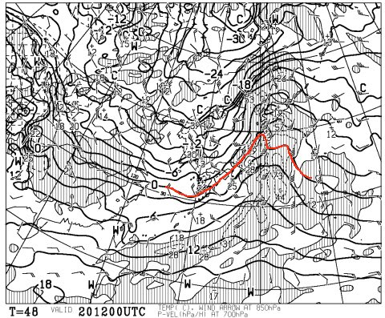
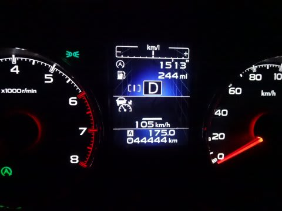
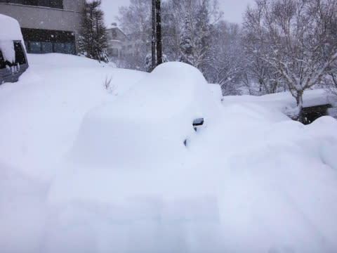

# レガシィ君，44444km突破

📅 投稿日時: 2014-12-19 01:55:13

🏷️ カテゴリ: [車](cba0e8330b3f2ded7c1addfacc75d4547.md)

ふむ．

なんだか．

やっぱり今日は，かなり積もったみたいですね…

焼額では，[1m超えクラスの積雪](https://www.facebook.com/yakebitaiyama/posts/725137294248286)だとか…

でも，強風でゴンドラが動かせなかったみたいだし．

この強風のおかげで，[急斜面や吹きさらし部分は
あまり積もらなかった](http://ameblo.jp/kumakumanoyu/entry-11966003904.html)ようですね～．

うーん．

でも．

とりあえず．

今回の積雪で，志賀高原も，今週末から全面オープンですね！

…あとは，土曜が雨にならず，雪のままであってくれることを祈るばかり…

最新の天気図を見ると．

20日の土曜日の850hpaの0度線は，こんな感じで…

微妙に，志賀高原より北まで上がっちゃってますが．

昨日の予想よりは良くなっている感じで．

これなら，志賀高原は，なんとかぎりぎり雪のままで

行ってくれるんじゃないかな～…

＃誰かさんの日ごろの行いが悪かった場合はこの限りではない

んで．

そろそろ購入から1年半たつ，我がBRレガシィ君．

先週の志賀高原で，44444万kmのゾロ目を踏みました…

年間3万kmという，過走行ペースを順調にキープしてますね（笑）．

とりあえず．

こんなになったり，いろいろ酷使されてる我が車ですが．

今のところ，全く完全に無故障で走ってくれてます．

雪道では無敵だし．

アイサイト様のおかげで，高速はむちゃくちゃ楽だし．

…スキーに行くには，最適な車だわ…
